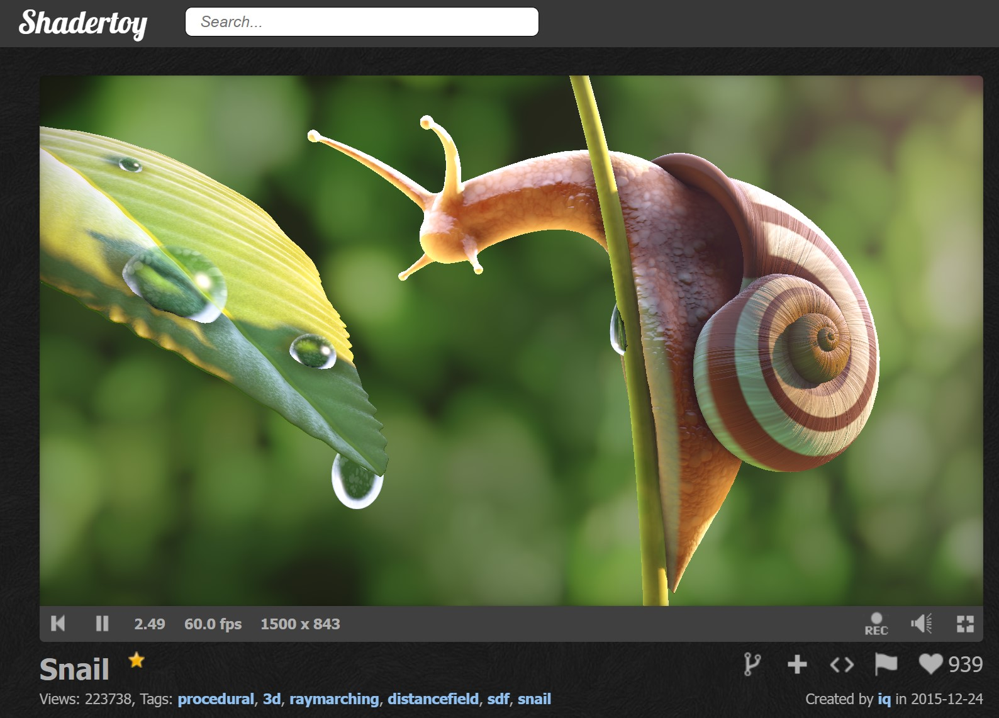
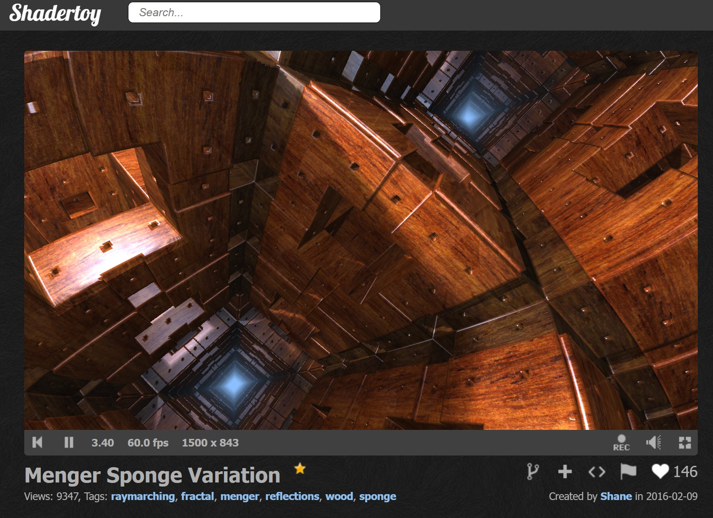
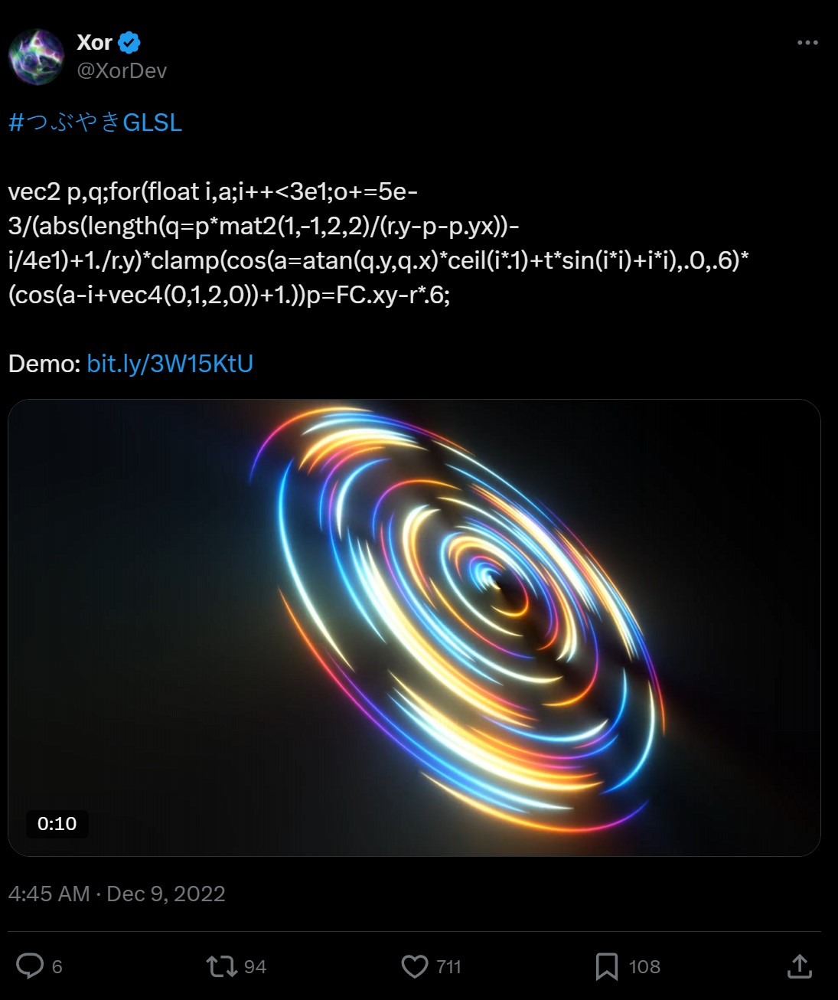
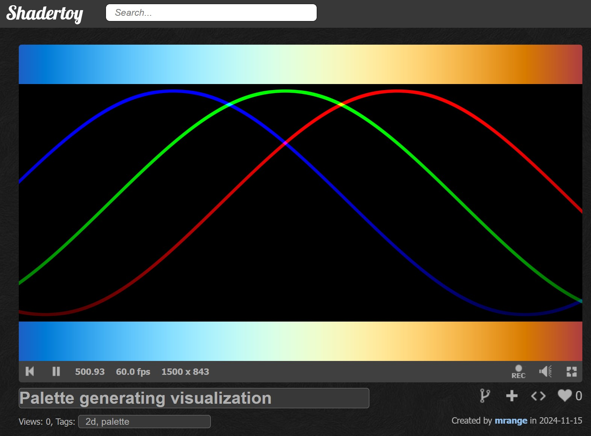
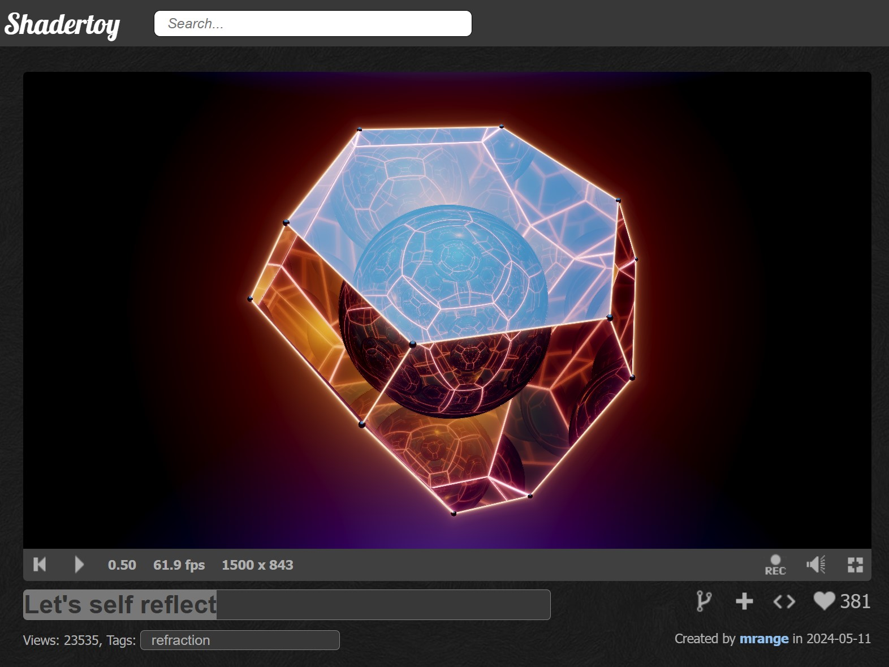

# 🎄⭐🎉 Welcome to Shader Advent Calendar 2024 🎉⭐🎄

🎅Ho, ho, ho! Merry Christmas!🎅

After following and even pitching in on the 🎄[F# Advent Calendar](https://sergeytihon.com/fsadvent/)🎄, I thought: why not bring a little shader magic to December? So, welcome to the Shader Advent Calendar, where each day (hopefully) brings a fresh shader gem 🎁 to tinker with or be inspired by.

I realize that creating something out of nothing is challenging, and realistically, we may not fill every day in December. To pad the schedule, you might see a few extra posts from me, but I’d happily give up a slot to anyone who wants to contribute.

Anyway, I thought I’d kick off the Shader Advent Calendar by sharing a few tricks and tips I’ve picked up while tinkering with shaders.

## 🎁Tip #1: Don't Be Afraid to Share What You've Created🎁

One thing I’ve realized while sharing shaders on [ShaderToy](https://www.shadertoy.com) is that predicting what resonates with people is almost impossible. I can spend days on something complex, post it, and hear only 🦗🦗🦗*crickets*🦗🦗🦗. But then, I might spend just a couple of hours on a quick hack, and suddenly it’s [Shader of the Week](https://www.shadertoy.com/view/MfjyWK) with loads of positive feedback!

Also, I’ve never had a negative experience on ShaderToy about code or visual quality—so I don’t feel any fear sharing work that may not be my absolute best. Sometimes, the simplest shaders end up being someone’s favorite, even if they don’t make a big splash.

So, my tip: share what you create, even if you’re just starting out! There’s room for all kinds of shaders on ShaderToy, from massive, intricate projects to simple 2D effects.

Creators like [IQ](https://www.shadertoy.com/view/4ttSWf), [Shane](https://www.shadertoy.com/view/wtfBDf), and [Kali](https://www.shadertoy.com/view/XcXXzS) put out stunning work, but for beginners and even seasoned tinkerers, these complex shaders can be hard to digest. Sometimes, it’s the smaller, simpler shaders that help beginners finally grasp concepts like Raymarching. So don’t hold back—your shader might be exactly what someone needs to see!



## 🎉Tip #2: Fragment Shaders Aren't Hard🎉

I often hear, "Shaders are dark magic and impossible to understand." But I’d argue that fragment shaders are actually pretty simple!

For one, they're written in GLSL—a language similar to C but without the tough stuff like resource management and recursion. Many developers are already familiar with C-style languages, so most will feel right at home with GLSL.

At its core, a fragment shader is just a function that takes a coordinate and returns a color. The basic structure of a [new ShaderToy snippet](https://www.shadertoy.com/new) shows this clearly:

```glsl
void mainImage(out vec4 fragColor, in vec2 fragCoord);
```

Given a coordinate, it produces a color. That’s it.

Now, shaders can be tricky to decipher but it’s not because the fundamentals are complex. The challenge lies in the unique techniques shader creators use—patterns that differ from “normal” programming.

Which brings us to the next tip...

## ⭐Tip #3: Distance Fields Are Amazing⭐

A central technique used by shader creators is the distance field. The idea is simple: distance field functions model 2D or 3D objects, like spheres and boxes, that can then be combined to create more complex shapes.

For instance, a basic distance field function for a sphere might look like this:

```glsl
float sphere(vec3 pos, float radius) {
  return length(pos) - radius;
}
```

Given a point in space, this `sphere` function returns the distance from the point to the sphere’s surface. A positive result means the point is outside the sphere, a negative result places it inside, and if it’s zero, the point lies on the sphere’s surface.

Ray tracing, a popular technique among shader creators, uses distance fields to create intricate 3D worlds. Here’s how it works: we define a distance field function—often called `map`—for our world. The ray tracer starts at a position and queries the distance field function to find out how far it is from the nearest surface. It then steps forward in the ray’s direction by that distance. The process repeats until the ray either reaches a surface or moves beyond the scene’s bounds.

Check out a classic example, [Menger Sponge Variation by Shane](https://www.shadertoy.com/view/ldyGWm). In this shader, the `map` function defines the distance field for the world (a Menger sponge, in this case), while the `trace` function handles the ray tracing. The rest is lighting magic by Shane, but the basic ray tracer itself is straightforward. I don’t have hard numbers, but I’d guess that 90% of the shaders on [ShaderToy](https://www.shadertoy.com/results?query=raymarch) use this technique.



## ⭐⭐⭐Tip #4: No, Really—Distance Fields Are Amazing⭐⭐⭐

One of the cool things about distance fields is how easily you can combine simple shapes with operations like union and intersection—much like Boolean algebra. With traditional triangle-based meshes, these operations are complex, but with distance fields, they’re almost trivial!

The union operation uses the `min` function, and the intersection operation uses `max`. When I first learned this, I couldn’t believe it was that simple—and it’s one of the reasons I got hooked on shaders.

Using these operations, let’s create a "hole-y" box by combining two distance fields:

```glsl
// Returns the distance to a box
// Adapted from: https://iquilezles.org/articles/distfunctions/
float box(vec3 p, vec3 b) {
  vec3 q = abs(p) - b;
  return length(max(q, 0.0)) + min(max(q.x, max(q.y, q.z)), 0.0);
}

// Returns the distance to a sphere
float sphere(vec3 pos, float radius) {
  return length(pos) - radius;
}

float map(vec3 pos) {
  // dbox is the distance to a cube with side length 2
  float dbox = box(pos, vec3(1.0));
  // dcircle is the distance to a sphere with radius 1.1
  float dcircle = sphere(pos, 1.1);

  // Return the intersection of the box and the inverted sphere
  // This creates a hole-y box
  return max(dbox, -dcircle);
}
```

It’s really cool how much you can do with just a few simple operations!

## 💖Tip #5: The Palette Generating Function Loved by Shader Coders💖

To create visually striking shaders, you need equally striking colors. One of the simplest and most popular ways to achieve this is by using the beloved 💗 palette generating function of shader coders:

```glsl
vec3 palette(float a) {
  return 0.5 + 0.5 * sin(vec3(0, 1, 2) + a);
}
```

By varying `a`, you’ll generate a vibrant color palette filled with rich blues and intense whites. I first came across this gem in a [tweet by XorDev](https://twitter.com/XorDev/status/1601060422819680256) (which you can also find on [ShaderToy](https://www.shadertoy.com/view/msjXRK)). Its simplicity and stunning results make it [an evergreen](https://www.shadertoy.com/view/mtyGWy) in the shader community.

<p align="center">
  
</p>

Since discovering this function, I’ve used it countless times in my own [projects](https://www.shadertoy.com/view/cdKXDV). To make its inner workings clearer, I also created [a shader visualization](https://www.shadertoy.com/view/McVyzw). It demonstrates how the red, green, and blue components evolve over time and how they combine to produce the resulting colors.

<p align="center">
  
</p>

## 🎅Tip #6: The Simplest Post-Processing🎅

One way to kick you shader up a notch is by applying post-processing. While this can be [a complicated multi-stage process](https://www.shadertoy.com/view/MflfR8), I often find myself returning to a really simple technique.

As you can see in my shaders, I like saturated colors and want to avoid the washed-out fog effect that can easily creep in. I used to struggle with this until I learned a simple trick.



In [the shader](https://www.shadertoy.com/view/XfyXRV) above, the trick occurs at line 347:

```glsl
// Does all of the work, but there's an annoying washed-out fog that desaturates
// the colors. I am annoyed!
col = render3(rayOrigin, rd);

// Line 347: This simple subtraction removes the global glow and increases saturation
col -= 2E-2 * vec3(2., 3., 1.) * (length(p) + 0.25);

// Maps colors from [0, inf[ to [0, 1]
col = aces_approx(col);
// Approximate RGB => sRGB conversion
col = sqrt(col);
```

Typically, I’ll start by doing my best to create the desired effect, and then as a final step, I apply post-processing. I usually begin with something as simple as `col -= 0.01;` and tweak it from there until it feels right.


And with that, this is a 🎁 wrap. Wishing you all...

✨🎄🎁 A merry and bright holiday season filled with colorful coding adventures! 🎁🎄✨

🎅 - mrange

## ❄️Licensing Information❄️

All code content I created for this blog post is licensed under [CC0](https://creativecommons.org/public-domain/cc0/) (effectively public domain). Any code snippets from other developers retain their original licenses.

The text content of this blog is licensed under [CC BY-SA 4.0](https://creativecommons.org/licenses/by-sa/4.0/) (the same license as Stack Overflow).