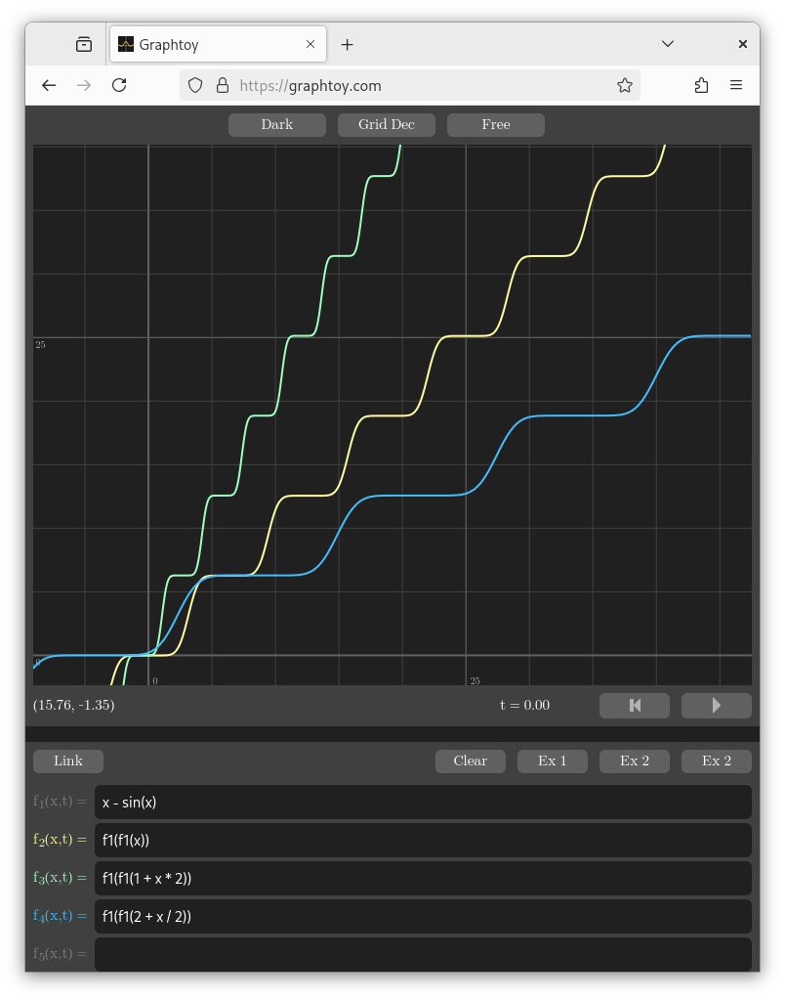
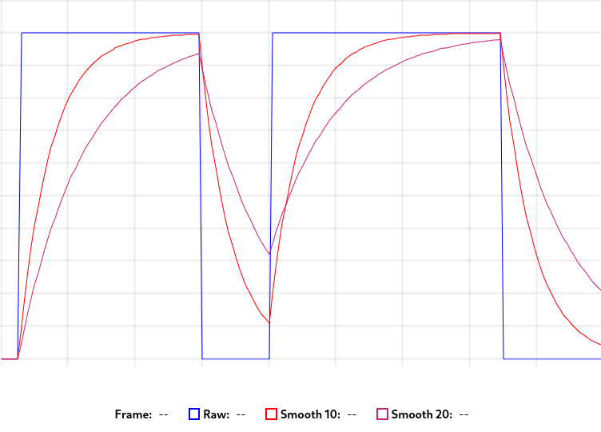
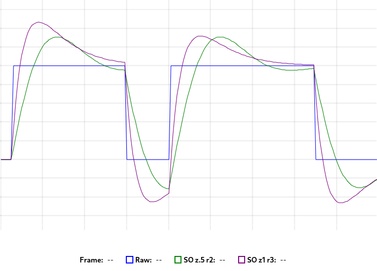
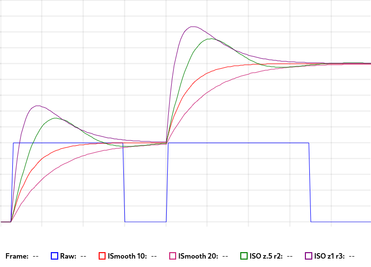

# Smooth Midi Modulation

Hello everbody, my name is Tristan de Cacqueray, and in this post I will explain how I made
the [one piano phase][my-piano-phase] demo.

You can learn more about my previous work with the [animation-fractal][af] project.
Below, I will set out the workflow I used to create this demo.


## Finding Modulation Targets

My first task was finding good modulation targets.
I am not good at writing shaders from scratch due to my limited knowledge of the tricks required to create pleasing visuals.
Therefore, I searched for reusable shaders on Shadertoy that could be modified to accommodate more inputs.

I needed a set of variables that could be independently adjusted.
I typically look for instances where iTime and interesting constants are used.
If the shader uses domain repetitions, a uniform array can be used to create variations per instance ID.

For *one piano phase*, I used the [Truchet + Kaleidoscope FTW][truchet-ftw] by @mrange. This shader is very flexible as it features repeated planes with many unique variables.
I tweaked the implementation to split the plane into an inner and outer ring, creating more variations.
Here are the new uniforms I added:

```glsl
uniform float rotations[4];
uniform float modulations[6];
```

… which are assigned in the plane function like that:

```glsl
  float prot1, prot2;
  float pmod1, pmod2;
  float cmod;
  if (mod(n, 2.) == 0.) {
    prot1 =  rotations[0], pmod1 = modulations[0],
    prot2 = -rotations[1], pmod2 = modulations[1],
    cmod = modulations[2];
  } else {
    prot1 = -rotations[2], pmod1 = modulations[3],
    prot2 =  rotations[3], pmod2 = modulations[4],
    cmod = modulations[5];
  }
```

I also added two global uniforms:

```glsl
uniform float icolor;
uniform float moveFWD;
```

… which are used in the color function like that:

```diff
- #define TIME            iTime
+ #define TIME            moveFWD

-   vec3 bcol = palette(abs(d));
+   vec3 bcol = palette(abs(d) + icolor);
```

Once I'm done with the edits, I make a shadertoy version using fake values that way:

```
// Simulate the pitch inputs using a smoothed stairs function STEP
#define STEP1(x) ((x) - sin(x))
#define STEP(x, offset, amp) (STEP1(STEP1(offset + x * amp)) * .15)
#define is (iTime)

void genInputs() {
  rotations[0] = STEP(is, 1., 1.);
  rotations[1] = STEP(is, 2., 2.);
  rotations[2] = STEP(is, 3., 3.);
  ...
}

void mainImage() {
  genInputs()
  ...
}
```

> Here is how the step function looks like in graphtoy: 

You can find a list of shaders I've edited to support multiple modulations parameters [here][af-shader].


## Assigning Modulation Sources

My next task was to assign modulation sources.
Previously, I have worked with audio stems and computed the RMS volume per frame.
I even implemented a custom filter to extract additional values from a single audio signal using this [IIR.hs module][simple-dsp].
However, I find it more straightforward to work with MIDI events. Thanks to [strudel][strudel], I can now embed the video with the audio.

For *one piano phase*, I used NoteOn events to modulate the uniforms like this:

- The kick drum modulates a different rotation each time.
- The hi-hat increases the icolor.
- The clap increases the moveFWD.
- The piano pitches are assigned to individual modulations.

Other assignment techniques can be used, such as following a CC curve or summing multiple inputs for a single destination.
However, this depends on the source material, and it can be tricky to make the video match the audio.


## Smoothing The Modulations

It is important to smooth the input signals to avoid abrupt changes which can cause unpleasant stroboscopic effects.

Here is a basic formula to limit the rate of change:

```javascript
const smooth = (speed) => (desired) => (value, elapsed) =>
  value + ((desired - value) / Math.max(1, speed * 60 * elapsed));
```

The *speed* can be set to taste, for example, between 5 and 42. The desired *value* is provided by the input signal.
Then, the render loop sets the current *value* and *elapsed* time for every frame.
This function looks like this:



Here is a more advanced formula, based on the second-order dynamics presented in this video [Giving Personality to Procedural Animations using Math][so-math]:

```javascript
const so = ({ f, z, r }) => {
  // constants
  const k1 = z / (pi * f);
  const k2 = 1 / ((2 * pi * f) * (2 * pi * f));
  const k3 = r * z / (2 * pi * f);

  // initial state
  let xp = 0;
  let y = 0;
  let yd = 0;

  return (desired) => {
    let x = desired;
    return (_, elapsed) => {
      let t = elapsed;

      // estimate velocity
      let xd = (x - xp) / t;
      xp = x;

      // clamp k2 to guarantee stability
      let k2_stable = Math.max(k2, t * t / 2 + t * k1 / 2, t * k1);

      // integrate velocity by acceleration
      yd = yd + t * (x + k3 * xd - y - k1 * yd) / k2_stable;

      // integrate position by velocity
      y = y + t * yd;

      return y;
    };
  };
};
```

*f* defines the rate of change, *z* the damping coefficient and *r* the initial response of the system.
Here is how that looks:




In most situations, it is better to only follow increments to avoid a back-and-forth effect, which looks like this:




Here is an example demo where you can see both techniques in use: [Midi Island - Opening Theme][midi-island]


## Food For Thought

In this post, I showed how to animate shader inputs with MIDI events.
As a hobbyist, I implemented this workflow multiple times over the years, as I couldn't find an existing solution.
Please let me know if I missed anything or if I am on the right track.

I made a [pull request][strudel-pr] to add a shader module to Strudel in order to share my demo through the upstream server.
I would appreciate your feedback on this new feature.

I wonder if Shadertoy could support MIDI inputs, and if the smoothing functions can be implemented with shader code, perhaps by using a buffer to keep track of the previous value?

Finally, it would be great to synchronize the modulation with the MIDI clock...

Anyway, that's it for today. Have a good advent of shader!


[my-piano-phase]: https://youtu.be/M7U3vGOQsTc
[af-shader]: https://www.shadertoy.com/results?query=tag%3Danimationfractal
[simple-dsp]: https://github.com/TristanCacqueray/simple-dsp/blob/main/src/SimpleDSP/IIR.hs
[af]: https://midirus.com/project/animation-fractal
[truchet-ftw]: https://www.shadertoy.com/view/lcGGDW
[strudel]: https://strudel.cc/
[so-math]: https://www.youtube.com/watch?v=KPoeNZZ6H4s
[midi-island]: https://www.youtube.com/watch?v=FBj8QWykvjg
[strudel-pr]: https://github.com/tidalcycles/strudel/pull/1196
