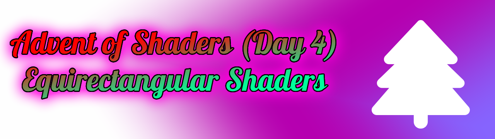
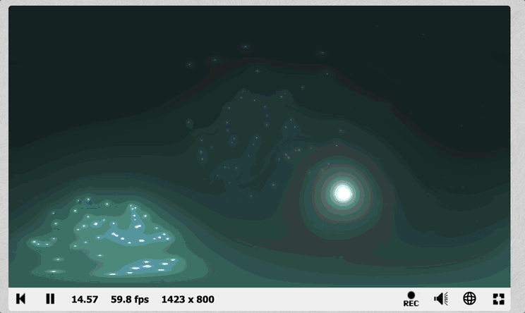
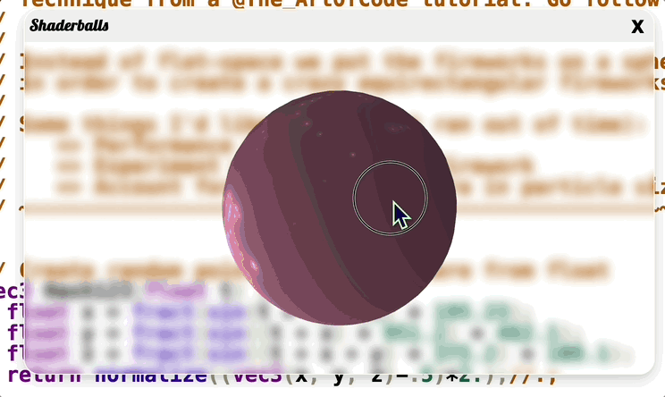

# ❄️🎨 Equirectangular Shaders ❄️🎨
Happy Holidays - Advent-of-Shaders 2024 crew ❄️ welcome to day 4!

Cozy up with some hot chocolate and a blanket as today I want to share with you my absolute favorite shader trick.




I often want cool artistic trippy backgrounds for my programmed 3D scenes. So why not use shaders to either render  skybox textures or create stunning live skybox masterpieces? 

Welcome to the glory provided for you through Equirectangular Shaders!

### 🐌 A Wee Bit of Pretext

You know how traditional images capture a bounded-section/frustum of 3D space? Equirectangular images capture an entire 360 degree view of 3D space.

Shaders of-course are very capable at drawing images so it's natural we can use them to create both normal and equirectangular images.

### 🧞‍♂️ A Little Magic

If you'd like to ponder how a 360 degree view of space get's mapped into a rectangular image I'll give you a moment  to think about it now. 

Remember we’re in shader land so we need to go from the picture’s UVs to a 3D position. UVs provide us with our current XY position on the image [0-1] range for both directions. Where 0,0 is the bottom left and 1,1 is the top right.

The magic comes from a 2-Sphere conversion  where we make the jump from 2D to 3D  by having each UV vector represent our longitude and latitude on a sphere.

Here's the *secret sauce* GLSL shader code:

```glsl
// License CC0-1.0
// Advent of Shaders - Day 4 (2024)
// This function let's us jump from 2D-UV to spherical 3D-XYZ position
vec3 uvTo3D(vec2 uv) {
    // The 2-Sphere point via UV => Lat/Long angles
    float theta = uv.x * 2.0 * 3.14159265359; // Longitude
    float phi = uv.y * 3.14159265359; // Latitude
    // Trigonometry from 2-Sphere angles to an XYZ normalized [-1,1].
    float x = sin(phi) * cos(theta);
    float y = sin(phi) * sin(theta);
    float z = cos(phi);
    // { Dev Note }
    // In fancier 3D oriented shader wrappers -> You can skip this conversion and use the XYZ of your "varying vNormal" in place of the result you would get here. It's generally more accurate and prevents artifacting around the poles. Should be suitable for all spheres and most round geometries
    return vec3(x, y, z);
}

```
At the very begining of your shader you can now jump from a 2D UV vector to a 3D position vector. 

This is practical insofar that all of the techniques that work to make beautiful 2D shaders can be applied here to make beautiful equirectangular shaders. Albeit sometimes you must jump up an addtional dimension (3D noise instead of 2D noise, etc..).

If you use this one trick at the start of your shader, you'll create a shader that's perfectly suitable for a skybox. I've even had success using these shaders as the material for round-ish objects with spectacular results.

### 👁️ See It In Action
Checkout this shadertoy [Mandel's Infinite 4D Circus](https://www.shadertoy.com/view/l3tSWH) (Take note of the flatmode boolean)

By default it renders an equirectangular view of a mandelbulb raymarch:


Now if we view that shader textured on a sphere:

👆 You can see the shader perfectly textures onto the orb with no seams! And if we go inside it becomes a perfect skybox of our trippy raymarch.

Just for example if we set `flatmode=true` in the shader code and recompile it looks like:

👆 We skip the UV=>3D-Pos conversion and now the shader renders only a subset of the 3D raymarch.

Predictably if we now try and use the flatmode version for a sphere texture, it is very wonky.


### 🎤 Showcase Cont...
In addition to the shader above, here's some other skybox shader creations I made in 2024. They're all CC0-1.0 (public domain) so consider it my Holiday gift for you ❄️!

#### [Marble](https://www.shadertoy.com/view/43G3Wy)


#### [Voronoi](https://www.shadertoy.com/view/lXV3z3)


#### [FBM](https://www.shadertoy.com/view/XXcXR7)


#### [Fireworks](https://www.shadertoy.com/view/l3KSzy)



#### [Grid SDF](https://www.shadertoy.com/view/X3tSD2)


#### [Perlin](https://www.shadertoy.com/view/M3y3zK)


### 🐞 A Debug Tool - From Me To You
I discovered this equirectangular trick this past year and it's been a god-send, I hope you enjoy it as much as I have!

I have yet to find anywhere faster and easier to create shaders with than [shadertoy.com](https://shadertoy.com). So I wrote a browser plugin which very easily let's you preview your equirectangular shaders on spheres via a small popup modal. I call it shaderballs and the code is open-source ([🔗 Repo Link](https://github.com/SoundSafari/ShaderBalls))

- Chromium Link [Here](https://chromewebstore.google.com/detail/shaderballs/ljijeelhhhnliklnedkaikkhemfjofpf?hl=en)
- Firefox Link [Here](https://addons.mozilla.org/en-US/firefox/addon/shaderballs/).

### 🎁 Extras
- [This video](https://www.youtube.com/watch?v=dkyvZo68IoM) by Richard Behiel has one of my favorite visualizations for 3-Spheres in the context of Hopf Fibrations. It's not an exact demo of the magic we're doing here but still one of my favorites.
- Artifacts around the sphere's poles occur because of how computers handle math, there's a more advanced algorithm called [HEALPix](https://en.wikipedia.org/wiki/HEALPix) that's it's own rabbit hole.
- Shoutouts to Martin Range for coordinating this event and his awesome CC0-1.0 licensed shaders. Without his work I'd be very unlikely to be here writing this today.


Happy Holidays ☕️

🐾 - Llama D'Attore 

~ My [twitter](https://x.com/SoundSafari_io) & my [3D Music Visualizer](https://SoundSafari.io) I've been working on since ~2016.