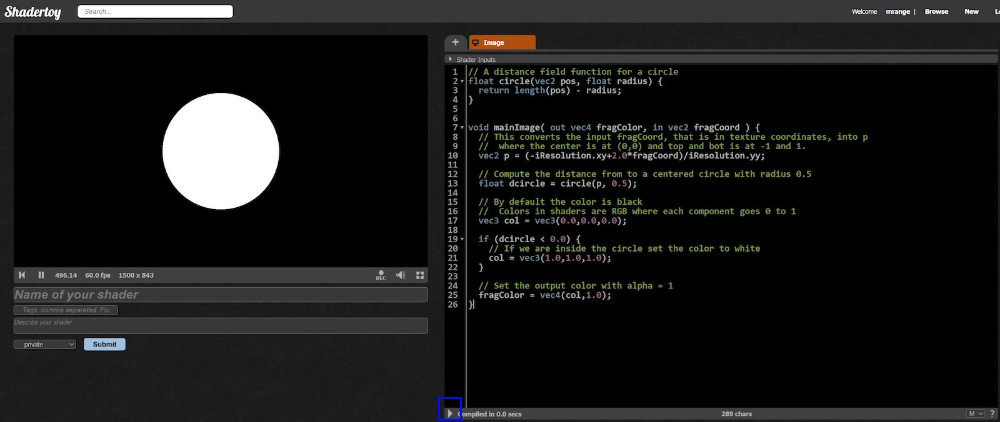
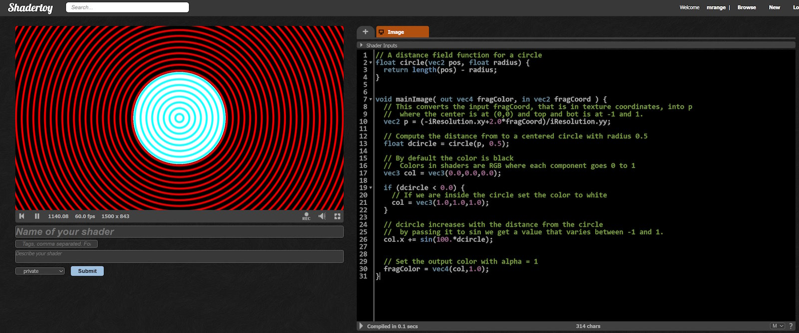
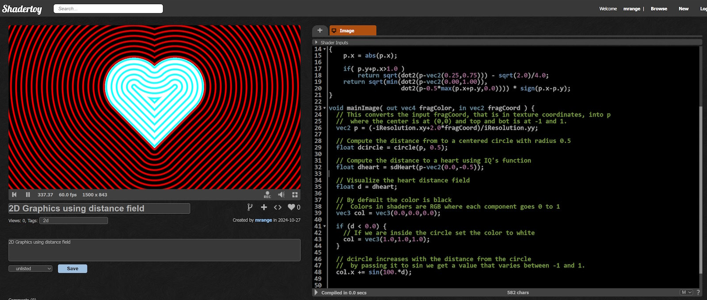
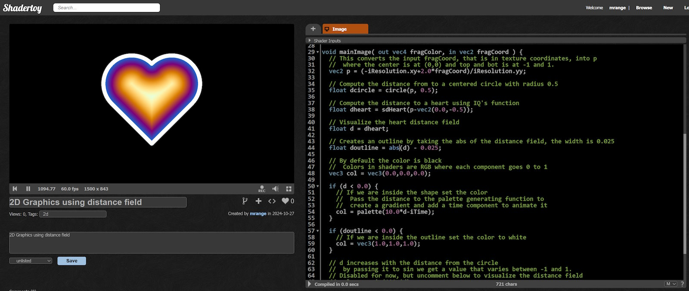
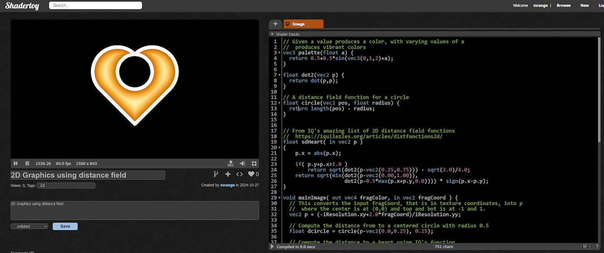

# 🎄⭐🎉 Introduction to 2D Shaders 🎉⭐🎄

🎅 Ho, ho, ho! Merry Christmas! 🎅

## 🎄 2D Shaders are Cool Too! 🎄

<p align="center">
  
[C# Logo as a ShaderToy](https://www.shadertoy.com/view/mtjSDD)
</p>

Most examples on ShaderToy use ray marching in 3D, but creating cool shaders in 2D is just as fun! Working in 2D allows us to easily visualize distance fields—a common pattern in shader coding—and we can apply what we learn in 2D to 3D.

## Drawing a ⭕ 2D Circle Using Shaders

Shaders on [ShaderToy](https://www.shadertoy.com/) are fragment shaders, which are functions that take screen coordinates as input and return a color. In our fragment shader, we’ll model shapes using distance field functions that calculate the distance from a given point to the edge of the shape.

Here’s an example of a circle distance field:

```glsl
float circle(vec2 pos, float radius) {
  return length(pos) - radius;
}
```

In this function:
- Any point farther from the origin (`pos`) than `radius` gives a positive value.
- Points within `radius` give a negative value.
- Points exactly at `radius` give zero.

To draw a circle, we pass each coordinate to this function. If the result is negative (inside the circle), we color it white; otherwise, it’s black.

## Let’s Code It!

Head over to [ShaderToy](https://www.shadertoy.com/new) and replace the default code with this:

```glsl
// A distance field function for a circle
float circle(vec2 pos, float radius) {
  return length(pos) - radius;
}


void mainImage( out vec4 fragColor, in vec2 fragCoord ) {
  // This converts the input fragCoord, that is in texture coordinates, into p
  //  where the center is at (0,0) and top and bot is at -1 and 1.
  vec2 p = (-iResolution.xy+2.0*fragCoord)/iResolution.yy;

  // Compute the distance from to a centered circle with radius 0.5
  float dcircle = circle(p, 0.5);

  // By default the color is black
  //  Colors in shaders are RGB where each component goes 0 to 1
  vec3 col = vec3(0.0,0.0,0.0);

  if (dcircle < 0.0) {
    // If we are inside the shape set the color to white
    col = vec3(1.0,1.0,1.0);
  }

  // Set the output color with alpha = 1
  fragColor = vec4(col,1.0);
}
```

Hit Alt-Enter or press ▶️ to compile the shader, and voilà—you should see a simple 2D circle like this:


## Visualizing the Distance Field

2D shaders make it easy to visualize distance fields. We’ll show this by adding red lines that depends on the distance to our shape.

Insert the following line right above `Set the output color with alpha = 1`:

```glsl
// dcircle grows with distance from the circle
//  Passing it through sin gives a varying effect between -1 and 1
col.x += sin(100. * dcircle);
```

Now, we can see a visual representation of the distance field around the circle:


This technique works for any distance field, so let’s try it with a more exciting shape. Creating reusable distance field functions can be tricky, but [IQ](https://www.shadertoy.com/user/iq) has a [fantastic collection of 2D distance functions](https://iquilezles.org/articles/distfunctions2d/) (licensed under MIT).

One example is a heart shape, `sdHeart`, which I’ve added to the code. I’m not entirely sure how `sdHeart` works under the hood, but like our `circle` function, it returns the distance to the shape’s edge.

```glsl
float dot2(vec2 p) {
  return dot(p, p);
}

// A distance field function for a circle
float circle(vec2 pos, float radius) {
  return length(pos) - radius;
}

// From IQ's amazing list of 2D distance field functions
//  https://iquilezles.org/articles/distfunctions2d/
float sdHeart( in vec2 p )
{
    p.x = abs(p.x);

    if (p.y + p.x > 1.0)
        return sqrt(dot2(p - vec2(0.25, 0.75))) - sqrt(2.0) / 4.0;
    return sqrt(min(dot2(p - vec2(0.00, 1.00)),
                    dot2(p - 0.5 * max(p.x + p.y, 0.0)))) * sign(p.x - p.y);
}

void mainImage(out vec4 fragColor, in vec2 fragCoord) {
  // Convert fragCoord to centered coordinates with -1 to 1 range on y-axis
  vec2 p = (-iResolution.xy + 2.0 * fragCoord) / iResolution.yy;

  // Distance from a centered circle with radius 0.5
  float dcircle = circle(p, 0.5);

  // Distance to the heart shape, centered a bit lower
  float dheart = sdHeart(p - vec2(0.0, -0.5));

  // Use the heart distance field for visualization
  float d = dheart;

  // Set color to black by default
  vec3 col = vec3(0.0, 0.0, 0.0);

  if (d < 0.0) {
    // Inside the shape, set color to white
    col = vec3(1.0, 1.0, 1.0);
  }

  // d increases with distance, and sin gives us a color oscillation effect
  col.x += sin(100. * d);

  // Set the output color with alpha = 1
  fragColor = vec4(col, 1.0);
}
```

And here’s the result:


More interesting already! The distance field now follows the heart shape, showing both inside and outside areas.

## Adding a Bit of Color 🌈

Now, let’s use the distance field to add a vibrant color gradient to our shapes. We’ll use a popular color palette function for this:

```glsl
// Produces a vibrant color based on 'a'
//  As 'a' varies, this generates a shifting color palette
vec3 palette(float a) {
  return 0.5 + 0.5 * sin(vec3(0, 1, 2) + a);
}
```

Next, we’ll use this function to set the color inside the shape:

```glsl
  if (d < 0.0) {
    // Inside the shape, use the palette function to set color
    //  Pass the distance to the palette function for a gradient
    //  Add iTime to animate the colors
    col = palette(10.0 * d - iTime);
  }
```

Finally, we need to convert the color to sRGB, as the shader outputs in linear RGB. Here’s an approximate conversion:

```glsl
  // Approximate conversion from linear RGB to sRGB
  col = sqrt(clamp(col, 0.0, 1.0));
```

Here’s the full example:

```glsl
// Produces a vibrant color based on 'a'
//  As 'a' varies, this generates a shifting color palette
vec3 palette(float a) {
  return 0.5 + 0.5 * sin(vec3(0, 1, 2) + a);
}

float dot2(vec2 p) {
  return dot(p, p);
}

// A distance field function for a circle
float circle(vec2 pos, float radius) {
  return length(pos) - radius;
}

// From IQ's amazing list of 2D distance field functions
//  https://iquilezles.org/articles/distfunctions2d/
float sdHeart(in vec2 p) {
    p.x = abs(p.x);

    if (p.y + p.x > 1.0)
        return sqrt(dot2(p - vec2(0.25, 0.75))) - sqrt(2.0) / 4.0;
    return sqrt(min(dot2(p - vec2(0.00, 1.00)),
                    dot2(p - 0.5 * max(p.x + p.y, 0.0)))) * sign(p.x - p.y);
}

void mainImage(out vec4 fragColor, in vec2 fragCoord) {
  // Convert fragCoord to centered coordinates with -1 to 1 range on y-axis
  vec2 p = (-iResolution.xy + 2.0 * fragCoord) / iResolution.yy;

  // Distance from a centered circle with radius 0.5
  float dcircle = circle(p, 0.5);

  // Distance to the heart shape, centered a bit lower
  float dheart = sdHeart(p - vec2(0.0, -0.5));

  // Use the heart distance field for visualization
  float d = dheart;

  // Set color to black by default
  vec3 col = vec3(0.0, 0.0, 0.0);

  if (d < 0.0) {
    // Inside the shape, set color using animated palette
    col = palette(10.0 * d - iTime);
  }

  // Uncomment the line below to visualize distance oscillation with sin()
  // col.x += sin(100. * d);

  // Approximate conversion from linear RGB to sRGB
  col = sqrt(clamp(col, 0.0, 1.0));

  // Set the output color with alpha = 1
  fragColor = vec4(col, 1.0);
}
```

The inside of the heart should now display an animated, vibrant color gradient!

## Adding an Outline

One of the great perks of distance fields is how effortlessly we can add effects like inner glows, shadows, or outlines.

To add a simple white outline around the heart, we can build on our shape’s existing distance field:

```glsl
  // Creates an outline around the shape by using the absolute distance
  //  The outline width is set to 0.025
  float doutline = abs(d) - 0.025;
```

Then we use this new distance field to set the color for the outline:

```glsl
  // After setting the color inside the shape
  if (doutline < 0.0) {
    // Inside the outline, set the color to white
    col = vec3(1.0, 1.0, 1.0);
  }
```

And that’s it! Surprisingly simple, right?

Here’s the full example:

```glsl
// Generates a vibrant color based on 'a'
vec3 palette(float a) {
  return 0.5 + 0.5 * sin(vec3(0, 1, 2) + a);
}

float dot2(vec2 p) {
  return dot(p, p);
}

// Distance field function for a circle
float circle(vec2 pos, float radius) {
  return length(pos) - radius;
}

// Distance field function for a heart (from IQ's distance function list)
//  https://iquilezles.org/articles/distfunctions2d/
float sdHeart(in vec2 p) {
    p.x = abs(p.x);

    if (p.y + p.x > 1.0)
        return sqrt(dot2(p - vec2(0.25, 0.75))) - sqrt(2.0) / 4.0;
    return sqrt(min(dot2(p - vec2(0.00, 1.00)),
                    dot2(p - 0.5 * max(p.x + p.y, 0.0)))) * sign(p.x - p.y);
}

void mainImage(out vec4 fragColor, in vec2 fragCoord) {
  // Convert fragCoord to centered coordinates with -1 to 1 range on y-axis
  vec2 p = (-iResolution.xy + 2.0 * fragCoord) / iResolution.yy;

  // Distance from a centered circle with radius 0.5
  float dcircle = circle(p, 0.5);

  // Distance to the heart shape, centered a bit lower
  float dheart = sdHeart(p - vec2(0.0, -0.5));

  // Use the heart distance field for visualization
  float d = dheart;

  // Create an outline using the absolute distance, setting width to 0.025
  float doutline = abs(d) - 0.025;

  // Set default color to black
  vec3 col = vec3(0.0, 0.0, 0.0);

  if (d < 0.0) {
    // Inside the shape, apply animated gradient using palette function
    col = palette(10.0 * d - iTime);
  }

  if (doutline < 0.0) {
    // Inside the outline, set color to white
    col = vec3(1.0, 1.0, 1.0);
  }

  // Uncomment below to visualize the distance field oscillation
  // col.x += sin(100. * d);

  // Convert from linear RGB to sRGB (approximate)
  col = sqrt(clamp(col, 0.0, 1.0));

  // Set the output color with alpha = 1
  fragColor = vec4(col, 1.0);
}
```

Now you should see the heart with a clean white outline!


## Combining the ⭕ Circle and ❤️ Heart Shape

One of the real joys of distance fields is how effortlessly shapes can be combined.

To show both the circle and heart at once, we just need to merge their distance fields into a single one. Replace this line:

```glsl
  float d = dheart;
```

with:

```glsl
  // This ends up looking a bit like Mickey Mouse
  float d = min(dheart, dcircle);
```

The `min` function here creates a union of the two shapes, while `max` would instead produce their intersection:

```glsl
  // This ends up looking a bit like a Google Map pin
  float d = max(dheart, dcircle);
```

If we flip the circle’s distance (using `-dcircle`), we can make it a “hole” inside the heart (perhaps Cupid’s handiwork?). With a few tweaks—making the circle radius 0.25 and shifting its center up a bit—we get:

```glsl
  // Define a smaller circle, centered slightly higher
  float dcircle = circle(p - vec2(0.0, 0.25), 0.25);

  // Compute the distance to a heart using IQ’s function
  float dheart = sdHeart(p - vec2(0.0, -0.5));

  // A heart with a hole
  float d = max(dheart, -dcircle);
```

Here’s the complete example:

```glsl
// Generates a vibrant color based on 'a'
vec3 palette(float a) {
  return 0.5 + 0.5 * sin(vec3(0, 1, 2) + a);
}

float dot2(vec2 p) {
  return dot(p, p);
}

// A distance field function for a circle
float circle(vec2 pos, float radius) {
  return length(pos) - radius;
}

// Distance field function for a heart (from IQ’s 2D distance functions)
//  https://iquilezles.org/articles/distfunctions2d/
float sdHeart(in vec2 p) {
    p.x = abs(p.x);

    if (p.y + p.x > 1.0)
        return sqrt(dot2(p - vec2(0.25, 0.75))) - sqrt(2.0) / 4.0;
    return sqrt(min(dot2(p - vec2(0.00, 1.00)),
                    dot2(p - 0.5 * max(p.x + p.y, 0.0)))) * sign(p.x - p.y);
}

void mainImage(out vec4 fragColor, in vec2 fragCoord) {
  // Convert fragCoord to centered coordinates with -1 to 1 range on y-axis
  vec2 p = (-iResolution.xy + 2.0 * fragCoord) / iResolution.yy;

  // Define a smaller circle, centered slightly higher
  float dcircle = circle(p - vec2(0.0, 0.25), 0.25);

  // Compute the distance to a heart shape
  float dheart = sdHeart(p - vec2(0.0, -0.5));

  // A heart with a hole
  float d = max(dheart, -dcircle);

  // Create an outline by taking the absolute value of the distance field, with a width of 0.025
  float doutline = abs(d) - 0.025;

  // Default color is black
  vec3 col = vec3(0.0, 0.0, 0.0);

  if (d < 0.0) {
    // Inside the shape, apply animated gradient using the palette function
    col = palette(10.0 * d - iTime);
  }

  if (doutline < 0.0) {
    // Inside the outline, set color to white
    col = vec3(1.0, 1.0, 1.0);
  }

  // Uncomment below to visualize the distance field oscillation
  // col.x += sin(100. * d);

  // Approximate linear RGB to sRGB conversion
  col = sqrt(clamp(col, 0.0, 1.0));

  // Set the output color with alpha = 1
  fragColor = vec4(col, 1.0);
}
```

And voilà—a heart with a cut-out circle!



## 🎉 That’s All for Today! 🎉

Distance fields are a handy tool in shader programming, showing up in all sorts of ways in 2D and 3D graphics. Getting a feel for them—especially in 2D—gives you a great foundation for tackling more complex 3D projects.

In this post, we covered some basics: combining shapes with `min` and `max`, and using distance fields to play with colors, outlines, and even animated gradients. There’s still plenty to explore, like using `soft-min` and `soft-max` to combine shapes. We skipped anti-aliasing for now, but it's an easy one-liner I can cover in a future post.

I hope this guide helps you getting started with 2D shaders and spark some fun experiments with shapes and color effects!

✨🎄🎁 Merry Christmas, and happy coding! 🎁🎄✨

🎅 - mrange

## ❄️Licensing Information❄️

All code content I created for this blog post is licensed under [CC0](https://creativecommons.org/public-domain/cc0/) (effectively public domain). Any code snippets from other developers retain their original licenses.

The text content of this blog is licensed under [CC BY-SA 4.0](https://creativecommons.org/licenses/by-sa/4.0/) (the same license as Stack Overflow).