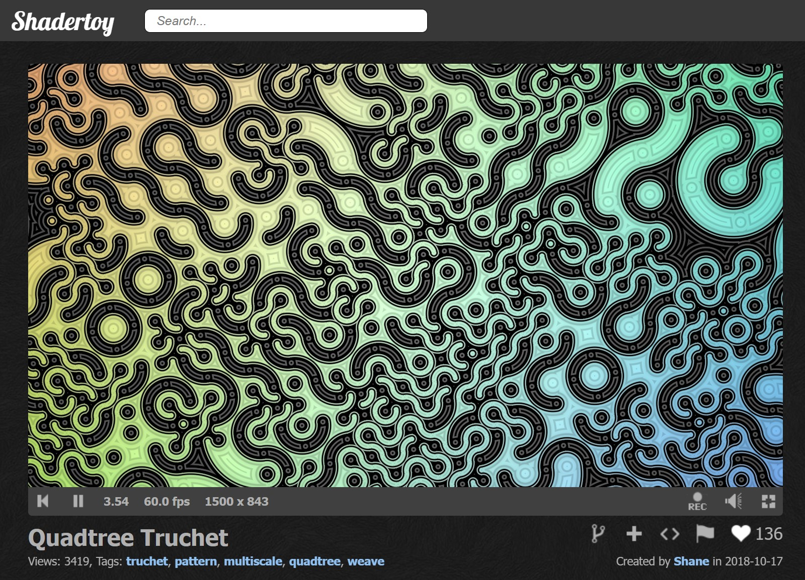
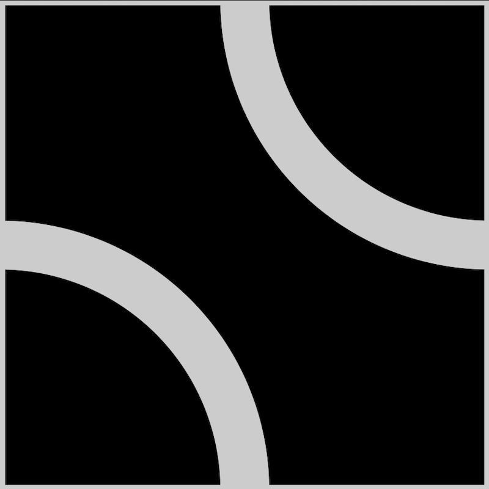
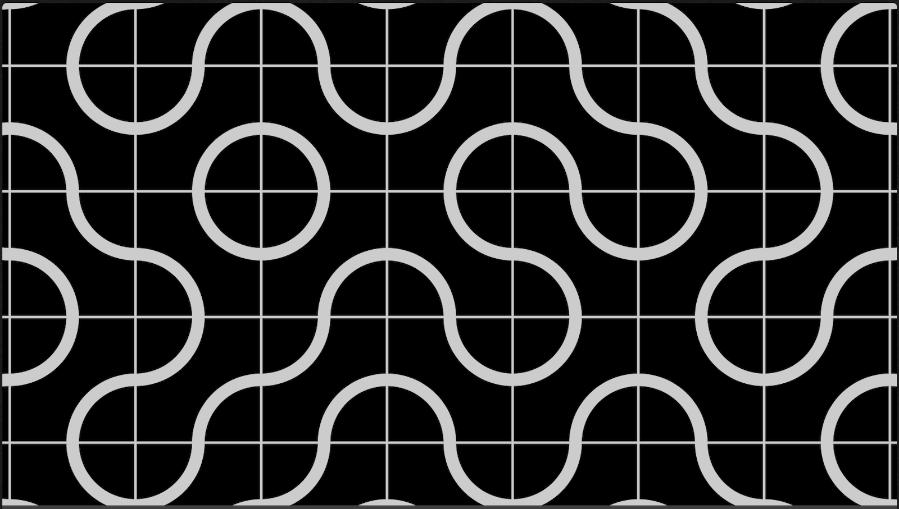
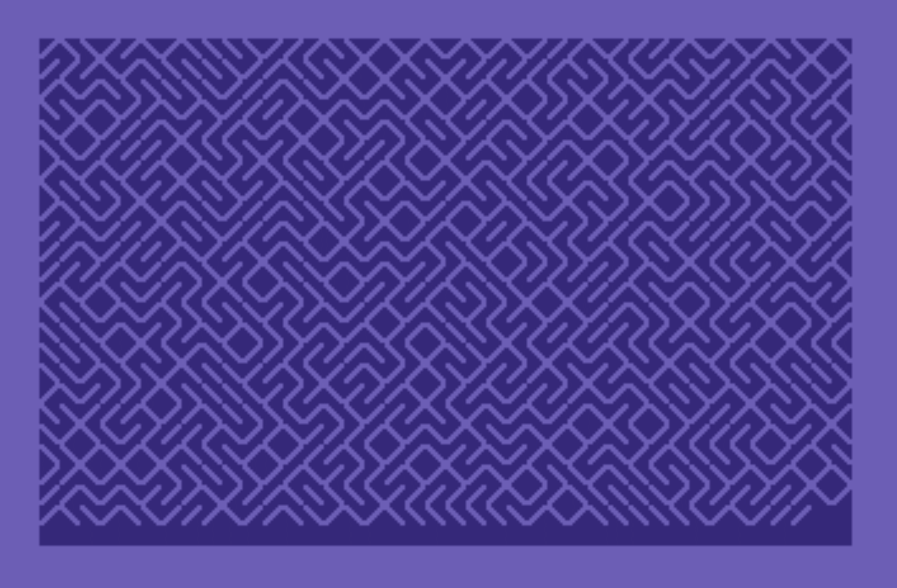
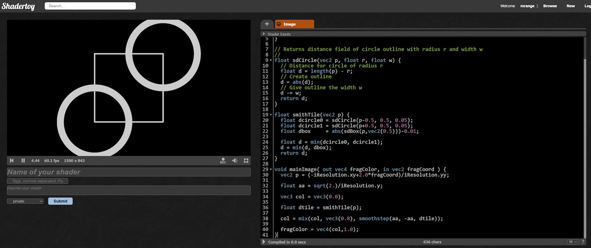
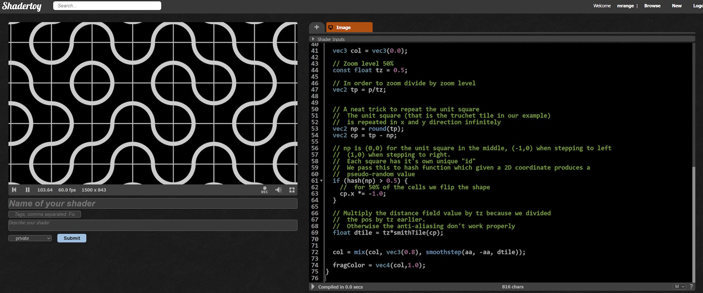
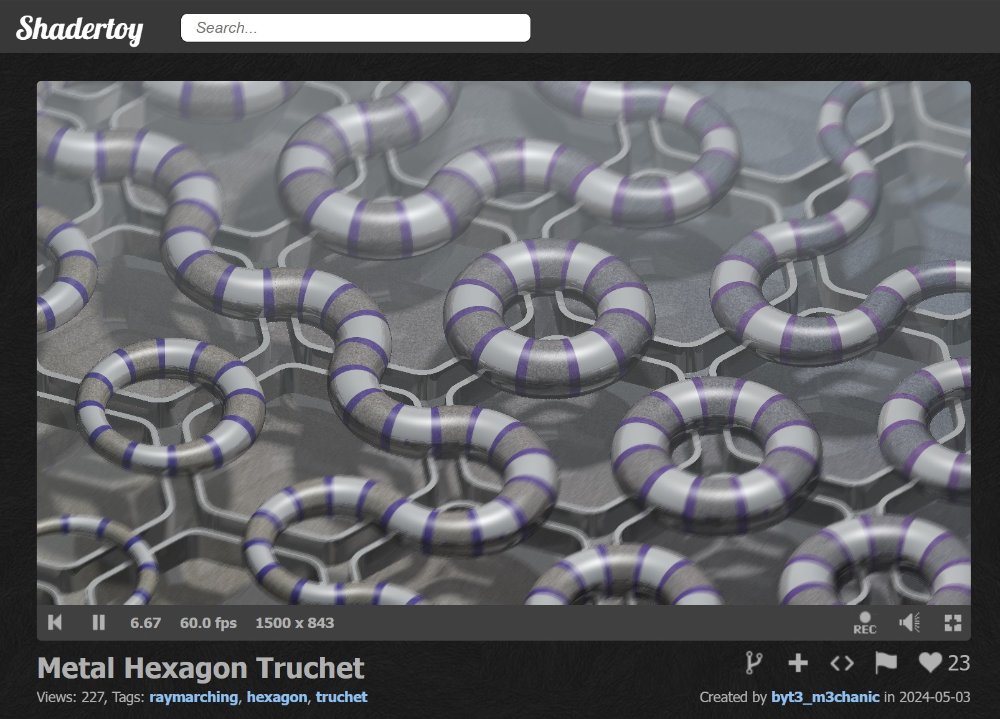

# 🎄⭐🎉 Festive Truchet Tiling to You All 🎉⭐🎄

🎅 *Merry Code-mas, shader fans!* 🎅

## 🎄 Why Truchet Patterns Are So Cool 🎄



Truchet patterns—or [Truchet tiles](https://en.wikipedia.org/wiki/Truchet_tiles)—are cool! With just a single tile, arranged randomly, you can create intricate, surprising designs.

Take the classic *Smith tile*, for example:
<p align="center">
  
</p>

This tile is simple: it fits with itself, no matter how you rotate it. Fill a whole grid with random rotations of the Smith tile, and suddenly, you’ve got an endlessly fascinating pattern:


For some retro feeling, there’s even the classic C64 trick that randomly fills the screen with slashes (`\`) and backslashes (`/`), creating an unexpected maze-like effect.

```basic
10 PRINT CHR$(205.5+RND(1));
20 GOTO 10
```

Try this on a C64 emulator and be surprised!


## ❓❓ So, How Do We Make a Shader Out of This? ❓❓

Step one: [create a new ShaderToy shader](https://www.shadertoy.com/new).

Let’s start simple by making a Smith tile in GLSL. Think of each tile as a square (side = 1), with two circles centered in opposite corners, each with a radius of 0.5. Throw in a border square and you’ve got your base tile!

Let's begin by defining the helper functions for the box and circle:
```glsl
// Found here: https://iquilezles.org/articles/distfunctions2d/
// Distance function for a 2D box centered at the origin
// - p: point to measure distance from
// - b: half-width of the box
float sdBox(in vec2 p, in vec2 b) {
    vec2 d = abs(p) - b;
    return length(max(d, 0.0)) + min(max(d.x, d.y), 0.0);
}

// Returns distance field for a circle outline with radius r and width w
// - p: point to measure distance from
// - r: radius of the circle
// - w: width of the circle outline
float sdCircle(vec2 p, float r, float w) {
    float d = length(p) - r;  // Distance from circle of radius r
    d = abs(d);               // Convert to an outline (absolute distance)
    d -= w;                   // Make outline have thickness w
    return d;
}
```

Using these functions we can now define the smith tile:
```glsl
// Creates a Smith Truchet tile with two quarter-circle arcs and a box outline
// - p: point to measure distance from
float smithTile(vec2 p) {
    // Calculate distance to each circle arc
    float dcircle0 = sdCircle(p - 0.5, 0.5, 0.05);
    float dcircle1 = sdCircle(p + 0.5, 0.5, 0.05);
    // Calculate distance to the surrounding box
    float dbox = abs(sdBox(p, vec2(0.5))) - 0.01;

    // Combine distances: take the minimum of arcs and box to form the shape
    float d = min(dcircle0, dcircle1);
    d = min(d, dbox);
    return d;
}
```

Here is the complete example:
```glsl
// Found here: https://iquilezles.org/articles/distfunctions2d/
// Distance function for a 2D box centered at the origin
// - p: point to measure distance from
// - b: half-width of the box
float sdBox(in vec2 p, in vec2 b) {
    vec2 d = abs(p) - b;
    return length(max(d, 0.0)) + min(max(d.x, d.y), 0.0);
}

// Returns distance field for a circle outline with radius r and width w
// - p: point to measure distance from
// - r: radius of the circle
// - w: width of the circle outline
float sdCircle(vec2 p, float r, float w) {
    float d = length(p) - r;  // Distance from circle of radius r
    d = abs(d);               // Convert to an outline (absolute distance)
    d -= w;                   // Make outline have thickness w
    return d;
}

// Creates a Smith Truchet tile with two quarter-circle arcs and a box outline
// - p: point to measure distance from
float smithTile(vec2 p) {
    // Calculate distance to each circle arc
    float dcircle0 = sdCircle(p - 0.5, 0.5, 0.05);
    float dcircle1 = sdCircle(p + 0.5, 0.5, 0.05);
    // Calculate distance to the surrounding box
    float dbox = abs(sdBox(p, vec2(0.5))) - 0.01;

    // Combine distances: take the minimum of arcs and box to form the shape
    float d = min(dcircle0, dcircle1);
    d = min(d, dbox);
    return d;
}

void mainImage(out vec4 fragColor, in vec2 fragCoord) {
    // Normalize fragment coordinates to range [-aspect, aspect] for x, [-1, 1] for y
    vec2 p = (-iResolution.xy + 2.0 * fragCoord) / iResolution.yy;

    // Estimate pixel size for anti-aliasing (smooths tile edges)
    float aa = sqrt(2.0) / iResolution.y;

    // Set initial background color
    vec3 col = vec3(0.0);

    // Compute the Smith tile distance field at point p
    float dtile = smithTile(p);

    // Mix background and tile color, applying anti-aliasing with smoothstep
    col = mix(col, vec3(0.8), smoothstep(aa, -aa, dtile));

    fragColor = vec4(col, 1.0);  // Output final color
}
```



To smooth out those sharp pixel edges, I use a little trick with `smoothstep` to blend the foreground and background colors nicely. By estimating the pixel size as `float aa = sqrt(2.)/iResolution.y;`, we can set up `smoothstep(aa, -aa, dtile)` to gradually shift from one color to another as the distance field `dtile` moves from inside (negative) to outside (positive) the tile. This keeps the borders smooth and anti-aliased—a handy technique I come back to again and again.

## ♾️ Infinite Tiles, Minimal Effort ♾️

One of the joys of shaders? You can often repeat an object endlessly at almost no extra cost! This concept, called domain repetition, lets us create a seamless, infinite grid of Truchet tiles with just a few lines of code. One simple way of repeating the unit square is this simple code:

```glsl
vec2 tp = p;
// Repeat the unit square infinitely in x and y directions
vec2 np = round(tp);   // Nearest integer coordinates
vec2 cp = tp - np;     // Coordinates within the unit square

float dtile = smithTile(cp);
```

Applying simple domain repetition to the Smith tile creates a wavy, hypnotic pattern. It’s nice, but we can spice it up by adding a dash of pseudo-randomness! To do that, we’ll introduce a `hash` function that will be used to randomize the rotation of each tile.

```glsl
// Produces a pseudo-random value based on a 2D coordinate
// - co: input coordinate for generating randomness
float hash(vec2 co) {
    return fract(sin(dot(co.xy, vec2(12.9898, 58.233))) * 13758.5453);
}
```

We then use `hash` to flip half of the tiles.

```glsl
vec2 cp = tp - np;

// np gives a unique "id" for each square in the grid
// Generate a pseudo-random value based on this unique id
if (hash(np) > 0.5) {
    // Flip the shape horizontally for 50% of the tiles
    cp.x *= -1.0;
}

float dtile = smithTile(cp);
```

This randomization kicks things up a notch, but we’re only seeing a small section of the plane.

To explore more (or less!) of the pattern, let’s add a zoom feature that lets us scale in and out, revealing different levels of detail across the tiled plane.

```glsl
// Set zoom level (e.g., 50%)
const float tz = 0.5;

// Adjust position for zooming by dividing by zoom level
vec2 tp = p / tz;

// ... the rest of the code from the sample

// Multiply the distance field value by the zoom level tz
// This ensures anti-aliasing works correctly
float dtile = tz * smithTile(cp);
```

You can now change `tz` to zoom in and out.

You can see the entire example below:

```glsl
// Found here: https://iquilezles.org/articles/distfunctions2d/
// Distance function for a 2D box centered at the origin
// - p: point to measure distance from
// - b: half-width of the box
float sdBox(in vec2 p, in vec2 b) {
    vec2 d = abs(p) - b;  // Calculate distance to box edges
    return length(max(d, 0.0)) + min(max(d.x, d.y), 0.0);
}

// Returns distance field for a circle outline with radius r and width w
// - p: point to measure distance from
// - r: radius of the circle
// - w: width of the circle outline
float sdCircle(vec2 p, float r, float w) {
    float d = length(p) - r;  // Distance from circle of radius r
    d = abs(d);               // Convert to an outline (absolute distance)
    d -= w;                   // Make outline have thickness w
    return d;
}

// Creates a Smith Truchet tile with two quarter-circle arcs and a box outline
// - p: point to measure distance from
float smithTile(vec2 p) {
    // Calculate distance to each circle arc
    float dcircle0 = sdCircle(p - 0.5, 0.5, 0.05);
    float dcircle1 = sdCircle(p + 0.5, 0.5, 0.05);
    // Calculate distance to the surrounding box
    float dbox = abs(sdBox(p, vec2(0.5))) - 0.01;

    // Combine distances: take the minimum of arcs and box to form the shape
    float d = min(dcircle0, dcircle1);
    d = min(d, dbox);
    return d;
}

// Produces a pseudo-random value based on a 2D coordinate
// - co: input coordinate for generating randomness
float hash(vec2 co) {
    return fract(sin(dot(co.xy, vec2(12.9898, 58.233))) * 13758.5453);
}

void mainImage(out vec4 fragColor, in vec2 fragCoord) {
    // Normalize fragment coordinates to range [-aspect, aspect] for x, [-1, 1] for y
    vec2 p = (-iResolution.xy + 2.0 * fragCoord) / iResolution.yy;

    // Estimate pixel size for anti-aliasing (smooths tile edges)
    float aa = sqrt(2.0) / iResolution.y;

    // Set initial background color
    vec3 col = vec3(0.0);

    // Set zoom level (e.g., 50%)
    const float tz = 0.5;

    // Adjust position for zooming by dividing by zoom level
    vec2 tp = p / tz;

    // Repeat the unit square infinitely in x and y directions
    vec2 np = round(tp);   // Nearest integer coordinates
    vec2 cp = tp - np;     // Coordinates within the unit square

    // np gives a unique "id" for each square in the grid
    // Generate a pseudo-random value based on this unique id
    if (hash(np) > 0.5) {
        // Flip the shape horizontally for 50% of the tiles
        cp.x *= -1.0;
    }

    // Multiply the distance field value by the zoom level tz
    // This ensures anti-aliasing works correctly
    float dtile = tz * smithTile(cp);

    // Blend the background color and tile color using smoothstep for anti-aliasing
    col = mix(col, vec3(0.8), smoothstep(aa, -aa, dtile));

    // Output the final color
    fragColor = vec4(col, 1.0);
}
```




With the box shape we added, the Truchet tiles are easy to spot. But if we remove the box, the pattern becomes more subtle, making the effect a bit harder to decipher.

```
float smithTile(vec2 p) {
  float dcircle0 = sdCircle(p-0.5, 0.5, 0.05);
  float dcircle1 = sdCircle(p+0.5, 0.5, 0.05);

  float d = min(dcircle0, dcircle1);
  return d;
}
```

## 🎉🎁🎉 That’s it for today! 🎉🎁🎉

Truchet tiles are a fantastic way to create intriguing patterns, and there are endless possibilities—even multi-layered Truchet patterns! If you’re up for some holiday shader fun, why not tinker with them yourself?

For inspiration, check out these awesome Truchet shaders by [Shane](https://www.shadertoy.com/user/Shane), like the [quadtree Truchet](https://www.shadertoy.com/view/4t3BW4) or the mesmerizing [Hyperbolic Poincare Weave](https://www.shadertoy.com/view/tljyRR). And [byt3_m3chanic](https://www.shadertoy.com/user/byt3_m3chanic) has crafted some amazing Truchet shaders too, often in 3D, like [this one](https://www.shadertoy.com/view/lcySzz).



Of course, these examples are more complex than what I shown above, but they build on the same core ideas—just taken to new heights.

Wishing you all…

✨🎄🎁 A festive season filled with shader magic and perhaps even a new GPU under the tree! 🎁🎄✨

🎅 - mrange

## ❄️Licensing Information❄️

All code content I created for this blog post is licensed under [CC0](https://creativecommons.org/public-domain/cc0/) (effectively public domain). Any code snippets from other developers retain their original licenses.

The text content of this blog is licensed under [CC BY-SA 4.0](https://creativecommons.org/licenses/by-sa/4.0/) (the same license as Stack Overflow).