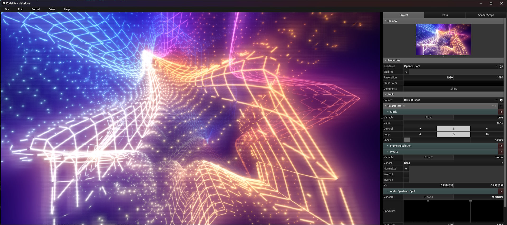
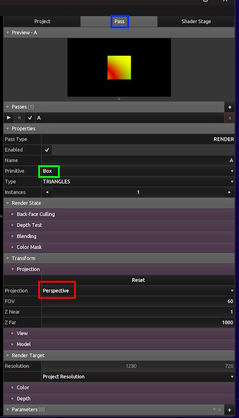
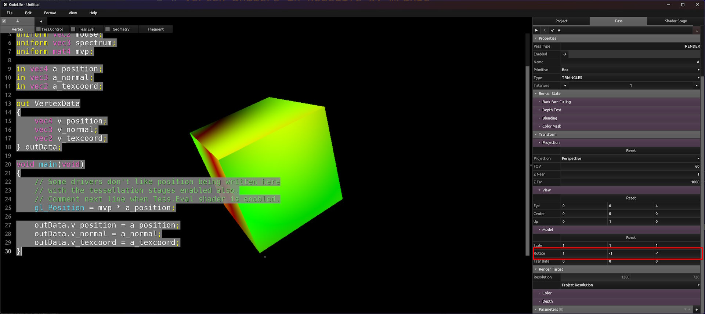
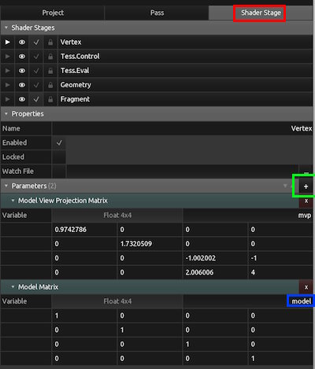
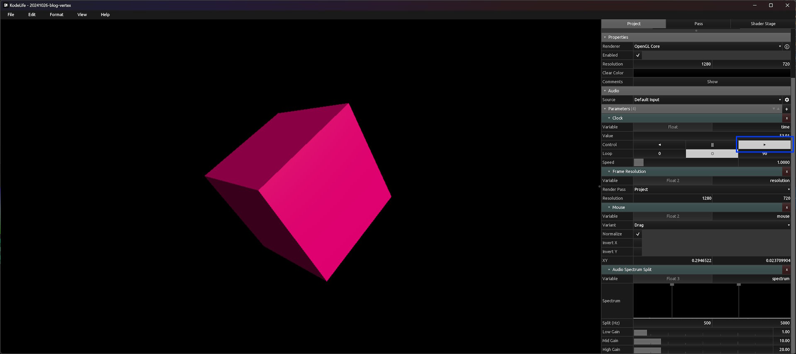
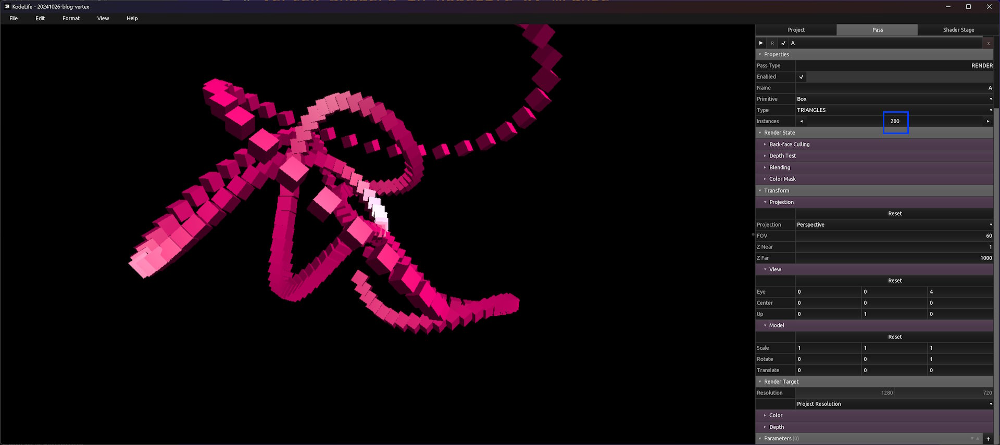
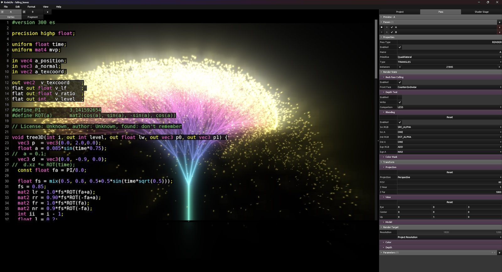

# 🎄🌟🎄 Vertex Shaders in KodeLife 🎄🌟🎄

🎅Ho, ho, ho! Merry Christmas!🎅

Many of us know [ShaderToy](https://www.shadertoy.com/) as a playground for experimenting with and sharing Fragment Shaders (also called Pixel Shaders in DirectX). But there's another type of shader that often flies under the radar: Vertex Shaders. Though less popular among shader enthusiasts, vertex shaders unlock a new world of possibilities—especially when combined with fragment shaders.

Take, for example, our 4KiB intro *Delusions of Mediocrity*. Here, most of the magic happens in the vertex shader, which generates vertices using a supershape formula. The fragment shaders handle the colors and post-processing effects.


## Getting Started with Vertex Shaders

Vertex shaders can be a bit trickier to work with than fragment shaders, but I’ll walk through some basics to help you get started.

For these examples, I’m using [KodeLife by Hexler](https://hexler.net/kodelife). KodeLife is a versatile tool that’s free to use, though it does include a gentle reminder to support the developers.

When you launch KodeLife, it sets you up with an initial template. Usually, I dive straight into the fragment shader, but this time, let’s explore the vertex shader instead.

I’ve added code comments to clarify the key differences from fragment shaders.
```glsl
#version 150

// ==== Input Uniforms ====
// Uniforms are global variables that remain constant across all vertices
// They are set by the application (KodeLife in this case)
uniform float time;        // Time since shader started (in seconds)
uniform vec2 resolution;   // Window size in pixels
uniform vec2 mouse;        // Mouse position in pixels
uniform vec3 spectrum;     // Audio spectrum data

// ==== Transform Matrix ====
// The Model-View-Projection (MVP) matrix is crucial for 3D rendering
// It combines three transformations:
// 1. Model: Positions object in world space
// 2. View: Positions camera in world
// 3. Projection: Converts 3D coordinates to 2D screen space
uniform mat4 mvp;

// ==== Vertex Attributes ====
// These are unique inputs for each vertex in your 3D model
in vec4 a_position;  // Vertex position in model space (x, y, z, w)
in vec3 a_normal;    // Surface normal at vertex (for lighting)
in vec2 a_texcoord;  // Texture coordinates (UV mapping)

// ==== Outputs to Fragment Shader ====
// This struct contains data that will be interpolated and passed
// to each fragment (pixel) between vertices
out VertexData {
    // We often want to pass the original position for effects
    // This position hasn't been transformed by MVP, useful for
    // things like lighting calculations
    vec4 v_position;

    // Surface normal, essential for lighting calculations
    // Interpolated between vertices for smooth lighting
    vec3 v_normal;

    // Texture coordinates for mapping images or patterns
    // These are interpolated for each fragment
    vec2 v_texcoord;
} outData;

void main(void) {
    // ==== Required Output ====
    // gl_Position is a special output variable that defines
    // where this vertex appears on screen
    // The MVP matrix transforms the vertex from model space
    // to screen space coordinates
    gl_Position = mvp * a_position;

    // ==== Pass-through Values ====
    // In this basic shader, we're simply forwarding the input
    // attributes to the fragment shader. More complex shaders
    // might transform these values first
    outData.v_position = a_position;  // Original position
    outData.v_normal = a_normal;      // Original normal
    outData.v_texcoord = a_texcoord;  // Original UV coordinates
}
```

## 🌟First Step: Let’s Switch It Up🌟

What we see initially in KodeLife is technically a 3D model, but it appears flat because we’re using a quad with an orthographic projection.

Let’s change that. We’ll swap the quad for a box (known as a “Primitive” in KodeLife) and switch to a perspective projection for a true 3D feel.

Go to the **Pass** tab, set **Primitive** to “Box,” and change **Projection** to “Perspective.”



Now the view changes, showing a square in the center of the screen. That square is actually a box! You’ll see this more clearly by adjusting some parameters under **Model** in KodeLife. For instance, I set **Rotate** to `(1, -1, -1)` to reveal the box’s 3D shape:



## 🕯️ Let’s Shade the Cube🕯️

Growing up with computers in the 1980s, I’ve always loved rotating cubes; in fact, I believe that’s what computers were made for!

Now, let’s give the cube a more natural look by shading its sides with a basic fragment shader.

Replace the current fragment shader with this code to add simple lighting. I’ve included comments to explain what each part does.
```glsl
#version 150

// ==== Basic Uniforms ====
// Unlike ShaderToy, KodeLife uses different uniform names
// ShaderToy's iTime becomes simply 'time' here
uniform float time;

// ==== Vertex Shader Input ====
// In ShaderToy, you only work with fragment shaders and get UV coordinates
// In a full 3D pipeline, the vertex shader passes interpolated data to us
in VertexData {
    vec4 v_position;  // Position in model space
    vec3 v_normal;    // Surface normal (interpolated)
    vec2 v_texcoord;  // Texture coordinates (UV)
} inData;
// Note: Values are automatically interpolated between vertices
// Use the 'flat' qualifier if you need exact vertex values instead

// ==== Output ====
// ShaderToy uses fragColor by convention - same here!
out vec4 fragColor;

// ==== Scene Setup ====
// Light and camera configuration
// In a real application, these would typically be uniforms
const vec3 lightDir = normalize(vec3(1, 1, 2));  // Light direction
const vec3 cameraPos = vec3(0, 0, 4);           // Matches KodeLife's "eye" parameter

void main(void) {
    // ==== Diffuse Lighting ====
    // Calculate how directly the surface faces the light
    float diffuse = max(dot(lightDir, inData.v_normal), 0.0);
    // Square the value for a more metallic appearance
    diffuse *= diffuse;
    // Add ambient light to prevent completely dark areas
    float ambient = 0.05;
    float lighting = diffuse + ambient;

    // ==== Specular Highlights ====
    // Calculate reflection vector for specular lighting
    vec3 rayDir = normalize(inData.v_position.xyz - cameraPos);
    vec3 reflectDir = reflect(rayDir, inData.v_normal);

    // Compute specular intensity
    // Higher power (10.0) = smaller, sharper highlights
    float specular = pow(max(dot(lightDir, reflectDir), 0.0), 10.0);

    // ==== Final Color Composition ====
    vec3 color = vec3(0.0);
    vec3 diffuseColor = vec3(1.0, 0.0, 0.25);  // Pinkish-red base color

    // Add diffuse and specular contributions
    color += lighting * diffuseColor;  // Diffuse color
    color += specular;                 // Add white specular highlight

    // ==== Color Space Conversion ====
    // Most displays expect sRGB color space (standardized in 1996)
    // While sRGB is becoming dated with OLED and newer display tech,
    // we still need to convert our linear RGB values to match expected input
    //
    // Proper sRGB conversion is more complex, but sqrt() provides a decent
    // approximation for our purposes here
    color = sqrt(color);

    // Output final color with full opacity
    fragColor = vec4(color, 1.0);
}
```

Now, you should see a cube with pink sides. However, when you try rotating it by changing the view parameters, the shading remains static. This is because we aren’t applying the model transform to the vertex positions and normals in the vertex shader.

Let’s fix that.

The Model-View-Projection (MVP) transform combines three matrices: model, view, and projection. Here, we need the model transform, but we can’t directly split MVP into these individual components.

Luckily, KodeLife lets us add the model transform as a uniform input to our vertex shader.



1. Make sure you’re editing the vertex shader.
2. Click on the shader stage, then under **Parameters**, click `+` to add a uniform.
3. Find the model transform under **Built-in > Transform > Model** and add it.
4. Rename the uniform to `model`.

Now, in the vertex shader source code, add this `model` uniform below the `mvp` uniform.
```glsl
// Locate the line below in the file to find and add the model uniform like below
uniform mat4 mvp;
// The model matrix handles object-space transformations only
// This is useful when we need the vertex position in world space,
// for example when calculating lighting
uniform mat4 model;
```

Finally modify the main method of the vertex shader:
```glsl
void main(void) {
    // ==== Screen-Space Position ====
    // Transform vertex to final screen position using combined MVP matrix
    gl_Position = mvp * a_position;

    // ==== World-Space Position ====
    // Transform vertex to world space using only the model matrix
    // Order matters! Matrix multiplication is not commutative:
    // model * position ≠ position * model
    outData.v_position = model * a_position;

    // ==== Normal Transform ====
    // Transform the normal vector to world space
    // We convert model matrix to 3x3 by dropping the translation component
    // because:
    // 1. Normals are vectors (direction only), not points in space
    // 2. Translation doesn't affect direction vectors
    // 3. mat3(model) extracts just the rotation/scale components
    outData.v_normal = mat3(model) * a_normal;

    // ==== Texture Coordinates ====
    // UV coordinates pass through unchanged
    // They're already in texture space (0 to 1 range)
    outData.v_texcoord = a_texcoord;
}
```

Now, the cube’s lighting should respond to rotation. To make the lighting effect more pronounced, try switching the **Primitive** from “Box” to “Teapot” or “Monkey” and see how the shading adapts.

Once you’ve explored the different models, switch back to “Box” so we can add a new element: *time*.

## 🎁Creating a Classic Rotating Cube🎁

By using a rotation matrix that changes over time, we can achieve that classic rotating cube effect.

Replace the vertex shader with the code below:
```glsl
#version 150

// ==== Input Uniforms ====
uniform float time;        // Time in seconds
uniform mat4 mvp;         // Model-View-Projection matrix
uniform mat4 model;       // Model matrix

// ==== Vertex Attributes ====
in vec4 a_position;
in vec3 a_normal;
in vec2 a_texcoord;

// ==== Output to Fragment Shader ====
out VertexData {
    vec4 v_position;
    vec3 v_normal;
    vec2 v_texcoord;
} outData;

// ==== Rotation Matrix Functions ====
// These functions create 3x3 rotation matrices for each axis
// They use the standard rotation matrices from linear algebra:
// https://en.wikipedia.org/wiki/Rotation_matrix#Basic_rotations

// Rotate around X axis (pitch)
mat3 rotX(float angle) {
    float c = cos(angle);
    float s = sin(angle);
    return mat3(
        1.0, 0.0, 0.0,  // First column
        0.0,  +c,  +s,  // Second column
        0.0,  -s,  +c   // Third column
    );
}

// Rotate around Y axis (yaw)
mat3 rotY(float angle) {
    float c = cos(angle);
    float s = sin(angle);
    return mat3(
        +c, 0.0,  +s,   // First column
        0.0, 1.0, 0.0,  // Second column
        -s, 0.0,  +c    // Third column
    );
}

// Rotate around Z axis (roll)
mat3 rotZ(float angle) {
    float c = cos(angle);
    float s = sin(angle);
    return mat3(
        +c,  +s, 0.0,   // First column
        -s,  +c, 0.0,   // Second column
        0.0, 0.0, 1.0   // Third column
    );
}

void main(void) {
    // ==== Create Time-Based Rotation ====
    // Combine rotations around all three axes:
    // - Base rotation around X axis with time
    // - Slower rotation around Y axis (sqrt(0.5) ≈ 0.707)
    // - Even slower rotation around Z axis (0.3 * sqrt(0.5) ≈ 0.212)
    // Different speeds create a more interesting animation pattern
    mat3 trot3 = rotX(time) *
                 rotY(sqrt(0.5) * time) *
                 rotZ(0.3 * sqrt(0.5) * time);

    // Convert 3x3 rotation to 4x4 matrix for position transforms
    // The mat4 constructor preserves rotation and adds identity translation
    mat4 trot4 = mat4(trot3);

    // ==== Apply Transformations ====
    // Transform vertex to screen space:
    // 1. Apply our time-based rotation (trot4)
    // 2. Apply the combined MVP matrix from KodeLife
    gl_Position = (mvp * trot4) * a_position;

    // Transform position to world space:
    // 1. Apply time-based rotation
    // 2. Apply model matrix for world position
    outData.v_position = (model * trot4) * a_position;

    // Transform normal to world space:
    // Use 3x3 matrices since normals don't need translation
    outData.v_normal = (mat3(model) * trot3) * a_normal;

    // Pass through texture coordinates unchanged
    outData.v_texcoord = a_texcoord;
}
```

By now, your setup should look something like this:



If it’s not rotating yet, you may need to hit the **Play** button to start the timer.

## 🎉Let’s Kick It Up a Notch🎉

A single rotating cube is cool, but you know what’s cooler? A lot of rotating cubes.

We can achieve this with *instancing*. Instancing allows us to take a single shape (like our cube) and repeat it multiple times, modifying the output in the vertex shader based on each instance’s unique ID.

Replace the vertex shader with the code below:
```glsl
#version 150

// ==== Input Uniforms ====
uniform float time;        // Time in seconds
uniform mat4 mvp;         // Model-View-Projection matrix
uniform mat4 model;       // Model matrix

// ==== Vertex Attributes ====
in vec4 a_position;
in vec3 a_normal;
in vec2 a_texcoord;

// ==== Output to Fragment Shader ====
out VertexData {
    vec4 v_position;
    vec3 v_normal;
    vec2 v_texcoord;
} outData;

// ==== Rotation Matrix Functions ====
// These functions create rotation matrices for each axis
mat3 rotX(float angle) {
    float c = cos(angle);
    float s = sin(angle);
    return mat3(
        1.0, 0.0, 0.0,
        0.0,  +c,  +s,
        0.0,  -s,  +c
    );
}

mat3 rotY(float angle) {
    float c = cos(angle);
    float s = sin(angle);
    return mat3(
        +c, 0.0,  +s,
        0.0, 1.0, 0.0,
        -s, 0.0,  +c
    );
}

mat3 rotZ(float angle) {
    float c = cos(angle);
    float s = sin(angle);
    return mat3(
        +c,  +s, 0.0,
        -s,  +c, 0.0,
        0.0, 0.0, 1.0
    );
}

void main(void) {
    // ==== Constants and Instance Setup ====
    const float tau = 2.*acos(-1.);  // 2π, full circle in radians

    // Configure instancing parameters
    const float numberOfInstances = 200.0;  // Should match KodeLife's instance count
    // Controls the "spread" of instances in space
    const float angleMul = tau * numberOfInstances / 40.0;

    // Convert instance ID to normalized range [0,1]
    // gl_InstanceID is built-in, unique per instance (0, 1, 2, ...)
    float instanceProgress = float(gl_InstanceID) / numberOfInstances;

    // Slow down time for smoother animation
    float animationTime = 0.5 * time;

    // ==== Position Modification ====
    // Start with the original vertex position
    vec4 pos = a_position;

    // Create unique wave patterns for each instance
    float wave = 0.25 + cos(0.25 * angleMul * instanceProgress + animationTime);
    pos.x += 13.0 * wave * sin(angleMul * instanceProgress + animationTime);
    pos.y += 17.0 * wave * sin(0.25 * angleMul * instanceProgress + animationTime);
    pos.z += 19.0 * wave * cos(angleMul * instanceProgress + animationTime);

    // ==== Rotation Animation ====
    // Create unique rotation angle for each instance
    float rotationAngle = animationTime + instanceProgress * tau * 2.0;

    // Combine rotations at different speeds for complexity
    mat3 trot3 = rotX(rotationAngle) *
                 rotY(sqrt(0.5) * rotationAngle) *
                 rotZ(0.3 * sqrt(0.5) * rotationAngle);

    // Scale positions by 0.1 to make the cubes fit inside the screen
    mat4 trot4 = mat4(0.1 * trot3);

    // ==== Final Transformations ====
    // Transform to screen space with all effects applied
    gl_Position = (mvp * trot4) * pos;

    // Transform to world space for fragment shader
    outData.v_position = (model * trot4) * pos;
    outData.v_normal = (mat3(model) * trot3) * a_normal;
    outData.v_texcoord = a_texcoord;
}
```

Not seeing a change? Increase the instance count in KodeLife:



Now you should have 200 animated cubes filling the screen!

If you’re having trouble getting these examples to work, you can download the [KodeLife project here](200_boxes.klproj).

## 🎁That’s a Wrap 🎁

I hope this gave you a quick introduction to tinkering with vertex shaders to create fun effects.

To give you a little extra inspiration, I’ve dug up a few of my incomplete (and possibly buggy) shaders from my personal library. They’re in the same state they were when I last worked on them, so use at your own risk!

1. [mrange & Virgill - *Delusions of Mediocrity* (Windows 4K intro)](delusions.klproj)
2. [Fractal 2D Tree](2d_tree.klproj)
3. [Fractal 3D Tree](falling_leaves.klproj)
4. [Parametric 3D Shapes](parametric3d.klproj)
5. [Solid Supershape](solid_supershapes.klproj)
6. [Neonwave Sunset](neonwave.klproj)
7. ["Star" Scroller](starscroller_variant.klproj)
8. [Underwater Bubbles](bubble_bobble.klproj)




Merry christmas all!

🎅 - mrange


## ❄️Licensing Information❄️

All code content I created for this blog post, including the linked KodeLife sample code, is licensed under [CC0](https://creativecommons.org/public-domain/cc0/) (effectively public domain). Any code snippets from other developers retain their original licenses.

The text content of this blog is licensed under [CC BY-SA 4.0](https://creativecommons.org/licenses/by-sa/4.0/) (the same license as Stack Overflow).