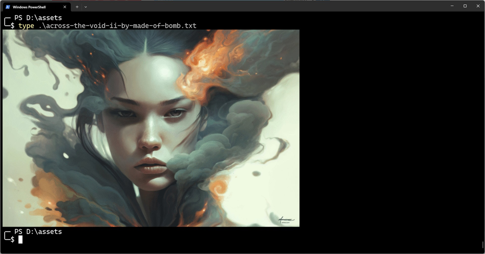
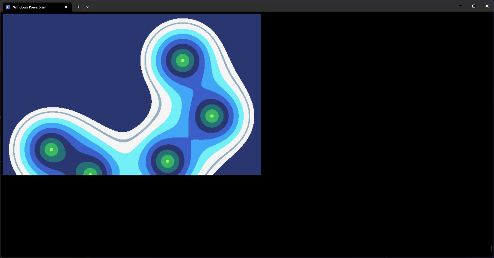

# 🎄🌟🎄 Sixel Graphics in Windows Terminal and Beyond 🎄🌟🎄

🎅 Ho, ho, ho! Merry Christmas, fellow demo-coders! 🎅

## 🏙️ Sixel? Did you mean Pixel? 🏙️

No typo here—*Sixel* is real! It was introduced in the late 1970s by DEC as a way to produce high-resolution images on early printers. Sixel graphics are still supported by many terminals and were recently added to Windows Terminal Preview.


*[Across The Void II by Made/Bomb](https://demozoo.org/graphics/342269/) (3rd place Revision 2024) in Windows Terminal*

For us demo coders, Sixel offers a nifty way to create graphics directly in the terminal—an approach that's both cool and unexpected for most people. It’s an alternative to opening a window, and it might even save some bytes for those size-coding competitions!

Let’s create a simple effect with Sixels using C#.

## 🚀 Getting Started 🛠️

First, let’s detect if the terminal supports Sixel graphics. We do this by sending a special command, `\x1B[c`, which prompts the terminal to respond with its capabilities. (`\x1B` is the escape character, used for sending commands to terminals.)

```csharp
// Ask the terminal for its capabilities
Console.Write("\x1B[c");

// Wait for the terminal to respond
Thread.Sleep(100);
```

Next, we read the response to see if it includes a '4', which indicates Sixel support.

```csharp
var sb = new StringBuilder();
// Read all available input (non-blocking)
while (Console.KeyAvailable)
{
    var key = Console.ReadKey();
    sb.Append(key.KeyChar);
}

// Parse capabilities (semicolon-separated)
var caps = sb
    .ToString()
    .Split(";")
    .Select(x => x.Trim())
    .ToHashSet();

// Check if Sixel support is present (capability code '4')
if (!caps.Contains("4"))
{
    throw new Exception("Terminal does not support Sixel graphics");
}
```

**IMPORTANT**: To run this example, you'll need a Sixel-compatible terminal, such as Windows Terminal version 1.22.2912.0+ (currently in preview). You can find it in the Windows Store.

Now we can set up the terminal for graphics using some more special commands:

```csharp
// Hide the cursor
Console.Write("\x1B[?25l");
// Clear the screen
Console.Write("\x1B[2J");
```

Let’s set up a screen buffer for our graphics:

```csharp
// Screen dimensions
const int Width = 640;
const int Height = 400;
// Screen buffer - each byte represents one pixel
// Uses 4-bit color (16 colors) from the TIC-80 palette
// Values 0-15 map to indices in the tic80Palette array
var screen = new byte[Width * Height];
```

## 🎨 Implementing a Simple Effect ✨

Now that our screen is set up, let’s create a simple effect. Here, we’ll compute distance fields for circles following a wavy, sinusoidal path. Then, we’ll combine these distance fields with `SoftMin` to give a smooth, blobby, meta-ball look.
I won’t dive too deep into the math behind it—the main event is coming up next! We’ll take this screen data and map it to a Sixel image, then “print” it right in the terminal.

## 🖼️ Converting an Image into Sixels 🖼️

To start displaying our effect at the top of the terminal, we first move the cursor to the top and clear the screen.

In Sixel graphics, each "sixel" is a block of six pixels stacked vertically. This means we’ll group every 6 rows of pixels from our image into a single row of sixels.

A sixel itself is a 6-bit value where each bit represents one of the six vertical pixels. A `0` bit leaves the pixel as-is, and a `1` bit colors it in the currently selected color. Think of it like an old-school dot-matrix printer: it punches color through at specific points to build up an image.

### Step 1: Define the Color Palette

For our colors, let’s use the TIC-80 palette, which is a charming retro palette perfect for a demo effect. This palette gives us 16 colors to work with.

### Step 2: Encode Pixels by Color

For each color in our palette:
1. Loop through every pixel on the screen.
2. If a pixel matches the current color, set the corresponding bit in the sixel to `1`.
3. This way, we build up a sixel with bits indicating where this color appears in that 6-pixel stack.

### Step 3: Convert Sixels to ASCII Values

Each sixel is a 6-bit value, which we convert into a 7-bit ASCII character. This encoding starts at ASCII 63 (`?`), where:
- `?` represents an empty sixel (all bits `0`).
- `~` (ASCII 126) represents a fully filled sixel (all bits `1`).

### Step 4: Optimize the Output

To make the output efficient, Sixel encoding supports run-length encoding:
- If you need to repeat a sixel multiple times, you can send a sequence like `!10~` to print `~` ten times.
- For short repeats (up to 3 sixels), just repeat the character, like `~~~`.

You can also skip a sequence of trailing `?` sixels on a line, as they add no output.

### Step 5: Move the “Printer Head”

At the end of each color line, add `$` to reset the "printer head" to the start of the line.
After processing each color, add `-` to move the "printer head" down to the next line.

## 🖨️ Generating the Sixel Image 🌈

Now let’s put it all together! Here are the steps to render the sixel image, along with the escape sequences needed for each step:

1. **Move the cursor to the top**: Send `\x1B[H`.
2. **Clear the terminal**: Send `\x1B[12t`.
3. **Start the sixel image**: Send `\x1BP7;1;q` to begin a new sixel graphic.
4. **Define the color palette**: For each color in the palette, send `#COLOR_INDEX;2;RED-0-100;BLUE-0-100;GREEN-0-100`, where color values are percentages (0 to 100) of each channel.

5. **Group rows into sixes**: Since each sixel represents 6 vertical pixels, group your image rows accordingly.

6. **Render each color in the palette**:
   - Start each row for a color by selecting it: send `#COLOR_INDEX`.
   - For each pixel in the row group, if it matches the current color, set the corresponding bit in the sixel (base sixel value is `?`, ASCII 63).

7. **Optimize with run-length encoding**:
   - Count consecutive identical sixels. If a sixel repeats multiple times, use run-length encoding (e.g., `!10~` for ten repetitions of `~`).
   - For shorter repeats (up to three sixels), simply repeat the character directly, like `~~~`.

8. **Send each sixel**: Output each sixel, either individually or using run-length encoding if there’s a repeat.

9. **End each row**: To reset the "printer head" for the next color, end the row with `$`.

10. **Advance to the next line**: After completing all colors for a row, send `-` to move down to the next line.

11. **Finish the sixel image**: End the sixel sequence with `\x1B\\`.

And there you have it! With this setup, your terminal should display the sixel image, ready to impress with that retro, demo-style effect.

In code it looks like this:

```csharp
// Render screen using Sixel graphics
{
    builder
        .Clear()
        .Append("\x1B[H")      // Move cursor to home position
        .Append("\x1B[12t")    // Clear screen
        .Append("\x1BP7;1;q")  // Initialize Sixel mode (square pixels)
        ;

    // Define color palette
    foreach (var color in tic80Palette)
    {
        builder.Append($"#{color.Index};2;{color.Red.ToSixelColorComponent()};{color.Green.ToSixelColorComponent()};{color.Blue.ToSixelColorComponent()}");
    }

    // Convert pixel data to Sixel format
    // Each Sixel represents 6 vertical pixels
    for (var y6 = 0; y6 < Height; y6 += 6)
    {
        // Process each color separately for RLE optimization
        foreach (var color in tic80Palette)
        {
            var idx = color.Index;
            builder.Append($"#{idx}");

            // Run-length encoding tracking
            byte repeatedSixel = SixelBase;
            int sixelRepetition = 0;

            for (var x = 0; x < Width; ++x)
            {
                byte sixel = 0;
                // Handle edge case where height isn't divisible by 6
                var rem = Min(6, Height - y6);

                // Build sixel by checking each vertical pixel
                for (var i = 0; i < rem; ++i)
                {
                    var y = y6 + i;
                    var pixel = screen[x + y * Width];
                    if (pixel == idx)
                    {
                        sixel |= (byte)(1 << i);
                    }
                }

                sixel += SixelBase;

                // Handle run-length encoding
                if (repeatedSixel == sixel)
                {
                    ++sixelRepetition;
                }
                else
                {
                    // Output previous run
                    if (sixelRepetition > 3)
                    {
                        // Use RLE for runs longer than 3
                        builder
                            .Append($"!{sixelRepetition}")
                            .Append((char)repeatedSixel);
                    }
                    else
                    {
                        // Direct output for short runs
                        for(var i = 0; i < sixelRepetition; ++i)
                        {
                            builder.Append((char)repeatedSixel);
                        }
                    }

                    repeatedSixel = sixel;
                    sixelRepetition = 1;
                }
            }

            // Output final run if not empty
            if (repeatedSixel != SixelBase)
            {
                if (sixelRepetition > 3)
                {
                    builder
                        .Append($"!{sixelRepetition}")
                        .Append((char)repeatedSixel);
                }
                else
                {
                    for(var i = 0; i < sixelRepetition; ++i)
                    {
                        builder.Append((char)repeatedSixel);
                    }
                }
            }

            builder.Append('$');  // Return to start of line
        }

        builder.Append('-');  // Move to next row
    }

    // End Sixel sequence
    builder.Append("\x1B\\");

    // Output to console
    Console.Write(builder.ToString());
}
```

Putting it all together, our final code should look something like this:



You can find the full code [here](sixel-app/Program.cs), and it's also included below for convenience:

```csharp
// First check if the terminal supports Sixel graphics
//  On Windows you can use Windows Terminal 1.22.2912.0+ (at the time of writing in preview)
//  You can find Windows Terminal in Windows Store.
{
    // Clear any pending input from STDIN
    while (Console.KeyAvailable)
    {
        Console.ReadKey();
    }

    // Ask the terminal for its capabilities
    Console.Write("\x1B[c");

    // Wait for the terminal to respond
    Thread.Sleep(100);

    var sb = new StringBuilder();
    // Read all available input (non-blocking)
    while (Console.KeyAvailable)
    {
        var key = Console.ReadKey();
        sb.Append(key.KeyChar);
    }

    // Parse capabilities (semicolon-separated)
    var caps = sb
        .ToString()
        .Split(";")
        .Select(x => x.Trim())
        .ToHashSet();

    // Check if Sixel support is present (capability code '4')
    if (!caps.Contains("4"))
    {
        throw new Exception("Terminal does not support Sixel graphics");
    }
}

// Hide the cursor
Console.Write("\x1B[?25l");
// Clear the screen
Console.Write("\x1B[2J");

// TIC-80 fantasy console color palette
// See: https://tic80.com/
RGB[] tic80Palette =
[
    new RGB(0x0, 0x1C, 0x1C, 0x2C), // Night Blue
    new RGB(0x1, 0x5D, 0x27, 0x5D), // Deep Purple
    new RGB(0x2, 0xB1, 0x3E, 0x53), // Dark Red
    new RGB(0x3, 0xEF, 0x7D, 0x57), // Orange
    new RGB(0x4, 0xFF, 0xCD, 0x75), // Yellow
    new RGB(0x5, 0xA7, 0xF0, 0x70), // Light Green
    new RGB(0x6, 0x38, 0xB7, 0x64), // Green
    new RGB(0x7, 0x25, 0x71, 0x79), // Teal
    new RGB(0x8, 0x29, 0x36, 0x6F), // Dark Blue
    new RGB(0x9, 0x3B, 0x5F, 0xC9), // Blue
    new RGB(0xA, 0x41, 0xA6, 0xF6), // Light Blue
    new RGB(0xB, 0x73, 0xEF, 0xF7), // Cyan
    new RGB(0xC, 0xF4, 0xF4, 0xF4), // White
    new RGB(0xD, 0x94, 0xB0, 0xC2), // Light Gray
    new RGB(0xE, 0x56, 0x6C, 0x86), // Gray
    new RGB(0xF, 0x33, 0x3C, 0x57)  // Dark Gray
];

// Sixel constants
const byte SixelBase = 63;  // Base character '?' (ASCII 63)

// Screen dimensions
const int Width = 640;
const int Height = 400;
// Screen buffer - each byte represents one pixel
// Uses 4-bit color (16 colors) from the TIC-80 palette
// Values 0-15 map to indices in the tic80Palette array
var screen = new byte[Width * Height];

var builder = new StringBuilder();
var clock = Stopwatch.StartNew();
var fps = 60;
var sleepFor = (int)Math.Round(1000.0 / fps);

var done = false;
while (!done)
{
    var before = clock.ElapsedMilliseconds;
    // Check for exit condition (Escape key)
    if (Console.KeyAvailable)
    {
        var key = Console.ReadKey();
        done |= key.Key == ConsoleKey.Escape;
    }

    // Generate a simple animated effect
    {
        var time = before / 1000.0;
        for (var y = 0; y < Height; ++y)
        {
            var yoff = y * Width;
            var yy = (-Height + 2.0 * y) / Height;
            for (var x = 0; x < Width; ++x)
            {
                var xx = (-Width + 2.0 * x) / Height;

                var d = 1E3;
                for (var i = 0; i < 5; ++i)
                {
                    var itime = time + i;
                    var xx2 = xx + Sin(itime);
                    var yy2 = yy + Sin(itime * 0.707);
                    var d2 = Sqrt(xx2 * xx2 + yy2 * yy2) - 0.5;
                    d = SoftMin(d, d2, 0.5);
                }

                var od = Abs(d) - 0.025;

                // Color selection based on distance field
                byte col = 8;
                if (d < 0.0)
                {
                    col = (byte)(((int)Round((d + time) * 16)) & 0xF);
                }
                if (od < 0.0)
                {
                    col = 12;
                }

                screen[x + yoff] = col;
            }
        }
    }

    // Render screen using Sixel graphics
    {
        builder
            .Clear()
            .Append("\x1B[H")      // Move cursor to home position
            .Append("\x1B[12t")    // Clear screen
            .Append("\x1BP7;1;q")  // Initialize Sixel mode (square pixels)
            ;

        // Define color palette
        foreach (var color in tic80Palette)
        {
            builder.Append($"#{color.Index};2;{color.Red.ToSixelColorComponent()};{color.Green.ToSixelColorComponent()};{color.Blue.ToSixelColorComponent()}");
        }

        // Convert pixel data to Sixel format
        // Each Sixel represents 6 vertical pixels
        for (var y6 = 0; y6 < Height; y6 += 6)
        {
            // Process each color separately for RLE optimization
            foreach (var color in tic80Palette)
            {
                var idx = color.Index;
                builder.Append($"#{idx}");

                // Run-length encoding tracking
                byte repeatedSixel = SixelBase;
                int sixelRepetition = 0;

                for (var x = 0; x < Width; ++x)
                {
                    byte sixel = 0;
                    // Handle edge case where height isn't divisible by 6
                    var rem = Min(6, Height - y6);

                    // Build sixel by checking each vertical pixel
                    for (var i = 0; i < rem; ++i)
                    {
                        var y = y6 + i;
                        var pixel = screen[x + y * Width];
                        if (pixel == idx)
                        {
                            sixel |= (byte)(1 << i);
                        }
                    }

                    sixel += SixelBase;

                    // Handle run-length encoding
                    if (repeatedSixel == sixel)
                    {
                        ++sixelRepetition;
                    }
                    else
                    {
                        // Output previous run
                        if (sixelRepetition > 3)
                        {
                            // Use RLE for runs longer than 3
                            builder
                                .Append($"!{sixelRepetition}")
                                .Append((char)repeatedSixel);
                        }
                        else
                        {
                            // Direct output for short runs
                            for(var i = 0; i < sixelRepetition; ++i)
                            {
                                builder.Append((char)repeatedSixel);
                            }
                        }

                        repeatedSixel = sixel;
                        sixelRepetition = 1;
                    }
                }

                // Output final run if not empty
                if (repeatedSixel != SixelBase)
                {
                    if (sixelRepetition > 3)
                    {
                        builder
                            .Append($"!{sixelRepetition}")
                            .Append((char)repeatedSixel);
                    }
                    else
                    {
                        for(var i = 0; i < sixelRepetition; ++i)
                        {
                            builder.Append((char)repeatedSixel);
                        }
                    }
                }

                builder.Append('$');  // Return to start of line
            }

            builder.Append('-');  // Move to next row
        }

        // End Sixel sequence
        builder.Append("\x1B\\");

        // Output to console
        Console.Write(builder.ToString());
    }

    // Maintain target framerate
    var after = clock.ElapsedMilliseconds;
    var elapsed = after - before;
    if (elapsed < sleepFor)
    {
        Thread.Sleep((int)(sleepFor - elapsed));
    }
}

// Helper functions
double Mix(double a, double b, double x)
{
    return a + (b - a) * x;
}

// Smooth minimum function
// License: MIT, author: Inigo Quilez
// Source: https://www.iquilezles.org/www/articles/smin/smin.htm
double SoftMin(double a, double b, double k)
{
    var h = Clamp(0.5 + 0.5 * (b - a) / k, 0.0, 1.0);
    return Mix(b, a, h) - k * h * (1.0 - h);
}

record RGB(byte Index, byte Red, byte Green, byte Blue);

static class Extensions
{
    // Convert 8-bit color component to Sixel color range (0-100)
    public static byte ToSixelColorComponent(this byte c)
    {
        return (byte)Round(c * 100.0 / 255);
    }
}
```

## 🎉🎁🎉 That’s a Wrap! 🎉🎁🎉

I hope this simple example sparks some ideas for your own sixel-based creations! Imagine coding up demos that run right in the terminal, or even porting TIC-80 to sixel graphics—how cool would that be? Or maybe it’s time for a new GUI toolkit that renders menus and buttons as sixels.

The potential for quirky, mind-bending terminal art is endless!

So go ahead and see what wild and wonderful things you can create with sixels!

🎄🌟🎄 Merry Christmas to all, and happy coding! 🎄🌟🎄

🎅 – mrange


## ❄️Licensing Information❄️

All code content I created for this blog post, including the linked KodeLife sample code, is licensed under [CC0](https://creativecommons.org/public-domain/cc0/) (effectively public domain). Any code snippets from other developers retain their original licenses.

The text content of this blog is licensed under [CC BY-SA 4.0](https://creativecommons.org/licenses/by-sa/4.0/) (the same license as Stack Overflow).

Additionally, the Sixel image of "Across The Void II" by "Made/Bomb" is a derivative [of the original image](https://demozoo.org/graphics/342269/), and "Made/Bomb" holds the copyright for it.

