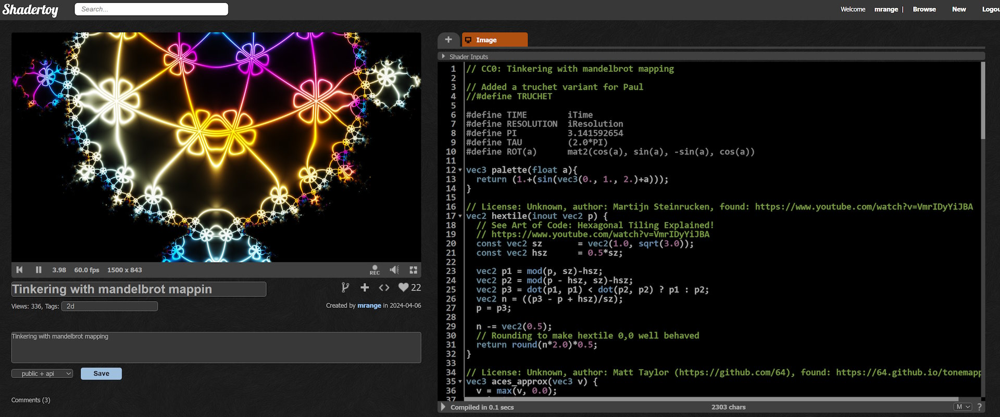
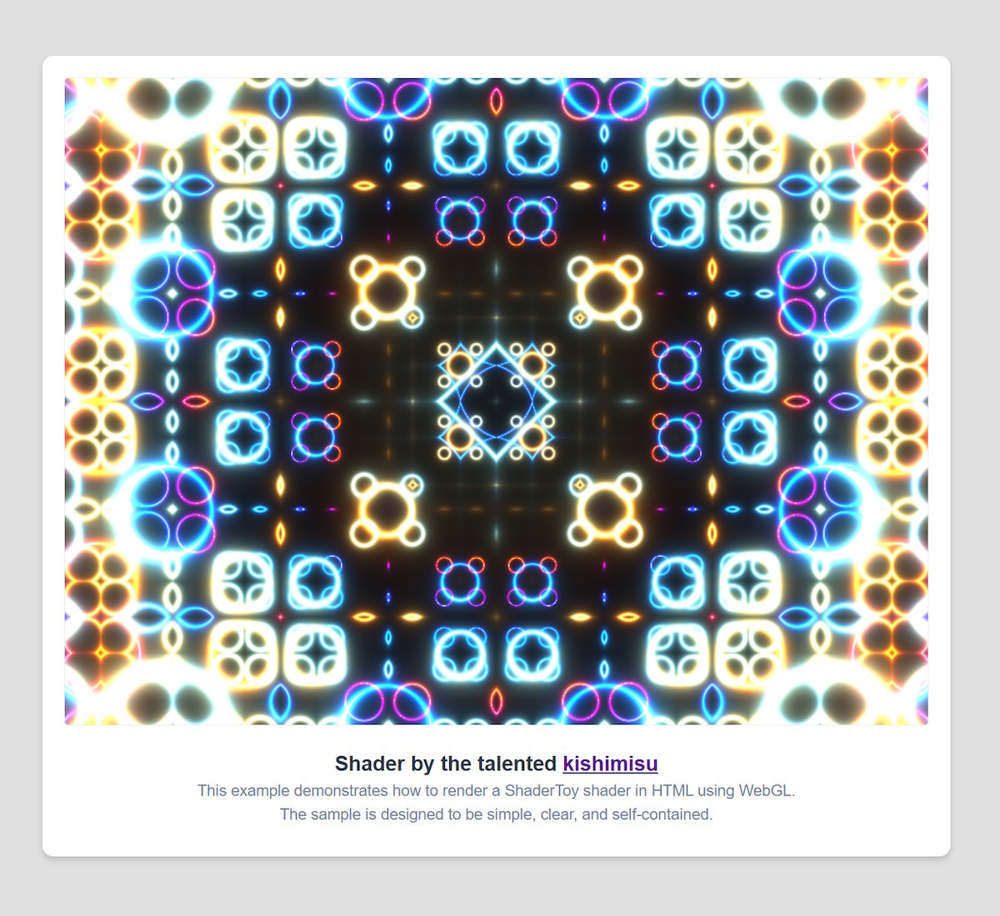

# 🎄⭐🎉 Rendering Shaders in WebGL 🎉⭐🎄

🎅 *Merry Christmas, WebGL fans!* 🎅

Who doesn’t love tinkering with shaders on [ShaderToy](https://www.shadertoy.com/)? While it’s fun to create stunning visuals there, have you ever thought about deploying those shaders in your own code?



You could create a Windows or MacOS application to showcase your shaders, but why not harness the power of WebGL for a broader reach?

Sure, [ShaderToy](https://www.shadertoy.com/) lets you embed shaders with an HTML iframe like this:

```html
<iframe width="640" height="360" frameborder="0" src="https://www.shadertoy.com/embed/MfjyWK?gui=true&t=10&paused=true&muted=false" allowfullscreen></iframe>
```

But as a hacker, you want to go deeper, right? By coding it yourself, you gain the freedom to customize textures, add music, and kick it up a notch!

## 🖼️🎨  It Starts with a Canvas 🎨🖼️

<p align="center">
  
</p>

[The complete example](https://mrange.github.io/shader-advent-2024/day-12/full-example/)

Let’s start with a `canvas` element:

```html
<canvas id="webGLCanvas" width="800" height="600"></canvas>
```

In JavaScript, we can locate this canvas and request a WebGL context. Here's how:

```javascript
const canvas = document.getElementById('webGLCanvas');
const gl = canvas.getContext('webgl2');
if (!gl) {
    alert("WebGL2 not supported in this browser. Unable to proceed.");
}
```

WebGL is well-documented on [MDN](https://developer.mozilla.org/en-US/docs/Web/API/WebGL_API), and if you’re familiar with OpenGL, you’ll feel right at home. However, if you’re new to WebGL or OpenGL, the journey to rendering your first shader can feel a bit finicky. But don’t worry—we’ll walk through it together!

## ⏳ Compiling and Linking a Shader Program ⏳

Shaders are special programs that run on the GPU. To render a fragment shader, you’ll also need a vertex shader. A simple one will suffice to get you started.

Here’s how we compile our shaders and link them into a cohesive shader program:

1. **Create and Compile Shaders**: Use `createShader` to create a shader object for both vertex and fragment shaders. Here’s a snippet to guide you:

```javascript
// createShader: Compiles a WebGL shader of a specified type (vertex or
//  fragment) from source code
// Parameters:
//   - type: Specifies the type of shader
//           (either gl.VERTEX_SHADER or gl.FRAGMENT_SHADER).
//   - source: The GLSL source code for the shader as a string.
// Returns:
//   - The compiled shader if successful, or null if there was a
//      compilation error.
function createShader(type, source) {
  // Create an empty shader object of the specified type
  const shader = gl.createShader(type);

  // Attach the source code to the shader object
  gl.shaderSource(shader, source);

  // Compile the shader source code into executable code
  gl.compileShader(shader);

  // Check for compilation success
  if (!gl.getShaderParameter(shader, gl.COMPILE_STATUS)) {
    // If compilation failed, log the error to the console for debugging
    console.error('Shader compilation error:', gl.getShaderInfoLog(shader));
    return null; // Return null to indicate failure
  }

  // If compilation was successful, return the compiled shader object
  return shader;
}
```

2. **Link the Shader Program**: Once you have your shaders compiled, it’s time to link them together into a final shader program using `createProgram`:


```javascript
// createProgram: Builds and links a shader program from provided vertex
//  and fragment shader source code.
// Parameters:
//   - vertexSource: GLSL source code for the vertex shader as a string.
//   - fragmentSource: GLSL source code for the fragment shader as a string.
// Returns:
//   - The linked shader program if successful, or null if there was an
//      error during shader compilation or program linking.

function createProgram(vertexSource, fragmentSource) {
  // Compile the vertex shader from source
  const vertexShader = createShader(gl.VERTEX_SHADER, vertexSource);

  // Compile the fragment shader from source
  const fragmentShader = createShader(gl.FRAGMENT_SHADER, fragmentSource);

  // Check for shader compilation errors
  if (!vertexShader || !fragmentShader) {
    // Shader creation failed; errors were logged by createShader
    return null; // Return null to indicate failure
  }

  // Create a new WebGL program object to hold the shaders
  const program = gl.createProgram();

  // Attach the compiled vertex and fragment shaders to the program
  gl.attachShader(program, vertexShader);
  gl.attachShader(program, fragmentShader);

  // Link the shaders to create the complete program
  gl.linkProgram(program);

  // Check if linking was successful
  if (!gl.getProgramParameter(program, gl.LINK_STATUS)) {
      // If linking failed, log the error for debugging
      console.error('Program linking error:', gl.getProgramInfoLog(program));
      return null; // Return null to indicate failure
  }

  // Clean up shader objects after linking; they're now part of the program
  gl.deleteShader(vertexShader);
  gl.deleteShader(fragmentShader);

  // Return the linked shader program
  return program;
}
```

3. **Use the Shader Program**: After linking, you’ll want to tell WebGL to use your shader program whenever you draw:

```javascript
// Create a shader program using the provided vertex and fragment shader
//  source code
const shaderProgram = createProgram(vertexShaderSource, fragmentShaderSource);

// Set the shader program as the active program for rendering
gl.useProgram(shaderProgram);
```

## 🟥🟩🟦 Setting Up the Quad 🟦🟩🟥

To render our fragment shader, we first need to draw a quad (or rectangle) that fills the entire screen. Each pixel on this quad will be generated by our fragment shader, hopefully looking awesome!

### Defining the Vertices

To set up the quad, we need to define its corners (or vertices) and load them into a vertex buffer. When we draw the quad, WebGL will use these vertices to create the shape, in our case drawing two triangles to create a quad.

In addition, we need to inform WebGL which input variable in the vertex shader will receive these vertices. In our case, we’ll use the input variable `position`.

### Our Vertex Shader

Here’s a minimal vertex shader that just forwards the input:

```glsl
#version 300 es
precision highp float;

// A minimal vertex shader that passes input directly to gl_Position.
in vec4 position;

void main() {
    gl_Position = position;
}
```

### Setting Up the Vertex Buffer

Now, let’s set up the vertex buffer to store our quad’s vertices. Here’s one way to do it:

```javascript
// Define the vertex positions for a full-screen quad as a triangle strip
// This quad will fill the entire canvas, covering the viewport
const vertices = new Float32Array([
  -1, -1,  // Bottom left corner
   1, -1,  // Bottom right corner
  -1,  1,  // Top left corner
   1,  1,  // Top right corner
]);

// Create a buffer to hold vertex data
const vertexBuffer = gl.createBuffer();
// Bind the buffer as the current ARRAY_BUFFER
gl.bindBuffer(gl.ARRAY_BUFFER, vertexBuffer);
// Fill the buffer with the vertex data, using STATIC_DRAW for data that
//  won't change
gl.bufferData(gl.ARRAY_BUFFER, vertices, gl.STATIC_DRAW);
```

### Connecting the Vertex Buffer to the Shader

Next, we need to connect our vertex buffer to the `position` variable in the vertex shader:

```javascript
// Get the location of the 'position' attribute from the shader program.
// Note: If the name of the 'position' attribute in the vertex shader is
//  changed, you must update the name here to match the new attribute name.
const positionLocation = gl.getAttribLocation(shaderProgram, 'position');

// Enable the position attribute for use in the vertex shader
gl.enableVertexAttribArray(positionLocation);

// Specify how to read the vertex data from the buffer
gl.vertexAttribPointer(
  positionLocation, // The index of the attribute in the shader
  2,                // Number of components per vertex (x and y coordinates)
  gl.FLOAT,         // Type of data in the buffer (floating-point numbers)
  false,            // Do not normalize the data (values are already in the correct range)
  0,                // Stride: 0 means use the size of the vertex data type (auto)
  0                 // Offset: 0 means start reading from the beginning of the buffer
);
```

And there you go! You’ve set up the quad and linked it to your vertex shader. Now, when you draw, your fragment shader will be applied across the entire screen.

## Setting Up the Fragment Shader Uniforms

I’ve defined a fragment shader prelude that streamlines the rendering of simple ShaderToy shaders by setting up the uniforms (or input variables) `iTime` and `iResolution`. At the end, you’ll simply paste in the ShaderToy code you want to render. The prelude will not work for advanced ShaderToy shaders.

### Our Fragment Shader

Here’s the fragment shader prelude:

```glsl
#version 300 es
precision highp float;

out vec4 fragColor;

// ShaderToy Uniforms
// These are the most commonly used ShaderToy uniforms.
uniform float iTime;          // ShaderToy's time uniform
uniform vec3 iResolution;     // ShaderToy's resolution (viewport) uniform

// ShaderToy-compatible mainImage function signature
void mainImage(out vec4 fragColor, in vec2 fragCoord);

void main() {
    // Pass the fragment coordinates to mainImage and output to fragColor
    mainImage(fragColor, gl_FragCoord.xy);
}

// Paste ShaderToy shader code here -->
```

### Getting Uniform Locations

To set these uniforms in our shader, we first need to ask WebGL for their locations by name. This is how we can update their values during the draw loop:

```javascript
// Retrieve the locations of the uniforms defined in the fragment shader
//  by their names.
// These locations will be stored so that we can update their values
//  during the draw loop.
const timeLocation = gl.getUniformLocation(shaderProgram, 'iTime');             // Location for the time uniform
const resolutionLocation = gl.getUniformLocation(shaderProgram, 'iResolution'); // Location for the resolution uniform

// Capture the current time to use for calculating the elapsed time
//  (iTime) in the draw loop.
const begin = performance.now();
```

With these locations captured, you’re ready to update the uniform values in your draw loop, allowing your shader to react dynamically to time and resolution changes.

## ♻️ The Draw Loop ♻️

Now we enter the heart of our application—the draw loop! In this loop, we compute the `iTime`, query the canvas for its current size, and set the `iResolution` based on that.

Once everything is set, we draw the vertices (corners) we defined earlier as a triangle strip. Thanks to the arrangement of the vertices, this will form a quad that covers the entire canvas. Finally, we request a new animation frame to ensure our graphics animate smoothly.

### The Draw Loop Code

Here’s how this all comes together:

```javascript
// Calculate the elapsed time (iTime) since the beginning of the
//  rendering.
// The result is in seconds, as performance.now() returns time in
//  milliseconds.
const iTime = (now - begin) * 0.001;

// Retrieve the current size of the canvas to set the iResolution uniform.
// This defines the dimensions of the rendering surface in the shader.
const width = canvas.clientWidth;
const height = canvas.clientHeight;

// Set the viewport to match the canvas dimensions.
// The viewport defines the drawable area within the canvas.
gl.viewport(0, 0, width, height);

// Update the iTime uniform in the shader with the calculated time value.
gl.uniform1f(timeLocation, iTime);

// Update the iResolution uniform with the current canvas size.
// The third component is set to 1, the same as ShaderToy uses.
gl.uniform3f(resolutionLocation, width, height, 1);

// Render the quad using the vertex buffer created earlier.
// This draws a triangle strip that forms a quad, utilizing the
//  vertices defined in the vertexBuffer.
gl.drawArrays(
    gl.TRIANGLE_STRIP,  // Drawing mode: uses a triangle strip to create the quad
    0,                  // Starting vertex index in the vertex buffer
    4                   // Total number of vertices to use for drawing (the quad has 4 vertices)
);

// Request the next animation frame to ensure smooth updates.
// This was a key insight for me after struggling with various methods
//  for smooth rendering in web development.
// Unlike other approaches that had their drawbacks,
//  requestAnimationFrame provides a seamless way to update animations.
requestAnimationFrame(drawShader);
```

### `requestAnimationFrame` is awesome

Finding `requestAnimationFrame` was a game-changer! It ensures that our animations are synchronized with the browser's refresh rate, leading to smoother graphics and more efficient rendering. Unlike other methods I tried, which can lead to choppy animations or excessive CPU usage, `requestAnimationFrame` automatically pauses when the user navigates to another tab, conserving resources.

## 🎁 And That's a Wrap 🎁

<p align="center">
  
</p>

[The complete example](https://mrange.github.io/shader-advent-2024/day-12/full-example/)

With this you should be able to render your own fragment shaders in WebGL! While it can feel a bit daunting at first, that’s all part of the fun. To help you on your journey, I’ve created [this complete example](src/index.html) for you.

Feel free to clone the GitHub repository or download the source code to run it locally. Just remember to include the CSS stylesheet `styles.css` to see the full example in all its glory.

You can even add music using the `audio` element, which supports FFT for creating fancy VU meters. The browser really does contain everything you need to create amazing WebGL demos!

Once you overcome that initial hurdle, you’ll find that crafting your own shaders and demos is not only doable but incredibly rewarding. I encourage you to experiment, play, and innovate! The world of shaders is your canvas—create something unique and share it with the community.

What I want for Christmas is an avalanche of new WebGL-based demos to explore and enjoy. I can't wait to see what you all come up with!

🎄🌟🎄 Merry Christmas to all, and happy coding! 🎄🌟🎄

🎅 – mrange

## ❄️Licensing Information❄️

All code content I created for this blog post is licensed under [CC0](https://creativecommons.org/public-domain/cc0/) (effectively public domain). Any code snippets from other developers retain their original licenses.

The text content of this blog is licensed under [CC BY-SA 4.0](https://creativecommons.org/licenses/by-sa/4.0/) (the same license as Stack Overflow).