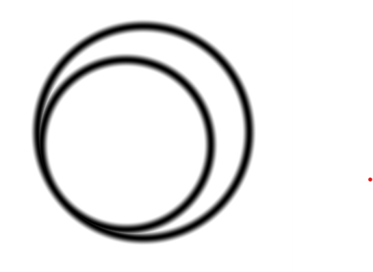
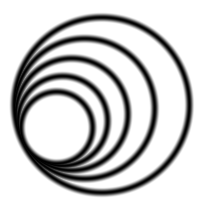
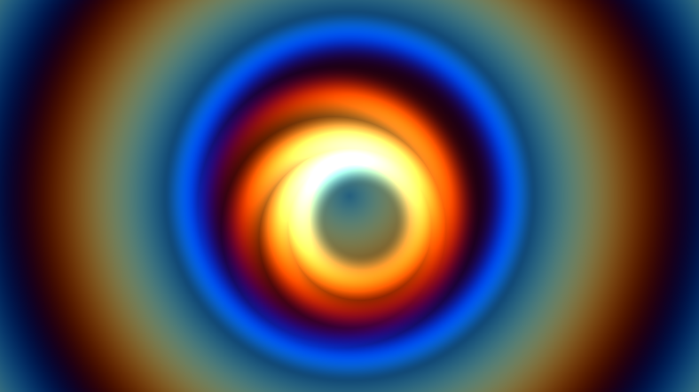
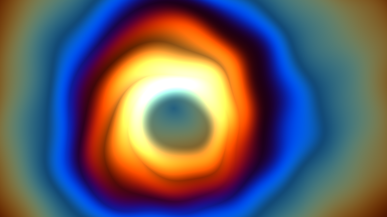

# Circles of light
Ho ho, shader friends!
Today, I have a Christmas tale to share—a tale of circles. 
Not just any circles, but circles that begin as humble shapes and evolve into radiant, magical rings of light.
But let’s not skip ahead. 
The story begins with me agreeing to write this article about shader coding. 
“Me? Is this really a good idea?” I wondered, considering I’m still a beginner in the world of shaders?
Days passed, the deadline loomed, and progress... well, it didn’t.

One evening, in a fit of procrastination, I lazily searched YouTube for shader tutorials. 
That’s when I stumbled upon [An Introduction to Shader Art Coding by Kishimisu](https://www.youtube.com/watch?v=f4s1h2YETNY). 
Wow. Starting with the simplest of circles, 
Kishimisu used ingenious techniques to transform them into dazzling, animated works of art.

Inspired, I thought, “Could I pull off something similar but with my own twist?”

## The basic idea

It turns out that it is very simple to draw a circle using a shader. 

```glsl
void mainImage( out vec4 fragColor, in vec2 fragCoord )
{
    vec2 uv = (fragCoord * 2.0 - iResolution.xy) / iResolution.y;    
    vec2 center = vec2(0.0,0.0);
    float radius = 0.7;

    // Calculate distance to circle. Use smoothstep
    // to get smooth edges.
    float dist = 
        smoothstep(
            0.0, 
            0.05, 
            abs(length(uv + center) - radius)
        );
        
    fragColor = vec4(dist, dist, dist, 1.0);
}
```


A single circle is not interesting enough though but what about a circles that contains other circles? 

If $r_n$ is the radius of the outer circle and $c_n$ is the center we can calculate the radius of the inner circle by multiplying by a number less than one, for example

$r_{n+1} = r_{n} * 0.8$

If we want the inner circle to touch the outer, the new center will be

$c_{n+1} = c_n + (r_{n} - r_{n+1}) \times [cos(\alpha), sin(\alpha)]$

where $\alpha$ is the rotation of the inner circle around the center of the outer. Let's try that out.

```glsl
void mainImage( out vec4 fragColor, in vec2 fragCoord )
{
    vec2 uv = ...;    
    
    float r_0 = ...;
    vec2 c_0 = ...;
    float dist_0 = smoothstep(...);    

    float r_1 = r_0 * 0.8;
    float alpha = ...;  // Arbitrary rotation angle
    vec2 c_1 = c_0 + (r_0 - r_1) * vec2(cos(alpha), sin(alpha));
    float  dist_1 = smoothstep(...);    

    // The combined distance is the minimum distance of the parts
    float dist = min(dist_0, dist_1);
    
    fragColor = ...;
}
```




Using a for loop we can create as many as we want.

```glsl
void mainImage( out vec4 fragColor, in vec2 fragCoord )
{
    vec2 uv = ...;    
    
    float ro = ...;
    vec2 co = ...;
    float dist = ...;    
    
    for(float i=1.0; i<5.0; i++)
    {        
        float ri = ...;
        float alpha = ...;
        vec2 ci = ...;
        float disti = ...;    
        dist = min(disti, dist);
        
        ro = ri;
        co = ci;
    }
    
    fragColor = vec4(dist, dist, dist, 1.0);
}
```



Still no magic but maybe it could be interesting enough using some tricks?

## Trick 1: Animation

It is easy to animate by letting the rotation $\alpha$ vary by time and circle index.

```glsl
float alpha = <arbitrary constant> * i * iTime;
```

## Trick 2: A nice color palette

Using the general palette function from https://iquilezles.org/articles/palettes/ combined with Kishimisu's parameter selection I got this

```glsl
vec3 palette( in float t ) 
{
    vec3 a = vec3(0.5, 0.5, 0.5);
    vec3 b = vec3(0.5, 0.5, 0.5);
    vec3 c = vec3(1.0, 1.0, 1.0);
    vec3 d = vec3(0.263, 0.416, 0.557);
    return a + b*cos( 6.283185*(c*t+d) );
}

void mainImage( out vec4 fragColor, in vec2 fragCoord )
{
    ...

    vec3 color = 
        palette(
            length(uv) + iTime * <arbitrary constant>
        ) * (1.0 - dist);       
    fragColor = vec4(color, 1.0);
}
```

Again, time is used to animate the effect.

## Trick 3: Color saturation overload

A very simple and cheap trick to get more saturated colors seems to be to subract a little. I do not know why it works but I tried, and I liked the result. 

```glsl
dist -= 0.5;  // Magic: Subtract a little for more saturation
vec3 color = palette(...) * (1.0 - dist);       
```

## Trick 4: Warp the plane by a pinch of noise

At this point the result look as below.



Colorful, but a bit boring. What if I could warp the plane with some noise to make it more interesting? 

Searching for noise effects on shadertoy.com did not disappoint. I copied to noise function from [Warping - procedural 2](https://www.shadertoy.com/view/lsl3RH).

```glsl
const mat2 m = mat2( 0.80,  0.60, -0.60,  0.80 );

float noise( in vec2 p )
{
	return sin(p.x)*sin(p.y);
}

float fbm4( vec2 p )
{
    float f = 0.0;
    f += 0.5000*noise( p ); p = m*p*2.02;
    f += 0.2500*noise( p ); p = m*p*2.03;
    f += 0.1250*noise( p ); p = m*p*2.01;
    f += 0.0625*noise( p );
    return f/0.9375;
}

vec2 fbm4_2( vec2 p )
{
    return vec2(fbm4(p), fbm4(p+vec2(7.8)));
}
```

Using this noise function it was just a matter of mixing it with the uv-coordinates.

```glsl
vec2 uv = ...;  
float warpAmount = 0.75;  // rather arbitrary
uv = mix(
    fbm4_2(uv + iTime * <arbitrary constant>), 
    uv, 
    warpAmount
);
```

The result looked like below.



# Summary

The final shader, after some tweaking of the constants, can be seen [here](https://www.shadertoy.com/view/McdcWM).
With only a basic understanding and a few simple concepts, I managed to create a vibrant, colorful effect. Sure, it carries the mark of a beginner, but it’s mine—and it’s unique. It feels like there’s an entire universe of undiscovered shaders waiting to be explored. Good times. Wishing you a bright and creative St. Lucia’s Day—and a joyful Advent!

*Abstract Dan, 2024*
