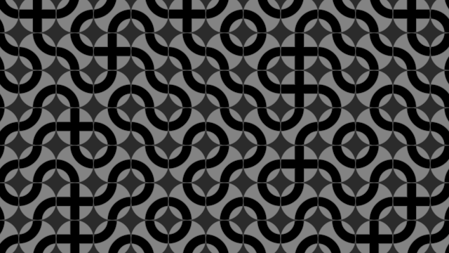
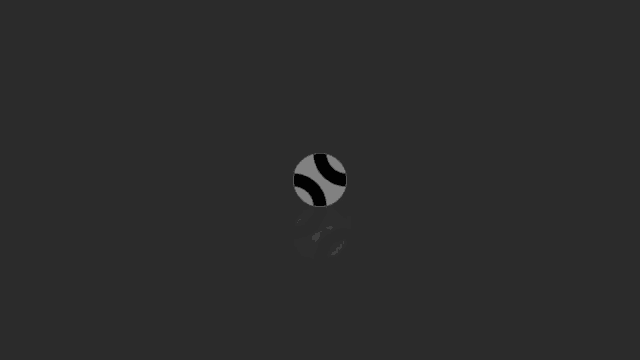
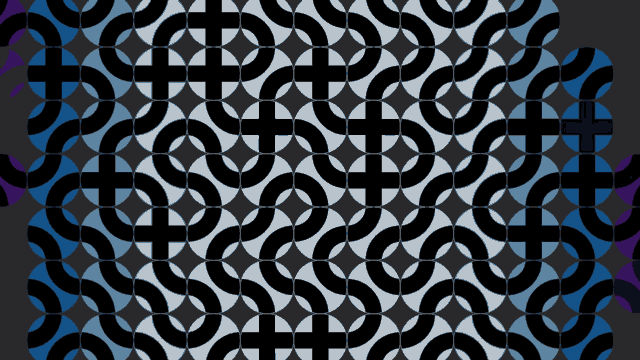

# 🕒 Timing with LERP (Linear interpolation)

When I first started to make shaders they were mostly just continious animation or moving in along in one direction. Trying to make some type of timed movement was hard, and would seem stiff. Over the past year I've found a few interesting ways to use ***clamp***, ***lerp***, and cubic timing functions in my shaders to create movment and drama.


### 💾 Linear Interpolation
What is ***LERP*** you ask? Linear interpolation is a mathematical method that uses linear polynomials to create new data points between known data points. It's a simple and popular method for estimating dependent variable values for independent variable values that aren't in a dataset.

The function essentially maps a value t to a normalized range [0, 1] based on the range [b, e]. It ensures that the output is always between 0 and 1, which makes it perfect for animating things in shaders.

```glsl
    // linear interpolation
    float lerp (float b, float e, float t) { 
        return clamp((t - b) / (e - b), 0., 1.); 
    }
```

#### Parameters:
- b: The beginning of the range (start value).
- e: The end of the range (end value).
- t: The input value that is being evaluated within the range [b, e].

#### Operation:
```glsl
(t - b) / (e - b)
```
- This normalizes the input t to a value between 0 and 1, relative to the range [b, e].
- If t is equal to b, this expression evaluates to 0.
- If t is equal to e, this expression evaluates to 1.
- For values of t between b and e, this expression linearly interpolates a value between 0 and 1.

```glsl
clamp(..., 0., 1.):
```
- Ensures that the result is constrained to the range [0, 1].

### 💾 Easing Functions

Now we'll also need two more functions to smooth things out IE ease-in and ease-out. These kinds of cubic functions are commonly used in animations or easing, where a smooth progression is needed over time.

```glsl
    // ease out cubic
    float eoc (float t) { return (t = t-1.)*t*t+1.; }
```
*This function takes an input t, shifts it down by 1, cubes it, and then adds 1 to the result.*


```glsl
    // ease in cubic
    float eic (float t) { return  t*t*t; }
```
*Is a simple easing-in function cubing the input t.*

## 💻 The Shader

Lets use these functions in a shader, something that can show off these tricks and has some visual impact. I'm going to use my favriote tile pattern - the Truchet. This time lets place them in a circle and use ***lerp*** to animate them rotating, and fading in place.

I've created a [template on Shadertoy](https://www.shadertoy.com/view/MfKBRh) you can use that has the basic timing functions and drawing code in place. You can follow along or just start messing around.



Before we start lets look at the top of our ***main()*** function.

```glsl
    // Set the speed of animation
    tspeed = T*.5;
    
    // Create a modlus version of time that will trigger our items on screen
    // this should be a value high enough to cover the ID's in the grid on screen.
    tmod = mod(tspeed,10.);
```

What this is doing it setting up a constant speed which we'll use in our animations, and making sure time loops in a large enough number to make sure all the ID's and hash values get hit for animation. These two variables are what till be fed into our linear interpolation function. 

### 💾 Fade-in Effect

After line #62 add the followig code snippet. This will create our fade in effect of the tiles, and we'll expand more on this function later.

```glsl
    // fade up based on time from start
    float shs = abs(id.x);
    float intro = lerp(shs,shs+.5,tspeed);
    intro = eoc(intro); intro = eic(intro);
```

The near the bottom update our two color variables ***clr*** and ***clx*** to the following.
```glsl
    // color mixdown
    vec3 clr = mix(C,vec3(.23),intro);
    vec3 clx = mix(C,vec3(.0),intro);
```

Compile, rewind and play - you'll see the tiles start to appear from the center row out. Our variable `shs` is using the ID of each column into the lerp function below it. That is then used in a mix function to fade in from our base C color to the new variables.

In short what is happening is that we're saying the intro variable will go from 0 to 1 when our time passes the hash `shs` and ends when `shs+.5` is reached. We're using the variable ***tspeed*** as it's tracking the time since start.

We can tweak that by randomizing that a little more and use the IDs and the original ***rnd*** value from the truchet pattern. 

```glsl
    // fade up based on time from start
    float ths = abs(id.x+(id.y*.1));
    float shs = (rnd*2.)+(ths*1.5);
```

This now gives us a positive number for each tile while using the ID row and random hash to stagger the fade in effect. Compile, rewind and play the shader again to see.



### 💾 Tile Rotation

Now lets add movement to the circle tiles. Under our newly added code, add two new variables that will use the lerp function to start and stop our rotations. We'll then use the ease-out and ease-in functions to smooth our movements before applying to a rotation.

```glsl
    // turn based on mod time
    float t1 = lerp(ths,ths+.5,tmod);
    float t2 = lerp(ths+1.5,ths+2.,tmod);
    
    t1 = eoc(t1); t1 = eic(t1);
    t2 = eoc(t2); t2 = eic(t2);
    
    q.xy*=rot((t1+t2)*1.5707);
```

The rotation here is just a simple 90 degree turn, which when adding both variables will equal a 180 degree and with symetical tiles that is a full turn. You could also use `(t1-t2)` and watch them turn backwards or any other variation needed, just know that t1 and t2 goes from 0 to 1 based on the hash 'value' and ends on that same 'value +.5'

If you compile, rewind and play you'll notice that the tiles turn from start, and we want them to wait a bit fisrt. This is an easy fix by using the ***tspeed*** variable.

```glsl
    if(tspeed>8.) q.xy*=rot((t1+t2)*1.5707);
```

Now before we turn, we are checking to make sure ***tspeed*** is at least greater than 8. This can be however long you need items to become visible before applying rotation.

### 💾 Color Accents

***LERP*** also plays nicely with color being a value from 0 to 1, and you can easily reuse variables to create variation. Lets update the color function that will use both the intro ***tspeed*** and the looped ***tmod*** time. 

```glsl
    vec3 clr = mix(C,vec3(t1-t2,1.-(t1-t2),shs),intro);
```

Or we can use a [procedural color function](https://iquilezles.org/articles/palettes/) to make it spicy. 

```glsl
    vec3 clr = mix(C,hue(abs(id.x*.05)+(t1-t2)*.2),intro);
```



## ⌨️ The Final Shader

Enjoy the [Final Shader](https://www.shadertoy.com/view/XfVfR1) with Color, rotation and fading-in intro!
