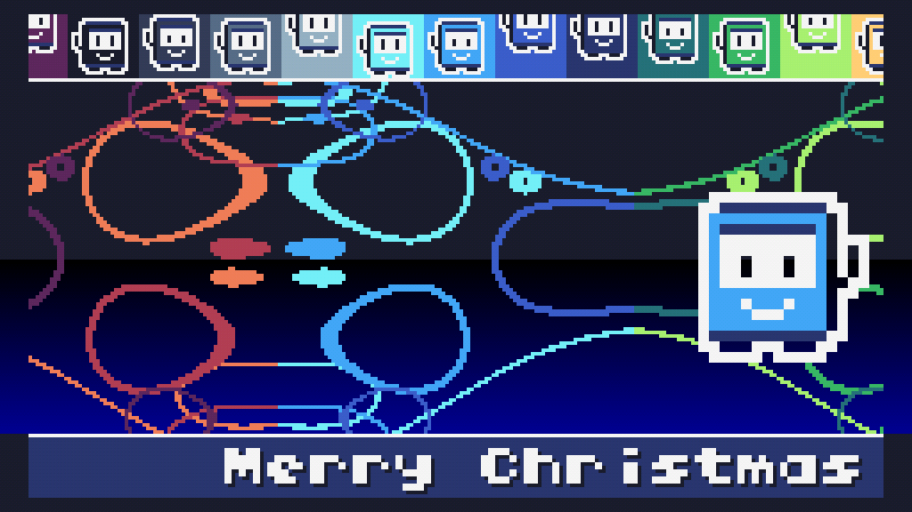
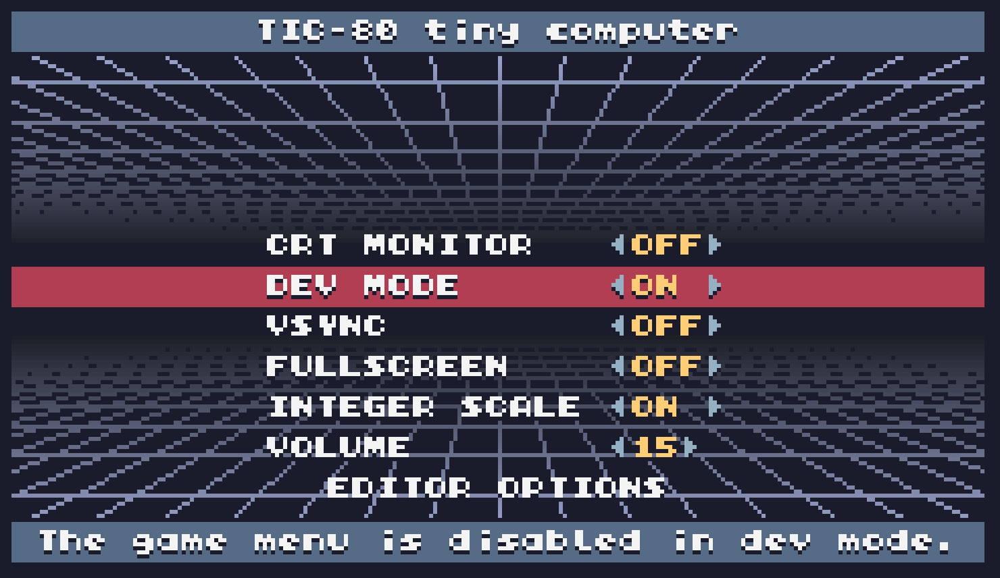
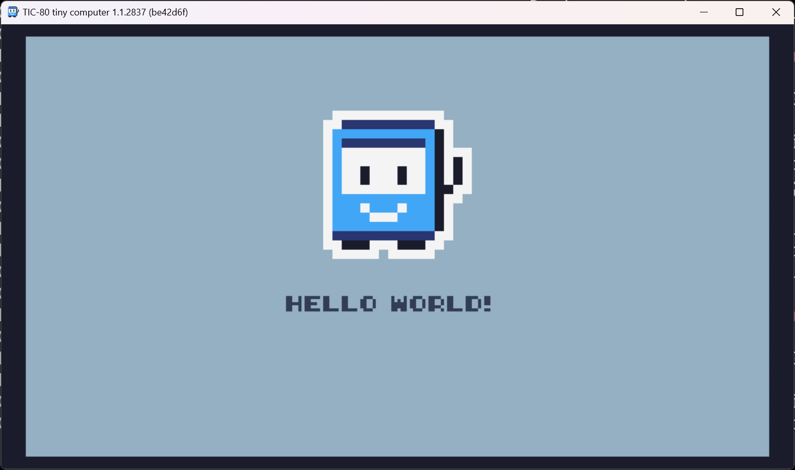
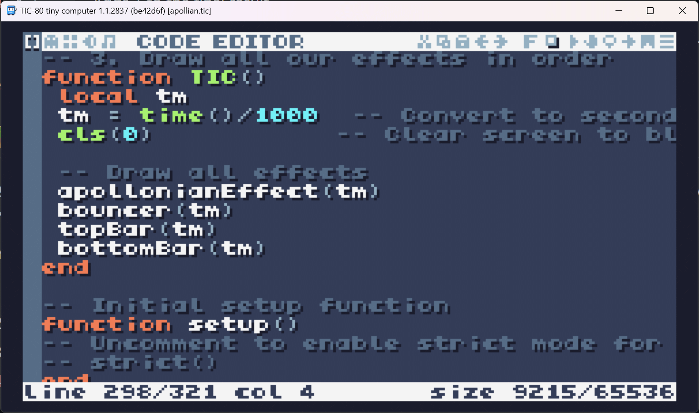
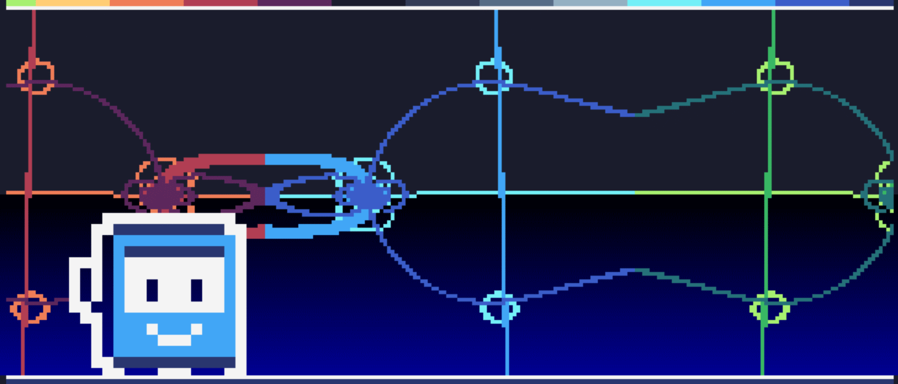

# 🎄💾🎄 Treat Yourself to a TIC-80 This Christmas🎄💾🎄

🎅 Ho, ho, ho! Merry Christmas, retro hackers! 🎅

## 🕹️📼🖲️ TIC-80? I Thought This Was About Shaders! 🖲️📼🕹️

I know, I know. Normally, this Shader Advent is all about shaders. But here’s the thing: TIC-80 is just *way* too much fun to ignore!
<p align="center">
	
</p>

If you’re like me, shader coding scratch that demo itch—pushing pixels to make art and effects. But shader coding can be intense: you’re aiming for perfection, and that takes time. TIC-80, though? It’s like an instant ticket to retro joy. You can whip up a wild, "craptastic" effect in no time and still feel like a kid in a candy store.

Everything’s built-in: a text editor, sprite editor, map editor, SFX editor, and even a tracker for music. The quirky limitations—lower resolutions, color restrictions—bring back memories of the C64.

## 🚀🚀🚀 Getting Started with TIC-80 🚀🚀🚀

For those new to TIC-80, it’s a "fantasy console" that channels the essence of old-school machines: reduced resolution and funky constraints.

Getting started is simple. Just head over to [the TIC-80 site](https://tic80.com/create), where you can run it right in your browser or download it to your desktop. Check out some of the amazing demos, like [TIMELINE 2](https://tic80.com/play?cart=3823), where you can jump straight into the code by pressing `Escape`.

And hey, if you're craving a different flavor, PICO-8 is another awesome fantasy console worth checking out.

## 🧭🗺️ Orienting Ourselves in TIC-80 🗺️🧭

When you open TIC-80, you’re greeted by the console—a retro throwback right from the start. To get around, use the function keys to access each of TIC-80’s editors:

- **F1** - Code Editor
- **F2** - Sprite Editor
- **F3** - Map Editor
- **F4** - SFX Editor
- **F5** - Music Editor (Tracker)

Once you’re ready to test your creation, just press `Ctrl-R` to run the program.

## 🛠️⚙️ Configuring TIC-80 for Quick Coding ⚙️🛠️

First things first: let’s make it easier to jump between coding and testing without any fuss.

1. Start up TIC-80.
2. Press `Escape` to open the menu, then go to `Options`.
3. Set **Dev Mode** to `On`.
<p align="center">
	
</p>

With Dev Mode active, you can quickly hop back to the code editor/console whenever you press `Escape`. Now, it’s super easy to go from tweaking code to running your demo. Press `Ctrl-R` to run, and `Escape` to get right back to editing. Fast and seamless!

## 👋🎉👋 `Hello, World!` in TIC-80 👋🎉👋

<p align="center">
	
</p>

Time for our first program! Whenever you start TIC-80 or enter the command `new lua` in the console, a basic "Hello, World" program is automatically created, complete with some starter code and sprites.
```lua
t=0
x=96
y=24

function TIC()

	if btn(0) then y=y-1 end
	if btn(1) then y=y+1 end
	if btn(2) then x=x-1 end
	if btn(3) then x=x+1 end

	cls(13)
	spr(1+t%60//30*2,x,y,14,3,0,0,2,2)
	print("HELLO WORLD!",84,84)
	t=t+1
end
```

This simple program lets you control a character with the arrow keys. Hit `F1` to see the code or hit `F2` to jump into the Sprite Editor, where you can tweak the sprites to your heart’s content.

The code itself is in `Lua`, a light but powerful language that’s a joy to code in. Don’t worry if it’s new to you—this program is straightforward, and you’ll get the hang of it quickly.

In TIC-80, there’s a main function called `TIC` that runs every frame (that’s 60 times per second), so this is where most of the magic happens.

### 🦾🤖🦿 Drawing a Big Robot 🦾🤖🦿

```lua
spr(1 + t % 60 // 30 * 2, x, y, 14, 3, 0, 0, 2, 2)
```

The function [`spr`](https://github.com/nesbox/TIC-80/wiki/spr) draws a sprite on the screen. Here’s a breakdown of the arguments:

```lua
spr(1+t%60//30*2, -- Alternates between 1 and 3
    x,            -- X coordinate
    y,            -- Y coordinate
    14,           -- Transparent color key
    3,            -- Zoom (3x)
    0,            -- Horizontal flip (0 = no flip)
    0,            -- Vertical flip (0 = no flip)
    2,            -- Sprite width in tiles
    2)            -- Sprite height in tiles
```

Here's an improved version:

### 🧮 Animating the Sprite: `1 + t % 60 // 30 * 2` 🧮

This formula may look complex, but its purpose is simple: it alternates between sprite #1 and sprite #3 based on the current frame, creating an eye animation to give the robot a bit more life.

1. **`t % 60`** – This takes the current frame (`t`) and gets the remainder when divided by 60.
   - At 60 frames per second, this creates a cycle that repeats every second, counting from 0 to 59.

2. **`// 30`** – Integer division by 30.
   - This splits the cycle into two halves:
     - When `t % 60` is between 0 and 29, it returns 0.
     - When `t % 60` is between 30 and 59, it returns 1.

3. **`* 2`** – Multiplies the previous result by 2.
   - So, we get either 0 or 2, effectively creating an alternating value every 30 frames.

4. **`1 + ...`** – Adds 1 to the final result.
   - This shifts the sprite ID to alternate between 1 and 3, resulting in a smooth frame switch for animation.

Pretty cool, right? With a bit of math, you get a simple, effective animation cycle!

## 👨‍🏫🖥️👩‍🏫 Demo of a Demo 👩‍🏫🖥️👨‍🏫

To get a feel for what TIC-80 can do, I’ve prepared a [sample demo screen](src/merry-christmas.lua) that’s ready for you to play with. Hopefully, it’ll inspire you to start tinkering and experimenting with your own creations!

Here’s how to try it out:

1. Press `Escape` until you’re in the console.
2. Type `new lua` to create a new Lua program.
3. Replace the code with the content of the [example](src/merry-christmas.lua).
4. Press `Ctrl-R` to run the demo.

<p align="center">
	
</p>

## 🔍 Starting with `TIC` 🔍

Now, let’s look at the `TIC` function, the engine driving our demo.

```lua
-- TIC() is the main function that TIC-80 calls every frame
-- (60 times per second). Here we:
-- 1. Get the current time
-- 2. Clear the screen
-- 3. Draw all our effects in order
function TIC()
	local tm
	tm = time()/1000  -- Convert to seconds
	cls(0)            -- Clear screen to black

	-- Draw all effects
	apollonianEffect(tm)
	bouncer(tm)
	topBar(tm)
	bottomBar(tm)
end
```

Simple!

## 🕵️‍♂️ What is this `BDR` Thing? 🕵️‍♂️

`BDR` is one of TIC-80’s coolest features—a function called once per horizontal line. It’s a nod to raster interrupts from the days of the C64 and other vintage computers. Back then, the limited color palette meant you had to get creative. Old TVs would render each line from top to bottom, allowing coders to change the color palette on the fly after each line was drawn, creating the illusion of more colors than the system officially supported.

In TIC-80, we get to relive that magic! Although it only offers 16 colors at a time, you can switch colors (and tweak other settings) between lines, simulating more colors on the screen. It’s a clever workaround that lets us push past TIC-80’s color limits—just like in the golden age of computing.

And in true retro style, we use the command [`poke`](https://github.com/nesbox/TIC-80/wiki/poke) to write values directly into memory, just like hardware registers on classic machines. With `poke`, you can tweak TIC-80’s "hardware" settings and make your effects even more impressive.

```lua
-- Sets Red component of color palette 0
poke(0x3FC0, 0xDF)
-- Sets Green component of color palette 0
poke(0x3FC1, 0xF1)
-- Sets Blue component of color palette 0
poke(0x3FC2, 0x80)

-- Sets Red component of color palette 1
poke(0x3FC3, 0xFF)
-- Sets Green component of color palette 1
poke(0x3FC4, 0x82)
-- Sets Blue component of color palette 1
poke(0x3FC5, 0x42)

-- and so on...
```

This is so satisfying! If you ask me, HAL (Hardware Abstraction Layer) was a mistake! Who needs it when we can poke right into memory and make magic happen?

Here’s a simple example that creates a beautiful blue gradient:

```lua
-- BDR is a special TIC-80 function that's called for every
-- scanline (horizontal line) of the screen. It's similar to
-- the raster interrupts used in old computers like the C64
-- to create effects that would otherwise be impossible due
-- to hardware color limitations.
function BDR(ln)
	local top,bottom
	top = 23+50
	bottom = 121
	if (ln < top) or (ln > bottom) then
		-- For the top and bottom portions of the screen,
		-- use the normal TIC-80 background color palette
		poke(0x3FC0, 0x1A)
		poke(0x3FC1, 0x1C)
		poke(0x3FC2, 0x2C)
	else
		-- For the middle portion, create a deep blue gradient
		-- by modifying the background color for each scanline
		poke(0x3FC0, 0x1A)
		poke(0x3FC1, 0x1C)
		poke(0x3FC2, 0x2C+3*(ln-top))
	end
end
```

## 🔭 Let’s Look at the Bottom Bar 🔭

Let’s start with the simplest part of our demo: the bottom bar.


1. **Using [`rect`](https://github.com/nesbox/TIC-80/wiki/rect)**: First, we draw a blue background for the bottom bar.

2. **A white [`line`](https://github.com/nesbox/TIC-80/wiki/line)**: Next, we add a white line to separate the bottom bar from the main screen effect.

3. **[`print`](https://github.com/nesbox/TIC-80/wiki/print) `Hello World` going back and forth**: Finally, we `print` to display “Hello World” that moves from left to right across the bar. It adds some movement and makes it feel more dynamic.

```lua
-- Creates the bottom banner with animated "Merry Christmas" text
-- The text moves in a sinusoidal pattern and includes a shadow
-- for better visibility
function bottomBar(tm)
	local px
	rect(0,118,240,136,8)
	line(0,118,240,118,12)

	-- Create moving text effect
	px = sin(tm)*40+30
	print("Merry Christmas", px+1,122+1,0,0,2)  -- Shadow
	print("Merry Christmas", px,122,12,0,2)     -- Text
end
```

## 🤖🤖🤖 What’s Going On in the Top Bar? 🤖🤖🤖

The top bar effect is a bit complex, but once you get the hang of it, it’s straightforward. Here’s how it works:


1. **Looping to Fill the Bar with Robots**: We create a row of bouncing robots moving from left to right across the bar.

2. **Calculating Color & "Cell ID" Hashing**: For each robot, we calculate a color and a hash based on its “cell ID,” giving each robot a unique bounce height and speed. This cell ID introduces randomness in their movement.

3. **Drawing a Background Rectangle**: We draw a rectangle behind the robots with `rect`, using the computed color as the background.

4. **Recoloring the Sprite with `poke4`**: Since TIC-80 limits sprites to 16 colors, we use `poke4` to recolor the robots to match the background color.

5. **Drawing the Robot Sprite**: We then draw each robot with `spr`, using the previously calculated position and color.

6. **Adding a White Separator Line**: Finally, we draw a white line with `line` to separate the top bar from the main effect area, similar to the bottom bar.

```lua
-- This creates a row of bouncing robots at the top of
-- the screen.
function topBar(tm)
	local px,py,dx,tx,w,nx,fx,b,si,i
	local h0,h1,sx
	dx = 30     -- Horizontal spacing
	sx = 20     -- Segment width

	for i=-1,11 do
		tx = dx*tm
		nx = tx//sx-i
		-- Create variation between robots using hash function
		h0	= hash(nx+123.4)
		h1 = fract(8667*h0)
		-- Calculate bounce with varying heights
		b  = fract(mix(1.5,0.5, h0*h0)*(tm+h0))-0.5
		b  = b*b
		b  = b
		px = round(tx%sx+i*sx)
		py = round(40*mix(0.25,1.0,h0)*(b-0.25)+3)
		si = floor(3*tm*mix(0.5,1.5,h1))%2
		-- Draw background bar and sprite
		-- Remove the white color (12) from
		--	the color cycle
		nx = (round(nx%15)-3)&0xF
		rect(px-2,0,sx,18,nx)
		-- Switching palette color 10
		--	This renders the sprite with
		--	different base colors
		poke4(0x3FF0*2+10,nx)
		spr(1+2*si,px-1,py,14,1,1,0,2,2)
		-- Restoring palette color 10
		poke4(0x3FF0*2+10,10)
	end
	line(0,18,240,18,12)
end
```

## 🦾🤖🦿 The Big Bouncing Robot 🦾🤖🦿
This one's pretty straightforward, but it adds a lot of rizz. Big sprites were a challenge back in the day, so they’re sure to impress retro enthusiasts!



1. **Computing `x` to Move Back and Forth**: We use the `t` variable (time) to calculate the robot’s `x` position. By applying a triangular wave, the robot bounces back and forth on the screen, while ensuring it always faces the right direction.

2. **Computing `y` to Bounce Up and Down**: Similarly, we calculate the `y` position using a simple quadratic formula, creating a smooth up-and-down bouncing motion.

3. **Using [`spr`](https://github.com/nesbox/TIC-80/wiki/spr) to Render the Big Robot**: Finally, we use the `spr` function to draw the robot on the screen. We increase the sprite’s zoom level to make the robot bigger and more eye-catching (3x zoom here).


```lua
-- This function creates a single bouncing robot sprite
-- that moves back and forth across the screen. The robot
-- automatically flips direction when it reaches the edges,
-- and its vertical position follows a bouncing pattern.
function bouncer(tm)
	local px,py,dx,tx,w,nx,fx,b,si
	w  = 240-48        -- Screen width minus sprite width
	dx = 80            -- Horizontal speed
	tx = dx*tm         -- Total distance traveled
	nx = (tx//w)%2     -- Number of complete travels (for direction)
	if nx == 0 then
		px = round(tx%w)   -- Moving right
		fx = 1
	else
		px = round(w-tx%w) -- Moving left
		fx = 0
	end
	-- Create bouncing motion using a parabola
	b  = fract(tm)-0.5
	b  = b*b
	py = round(50+100*b)
	-- Animate the sprite (alternating between two frames)
	si = floor(3*tm)%2
	spr(1+2*si,px,py,14,3,fx,0,2,2)
end
```

## 🎉🎉🎉 The Fractal Effect 🎉🎉🎉

The main effect is an **Apollonian fractal**, which is a popular choice in shaders, like [this one by IQ](https://www.shadertoy.com/view/4ds3zn).


To add some extra oomph, even though this is a 2D effect, the Apollonian fractal is rendered in 3D. We sample the fractal at points on a rotating 3D plane, which creates a dynamic, animated 2D fractal effect.

Here's how it works:
1. We loop over a 100x100 grid of pixels. For each pixel, we compute a corresponding 3D coordinate.
2. We apply a rotation to the 3D coordinates.
3. Then, we calculate the Apollonian distance in all three axes (X, Y, Z).

If the pixel is inside the fractal distance, we plot it using [`pix`](https://github.com/nesbox/TIC-80/wiki/poke) and color it in different shades of blue based on which axis is being considered.

To add even more zing:
- We reflect the fractal result to the left and right of the center.
- Pixels to the left are colored in shades of red, and pixels to the right are shaded in green.

Pretty sweet, right?

```lua
-- This creates the main visual effect based on the apollonian
-- fractal. For each pixel, we:
-- 1. Transform the pixel coordinates into 3D space
-- 2. Apply a rotation to create movement
-- 3. Apply the apollonian fractal formula
-- 4. Draw the result in different colors
--
-- The effect creates an intricate pattern of curved lines
-- that seems to fold through space as it rotates.
function apollonianEffect(tm)
	local a,s,c1,s1,c2,s2,radii
	local anim,px,py,pz,spx,tmp
	local scale,r2,k
	s							= 1.25
	a							= tm*0.25
	-- Calculate rotation matrices
	c1						= cos(a)
	s1						= sin(a)
	c2						= cos(a*1.234)
	s2						= sin(a*1.234)

	-- Set the thickness of the lines we'll draw
	radii			= 0.005
	anim				= 1.5
	for x=0,99 do
		-- Convert screen coordinates to normalized space (-1 to 1)
		spx = -1+x*0.02
		-- Apply smoothing at the edges
		spx = tanh_approx(spx*anim)/anim
		for y=0,99 do
			px = spx
			py = -1+y*0.02
			px = px*0.5
			py = py*0.5
			-- Create animation in the z dimension
			pz = 0.3*(c1+s2)
			-- Apply 3D rotation to create movement
			tmp=  c1*px+s1*pz
			pz = -s1*px+c1*pz
			px = tmp

			tmp=  c2*py+s2*pz
			pz = -s2*py+c2*pz
			py = tmp
			scale = 1
			-- The apollonian fractal loop
			--	Many shaders based on this fractal
			--	For example IQ's: https://www.shadertoy.com/view/4ds3zn
			for i=0,2 do
				px = -1+2*fract(0.5*px+0.5)
				py = -1+2*fract(0.5*py+0.5)
				pz = -1+2*fract(0.5*pz+0.5)
				r2 = px*px+py*py+pz*pz
				k  = s/r2
				px = k*px
				py = k*py
				pz = k*pz
				scale = scale*k
			end

			scale = 1/scale

			-- Draw the fractal by testing each axis
			-- We draw three copies with different colors:
			-- center (blue), left (red), and right (green)
			if abs(pz)*scale < radii then
				-- Mid (blue)
				pix(x+70,y+18,11)
				-- Left (red)
				pix(69-x,y+18,3)
				-- Right (green)
				pix(269-x,y+18,5)
			end

			if abs(py)*scale < radii then
				-- Mid (blue)
				pix(x+70,y+18,10)
				pix(69-x,y+18,2)
				pix(269-x,y+18,6)
			end

			if abs(px)*scale < radii then
				-- Mid (blue)
				pix(x+70,y+18,9)
				-- Left (red)
				pix(69-x,y+18,1)
				-- Right (green)
				pix(269-x,y+18,7)
			end
		end
	end
end
```

## ⚙️🛠️ The Setup 🛠️⚙️

In most cases, the setup doesn't do much, but I’ve included an option to enable "strict" mode. By default, Lua silently creates global variables, which makes it easy to accidentally create globals when you intended to use locals.

To prevent this, I use the `strict` function, which throws an error whenever I try to create a global variable unintentionally.

Normally, I don't enable strict mode right away. However, after writing a lot of code, I turn it on to clean up any unintentional global variables and keep the code tidy.

```lua
-- Initial setup function
function setup()
-- Uncomment to enable strict mode for debugging
--	strict()
end
```

## 🎁 And That’s a Wrap! 🎁

<p align="center">
	
</p>

TIC-80 is truly incredible! It’s a blast to tinker with retro effects, and getting started couldn’t be easier. You can [run it directly in the browser](https://tic80.com/create) or download it to run it offline. The TIC-80 website is packed with tons of examples, and it includes everything you need to create your own retro demos or games.

Deploying your TIC-80 programs is a breeze too. For example, to deploy to a static web app, just run `export html my-app`. You’ll get a zip file, upload its contents, and you’re all set!

And if you're looking for some inspiration, don’t miss [FieldFx’s](https://www.twitch.tv/fieldfxdemo) weekly TIC-80 coding jams on Twitch every Monday. I highly recommend tuning in to watch, or better yet, join in on the fun!

🎄🌟🎄 Merry Christmas to all, and happy retro-tastic coding! 🎄🌟🎄

🎅 – mrange

## ❄️Licensing Information❄️

All code content I created for this blog post, including the linked KodeLife sample code, is licensed under [CC0](https://creativecommons.org/public-domain/cc0/) (effectively public domain). Any code snippets from other developers retain their original licenses.

The text content of this blog is licensed under [CC BY-SA 4.0](https://creativecommons.org/licenses/by-sa/4.0/) (the same license as Stack Overflow).
