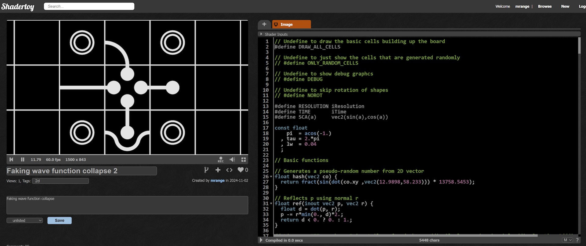
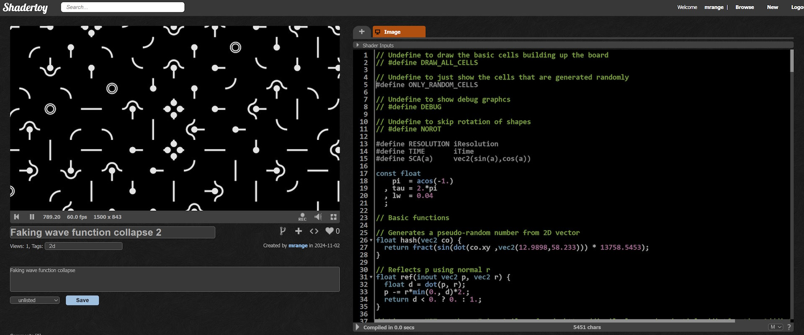
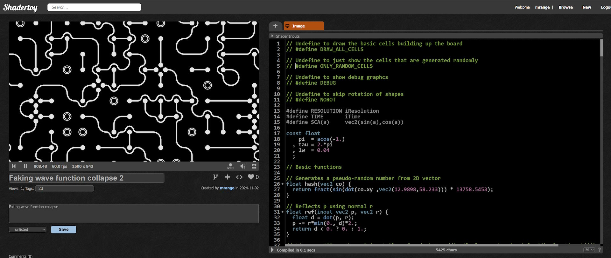

# 🎄⭐🎉 Faking Wave Function Collapse in Shaders 🎉⭐🎄

🎅 *Merry Code-mas, ShaderToy enthusiasts!* 🎅

## 🌊 What’s This Wave Function Collapse? 🌊

A few years back, I stumbled upon [Coding Challenge 171: Wave Function Collapse](https://www.youtube.com/watch?v=rI_y2GAlQFM) and had a couple of thoughts:

1. **That's a stupid name for a straightforward algorithm!**
2. **This looks awesome—I’ve got to try it in a shader!**

Now, if you search for it online, you’ll wade through ads before landing on articles on quantum physics because the name is misleading. In our world, Wave Function Collapse is a nifty little algorithm for generating randomized patterns. Think of it as truchet tiling on steroids! I highly recommend checking out the [YouTube clip](https://www.youtube.com/watch?v=rI_y2GAlQFM); it’s both educational and entertaining.

## Bringing It to Life in a Shader

While the algorithm is simple, translating it into a fragment shader isn’t straightforward. You could use a persistent texture to maintain state, but that sounds a bit too challenging for me.

A few years ago, I gave it a shot by tweaking the algorithm, resulting in [a somewhat lackluster shader](https://www.shadertoy.com/view/fsyfWV).

While the shader isn't particularly impressive, I still believe the underlying idea is interesting. I’d like to share how it works while making some upgrades to the shader. My hope is to inspire Truchet giants like [Shane](https://www.shadertoy.com/user/Shane) and [byt3_m3chanic](https://www.shadertoy.com/user/byt3_m3chanic) to create something truly amazing with it.

## 🏗️ Crafting Some Shapes 🏗️

The goal? Create something that resembles a circuit board. While truchet tiles can do the trick, we want to mix things up with multiple shapes that don’t necessarily align.

I defined five shapes, from none to 4 connections with neighbors. For the two-connection shape, I crafted both a corner shape and a line shape. Here’s what they look like:



## 🔲 Arranging the Shapes 🔳

When placing these shapes side by side, I need to rotate them so their connections line up.

This is where things get a bit tricky. I want a pattern driven by pseudo-randomness, but since the shapes can clash, it creates restrictions on both the shape and rotation. The Wave Function Collapse algorithm solves this by selecting a cell to resolve (or collapse) based on its degrees of freedom and a sprinkle of randomness. While that’s a breeze in most programming languages, shader code isn’t quite as forgiving.

Instead, picture a chessboard: I randomize the shape and rotation for all the white cells. Since they only touch at the corners, they won't create any connection conflicts. For the black cells, I choose a shape and rotation that matches their neighboring white cells.


It sounds straightforward, but getting it all to work can be a bit of a puzzle!

## 🔌 Setting Up the "Circuit" Board 🔌

One straightforward method to divide the plane into cells of size 1 is as follows:

```glsl
// Computes cell id
vec2 np = round(tp);
// Computes cell coordinate from (-0.5,-0.5 to (0.5,0.5)
vec2 cp = tp - np;
```

Next, we’ll focus on generating only the "white" cells of a chessboard:

```glsl
  float d0 = 1E3;
  if (fract((np.x + np.y)*0.5) > 0.25) {
    d0 = randomCell(np, cp);
  }
```

## 🔲 Randomizing the "White" Cells 🔲

This step is straightforward and closely resembles our usual approach to truchet tiling. We generate pseudo-random values based on the cell ID and use those to select the shape and rotation.

The distance field for the randomized cell appears as follows:

```glsl
// Generate two pseudo-random values from a cell identifier:
// - v.x determines the cell type
// - v.y determines the cell rotation
vec2 selection(vec2 np) {
  float h0 = hash(np+123.4);
  float h1 = fract(h0*8667.0);
  return vec2(h0,h1);
}

// For a given cell identifier, return a random cell's distance field
float randomCell(vec2 np, vec2 cp) {
  float d0 = 1E3;
  vec2 sel = selection(np);
#ifndef NOROT
  // ROTATION_DISTRIBUTION_MUST_MATCH: This distribution needs to be kept in snc
  if (sel.y > 0.75) {
    cp = vec2(cp.y, -cp.x);
  } else if (sel.y > 0.5) {
    cp = -cp;
  } else if (sel.y > 0.25) {
    cp = vec2(-cp.y, cp.x);
  } else {
  }
#endif

  // CELL_DISTRIBUTION_MUST_MATCH: This distribution needs to be kept in sync
  if (sel.x > 0.95) {
    d0 = cell4(cp);
  } else if (sel.x > 0.7) {
    d0 = cell3(cp);
  } else if (sel.x > 0.5) {
    d0 = cell2c(cp);
  } else if (sel.x > 0.3) {
    d0 = cell2t(cp);
  } else if (sel.x > 0.05) {
    d0 = cell1(cp);
  } else {
    d0 = cell0(cp);
  }
  return d0;
}
```

This results in a pattern that looks like this:



While this is pretty cool on its own, it will look even better once we choose a matching shape and rotation for the "black" cells.

## ⬛ Lining Up the Fixed Cells ⬛

For the other cells, we need to consider their neighboring cells, which will be pseudo-randomized. This pseudo-randomization is determined by the cell ID, which we can compute based on the current ID of the fixed cell.

```glsl
// Generate two pseudo-random values from a cell identifier:
// - v.x determines the cell type
// - v.y determines the cell rotation
vec2 selection(vec2 np) {
  float h0 = hash(np+123.4);
  float h1 = fract(h0*8667.0);
  return vec2(h0,h1);
}

// For a given cell identifier, return a random cell's connections, accounting for rotation
vec4 connections(vec2 np) {
  vec2 sel = selection(np);

  vec4 c = cell0Cons;

  // CELL_DISTRIBUTION_MUST_MATCH: This distribution needs to be kept in sync
  if (sel.x > 0.95) {
    c = cell4Cons;
  } else if (sel.x > 0.7) {
    c = cell3Cons;
  } else if (sel.x > 0.5) {
    c = cell2cCons;
  } else if (sel.x > 0.3) {
    c = cell2tCons;
  } else if (sel.x > 0.05) {
    c = cell1Cons;
  } else {
  }

#ifndef NOROT
  // ROTATION_DISTRIBUTION_MUST_MATCH: This distribution needs to be kept in sync
  if (sel.y > 0.75) {
    c = c.yzwx;
  } else if (sel.y > 0.5) {
    c = c.zwxy;
  } else if (sel.y > 0.25) {
    c = c.wxyz;
  } else {
  }
#endif

  return c;
}

// Distance field for a fixed cell, which samples neighboring cells to
//  determine its shape and rotation
float fixedCell(vec2 np, vec2 cp) {
  vec4 cons;
  // Peek at neighboring random cells by passing in their cell IDs.
  // Each neighboring cell is pseudo-randomly generated from its ID.
  // Our cell mirrors the connections of neighboring cells.
  cons.x = connections(np-vec2( 1., 0.)).z;
  cons.y = connections(np-vec2( 0.,-1.)).w;
  cons.z = connections(np-vec2(-1., 0.)).x;
  cons.w = connections(np-vec2( 0., 1.)).y;

  // How many connections do we need?
  float c = dot(vec4(1.), cons);
  vec4 tcons;
  // Pick a cell type that match the connections needed
  // SELECTION_DISTRIBUTION_MUST_MATCH: This distribution needs to be kept in sync
  if (c == 0.) {
    tcons = cell0Cons;
  } else if (c == 1.) {
    tcons = cell1Cons;
  // Two shapes have two connections each,
  //  so we need to check the connections to identify the correct shape.
  } else if (c == 2. && cons.x == cons.z) {
    tcons = cell2tCons;
  } else if (c == 2.) {
    tcons = cell2cCons;
  } else if (c == 3.) {
    tcons = cell3Cons;
  } else {
    tcons = cell4Cons;
  }

  // The selected cell may have incorrect orientation, so we rotate its connections
  //  until they align correctly.
  //  Simultaneously, we apply the same rotation to the cell's coordinates.
  for (int i = 0; i < 4; ++i) {
    // Do we have a match?
    if (tcons == cons) {
      break;
    }
    // Rotate connections
    tcons = tcons.wxyz;
    // Rotate cell coordinates
    cp = vec2(-cp.y, cp.x);
  }

  float d = 1E3;

  // SELECTION_DISTRIBUTION_MUST_MATCH: This distribution needs to be kept in sync
  if (c == 0.) {
    d = cell0(cp);
  } else if (c == 1.) {
    d = cell1(cp);
  // Two shapes have two connections each,
  //  so we need to check the connections to identify the correct shape.
  } else if (c == 2. && cons.x == cons.z) {
    d = cell2t(cp);
  } else if (c == 2.) {
    d = cell2c(cp);
  } else if (c == 3.) {
    d = cell3(cp);
  } else {
    d = cell4(cp);
  }

  return d;
}
```

If done correctly, the result will look something like this:



## 🛠️ Things to Tinker With 🛠️

I’ve uploaded [the entire shader on ShaderToy](https://www.shadertoy.com/view/XfcyWH) for you to explore.

To make it easier to deconstruct the shader, I’ve included a few defines that allow you to control its functionality:

```glsl
// Undefine to draw the basic cells building up the board
// #define DRAW_ALL_CELLS

// Undefine to just show the cells that are generated randomly
// #define ONLY_RANDOM_CELLS

// Undefine to show debug graphcs
// #define DEBUG

// Undefine to skip rotation of shapes
// #define NOROT
```

## 🎁 Wrapping It All Up 🎁

That’s a wrap for today! I hope this inspires some of you to experiment with fake Wave Function Collapse or even implement the full algorithm in a shader or your favorite stateful language.

Wishing you all…

✨🎄🎁 An amazing Christmas filled with pseudo-random goodness under the tree! 🎁🎄✨

🎅 - mrange

## ❄️Licensing Information❄️

All code content I created for this blog post is licensed under [CC0](https://creativecommons.org/public-domain/cc0/) (effectively public domain). Any code snippets from other developers retain their original licenses.

The text content of this blog is licensed under [CC BY-SA 4.0](https://creativecommons.org/licenses/by-sa/4.0/) (the same license as Stack Overflow).

## Appendix

## Appendix 1 - The complete example

```glsl

// Undefine to draw the basic cells building up the board
// #define DRAW_ALL_CELLS

// Undefine to just show the cells that are generated randomly
// #define ONLY_RANDOM_CELLS

// Undefine to show debug graphcs
// #define DEBUG
// Undefine to skip rotation of shapes
// #define NOROT

#define RESOLUTION iResolution
#define TIME       iTime
#define SCA(a)     vec2(sin(a),cos(a))

const float
    pi  = acos(-1.)
  , tau = 2.*pi
  , lw  = 0.04
  ;

// Basic functions

// Generates a pseudo-random number from 2D vector
float hash(vec2 co) {
  return fract(sin(dot(co.xy ,vec2(12.9898,58.233))) * 13758.5453);
}

// Reflects p using normal r
float ref(inout vec2 p, vec2 r) {
  float d = dot(p, r);
  p -= r*min(0., d)*2.;
  return d < 0. ? 0. : 1.;
}

// License: MIT, author: Inigo Quilez, found: https://iquilezles.org/www/articles/distfunctions2d/distfunctions2d.htm
// Distance field for a 2D box with size 2*b
float box(vec2 p, vec2 b) {
  vec2 d = abs(p)-b;
  return length(max(d,0.0)) + min(max(d.x,d.y),0.0);
}

// Distance field for a circle with radius r
float circle(vec2 p, float r) {
  return length(p) - r;
}

// Distance field for a line across that ends in (0,0)
float segmentx(vec2 p, float r) {
  float d0 = length(p) - r;
  float d1 = abs(p.y) - r;
  return p.x > 0. ? d0 : d1;
}

// License: MIT, author: Inigo Quilez, found: https://iquilezles.org/www/articles/distfunctions2d/distfunctions2d.htm
// Distance fields for a wave of circles
float circleWave(vec2 p, float tb, float ra) {
  tb = pi*5.0/6.0*max(tb,0.0001);
  vec2 co = ra*vec2(sin(tb),cos(tb));
  p.x = abs(mod(p.x,co.x*4.0)-co.x*2.0);
  vec2  p1 = p;
  vec2  p2 = vec2(abs(p.x-2.0*co.x),-p.y+2.0*co.y);
  float d1 = ((co.y*p1.x>co.x*p1.y) ? length(p1-co) : abs(length(p1)-ra));
  float d2 = ((co.y*p2.x>co.x*p2.y) ? length(p2-co) : abs(length(p2)-ra));
  return min(d1, d2);
}

// Define distance fields and connection configurations for each cell type.
// Connections are specified in a vec4, with each component representing a side:
// vec4(left, top, right, bottom). For example, vec4(1.0, 0.0, 1.0, 0.0)
// indicates connections on the left and right sides only.


// Distance field and connections for cell with 0 connections
const vec4 cell0Cons = vec4(0.);
float cell0(vec2 p) {
  float d0 = circle(p, 0.15+0.06);
  d0 = abs(d0) - lw;
  d0 = abs(d0) - lw*0.5;
  return d0;
}

// Distance field and connections for cell with 1 connection
const vec4 cell1Cons = vec4(1.,0.,0.,0.);
float cell1(vec2 p) {
  float d0 = circle(p, 0.15);
  float d1 = segmentx(p,lw);
  float d = min(d0,d1);
  return d;
}

// Distance field and connections for cell with 2 connections. This forms a corner
const vec4 cell2cCons = vec4(1.,0.,0.,1.);
float cell2c(vec2 p) {
  vec2 p0 = p;
  float d = abs(circle(p0+0.5,0.5))-lw;
  return d;
}

// Distance field and connections for cell with 2 connections. This forms straight line
const vec4 cell2tCons = vec4(1.,0.,1.,0.);
float cell2t(vec2 p) {
  float d = abs(p.y)-lw;
  return d;
}

// Distance field and connections for cell with 3 connections.
const vec4 cell3Cons = vec4(1.,0.,1.,1.);
float cell3(vec2 p) {
  vec2 p0 = -p;
  p0.y -= -0.25;
  vec2 p2 = p.yx;

  float d0 = circleWave(p0, 0.5, 0.25)-lw;
  float d2 = segmentx(p2, lw);
  float d3 = circle(p2,0.15);
  float d = d0;
  d = min(d, d2);
  d = min(d, d3);

  return d;
}

// Distance field and connections for cell with 3 connections.
const vec4 cell4Cons = vec4(1.);
float cell4(vec2 p) {
  const vec2 ref45 = SCA(radians(-45.));
  p = -abs(p);
  ref(p, ref45);
  p.x -= -0.3;
  float d0 = circle(p, 0.15);
  float d1 = segmentx(p, lw);
  float d = min(d0,d1);
  return d;
}

// Draw all cells for easier visualization while refining or tweaking cell designs.
vec3 drawAllCells(vec3 col, vec2 p) {
  const float tz = 2.0/3.0;
  float aa = sqrt(2.)/RESOLUTION.y;
  vec2 tp = p/tz;
  vec2 np = round(tp);
  vec2 cp = tp - np;
  float d0 = 1E3;
  if (np == vec2(0.,0.)) {
    d0 = cell4(cp);
  } else if (np == vec2(1.,0.)) {
    d0 = cell1(cp);
  } else if (np == vec2(-1.,0.)) {
    d0 = cell2t(cp);
  } else if (np == vec2(-0.,1.)) {
    d0 = cell2c(cp);
  } else if (np == vec2(0.,-1.)) {
    d0 = cell3(cp*-1.);
  } else if (abs(np) == vec2(1.,1.)) {
    d0 = cell0(cp);
  }

  // A box surrounding each cell make the cells easier to see
  float d1 = box(cp, vec2(0.5));
  d1 = abs(d1) - 0.0125;
  float d = d0;
  d = min(d, d1);
  d *= tz;
  col = mix(col, vec3(0.8), smoothstep(aa, -aa, d));
  return col;
}

// Generate two pseudo-random values from a cell identifier:
// - v.x determines the cell type
// - v.y determines the cell rotation
vec2 selection(vec2 np) {
  float h0 = hash(np+123.4);
  float h1 = fract(h0*8667.0);
  return vec2(h0,h1);
}

// For a given cell identifier, return a random cell's connections, accounting for rotation
vec4 connections(vec2 np) {
  vec2 sel = selection(np);

  vec4 c = cell0Cons;

  // CELL_DISTRIBUTION_MUST_MATCH: This distribution needs to be kept in sync
  if (sel.x > 0.95) {
    c = cell4Cons;
  } else if (sel.x > 0.7) {
    c = cell3Cons;
  } else if (sel.x > 0.5) {
    c = cell2cCons;
  } else if (sel.x > 0.3) {
    c = cell2tCons;
  } else if (sel.x > 0.05) {
    c = cell1Cons;
  } else {
  }

#ifndef NOROT
  // ROTATION_DISTRIBUTION_MUST_MATCH: This distribution needs to be kept in sync
  if (sel.y > 0.75) {
    c = c.yzwx;
  } else if (sel.y > 0.5) {
    c = c.zwxy;
  } else if (sel.y > 0.25) {
    c = c.wxyz;
  } else {
  }
#endif

  return c;
}

// For a given cell identifier, return a random cell's distance field
float randomCell(vec2 np, vec2 cp) {
  float d0 = 1E3;
  vec2 sel = selection(np);
#ifndef NOROT
  // ROTATION_DISTRIBUTION_MUST_MATCH: This distribution needs to be kept in snc
  if (sel.y > 0.75) {
    cp = vec2(cp.y, -cp.x);
  } else if (sel.y > 0.5) {
    cp = -cp;
  } else if (sel.y > 0.25) {
    cp = vec2(-cp.y, cp.x);
  } else {
  }
#endif

  // CELL_DISTRIBUTION_MUST_MATCH: This distribution needs to be kept in sync
  if (sel.x > 0.95) {
    d0 = cell4(cp);
  } else if (sel.x > 0.7) {
    d0 = cell3(cp);
  } else if (sel.x > 0.5) {
    d0 = cell2c(cp);
  } else if (sel.x > 0.3) {
    d0 = cell2t(cp);
  } else if (sel.x > 0.05) {
    d0 = cell1(cp);
  } else {
    d0 = cell0(cp);
  }
  return d0;
}

// Distance field for a fixed cell, which samples neighboring cells to
//  determine its shape and rotation
float fixedCell(vec2 np, vec2 cp) {
  vec4 cons;
  // Peek at neighboring random cells by passing in their cell IDs.
  // Each neighboring cell is pseudo-randomly generated from its ID.
  // Our cell mirrors the connections of neighboring cells.
  cons.x = connections(np-vec2( 1., 0.)).z;
  cons.y = connections(np-vec2( 0.,-1.)).w;
  cons.z = connections(np-vec2(-1., 0.)).x;
  cons.w = connections(np-vec2( 0., 1.)).y;

  // How many connections do we need?
  float c = dot(vec4(1.), cons);
  vec4 tcons;
  // Pick a cell type that match the connections needed
  // SELECTION_DISTRIBUTION_MUST_MATCH: This distribution needs to be kept in sync
  if (c == 0.) {
    tcons = cell0Cons;
  } else if (c == 1.) {
    tcons = cell1Cons;
  // Two shapes have two connections each,
  //  so we need to check the connections to identify the correct shape.
  } else if (c == 2. && cons.x == cons.z) {
    tcons = cell2tCons;
  } else if (c == 2.) {
    tcons = cell2cCons;
  } else if (c == 3.) {
    tcons = cell3Cons;
  } else {
    tcons = cell4Cons;
  }

  // The selected cell may have incorrect orientation, so we rotate its connections
  //  until they align correctly.
  //  Simultaneously, we apply the same rotation to the cell's coordinates.
  for (int i = 0; i < 4; ++i) {
    // Do we have a match?
    if (tcons == cons) {
      break;
    }
    // Rotate connections
    tcons = tcons.wxyz;
    // Rotate cell coordinates
    cp = vec2(-cp.y, cp.x);
  }

  float d = 1E3;

  // SELECTION_DISTRIBUTION_MUST_MATCH: This distribution needs to be kept in sync
  if (c == 0.) {
    d = cell0(cp);
  } else if (c == 1.) {
    d = cell1(cp);
  // Two shapes have two connections each,
  //  so we need to check the connections to identify the correct shape.
  } else if (c == 2. && cons.x == cons.z) {
    d = cell2t(cp);
  } else if (c == 2.) {
    d = cell2c(cp);
  } else if (c == 3.) {
    d = cell3(cp);
  } else {
    d = cell4(cp);
  }

  return d;
}

#ifdef DEBUG

// Aligning the cells is tricky, so I added some debugging functions.
//  These might be useful for others, and they also add a cool visual effect.

// Generates distance fields for debugging a randomly selected cell.
//  Displays a small red dot at connection points, allowing you to verify
//  whether the cell shape aligns with its intended configuration.
float debugRandomCell(vec2 np, vec2 cp) {
  const vec2 offs[4] = vec2[4](vec2(1.,0.), vec2(0.,-1.),vec2(-1.,0.), vec2(0.,1.));

  float dd = 1E3;
  vec4 cons = connections(np);
  for (int i = 0; i < 4; ++i) {
    vec2 off = offs[i];
    float con = cons[i];
    if (con > 0.) {
      dd = min(dd, circle(cp+0.45*off,0.03));
    }
  }
  return dd;
}

// Generates distance fields for debugging a fixed cell.
//  The fixed cell's properties are influenced by its neighboring random cells.
//  It peeks at the neighbors to determine the number of connections,
//  rotating one connection toward the fixed cell.
//  The effect enhances the onion layer appearance based on the neighbor's connections.
//  If a connection points directly to the fixed cell, only a half-circle is displayed.
float debugFixedCell(vec2 np, vec2 cp) {
  const vec2 offs[4] = vec2[4](vec2(1.,0.), vec2(0.,-1.),vec2(-1.,0.), vec2(0.,1.));

  float dd = 1E3;

  for (int i=0; i < 4; ++i) {
    vec2 off = offs[i];
    vec4 cons = connections(np-off);
    float con = cons[(i+2)%4];
    float c = dot(cons, vec4(1.));
    float ddd = circle(cp+(0.3+0.2*con)*off,0.1);
    float w = 0.05;
    for (float ii = 0.; ii < c; ++ii) {
      ddd = abs(ddd)-w;
      w *= 0.5;
    }

    dd = min(dd, ddd);
  }

  return dd;
}
#endif

// Draw the "circuit" board
vec3 drawBoard(vec3 col, vec2 p) {
  const float tz = 2.0/9.0;
  float aa = sqrt(2.)/RESOLUTION.y;
  vec2 tp = p/tz;
  const float ar = 25.;
  // A smooth moment across the board
  tp += ar*sin(vec2(sqrt(0.5), 1.0)+100.0+TIME/ar);

  // Computes cell id
  vec2 np = round(tp);
  // Computes cell coordinate from (-0.5,-0.5 to (0.5,0.5)
  vec2 cp = tp - np;

  float d0 = 1E3;
#ifdef DEBUG
  float dd = 1E3;
#endif

  if (fract((np.x + np.y)*0.5) > 0.25) {
    // Random cells only touches neighboring random cells at their corners.
    // This means that they cannot influence each other's connections directly,
    // eliminating the possibility of connection conflicts between them.
    // The randomness of each cell is determined by its unique cell ID.
    d0 = randomCell(np, cp);
#ifdef DEBUG
    dd = debugRandomCell(np,cp);
#endif
  } else {
#ifndef ONLY_RANDOM_CELLS
    // Similar to random cells, a fixed cell only touches other fixed cells at their corners.
    // This means that any neighboring cells that could cause connection conflicts are random cells.
    // Since the randomness is derived from the cell ID, a fixed cell can peek at its neighbors
    // by passing the corresponding cell ID.
    d0 = fixedCell(np, cp);
#ifdef DEBUG
    dd = debugFixedCell(np, cp);
#endif
#endif

  }

  float d = d0;
  d *= tz;
  // Draw the board using white color
  col = mix(col, vec3(0.8), smoothstep(aa, -aa, d));
#ifdef DEBUG
  float d1 = box(cp, vec2(0.5));
  d1 = abs(d1) - 0.005;
  dd = min(dd, d1);
  dd *= tz;
  // Draw the debugging of board using red color
  col = mix(col, vec3(0.8, 0.0,0.0), smoothstep(aa, -aa, dd));
#endif

  return col;
}

void mainImage(out vec4 fragColor, in vec2 fragCoord ) {
  vec2 q = fragCoord/iResolution.xy;
  vec2 p = -1. + 2. * q;
  p.x *= RESOLUTION.x/RESOLUTION.y;
  vec3 col = vec3(0.00);
#ifdef DRAW_ALL_CELLS
  col = drawAllCells(col, p);
#else
  col = drawBoard(col, p);
#endif
  col = sqrt(col);

  fragColor = vec4(col, 1.0);
}
```
