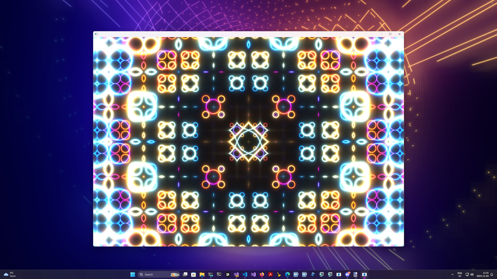
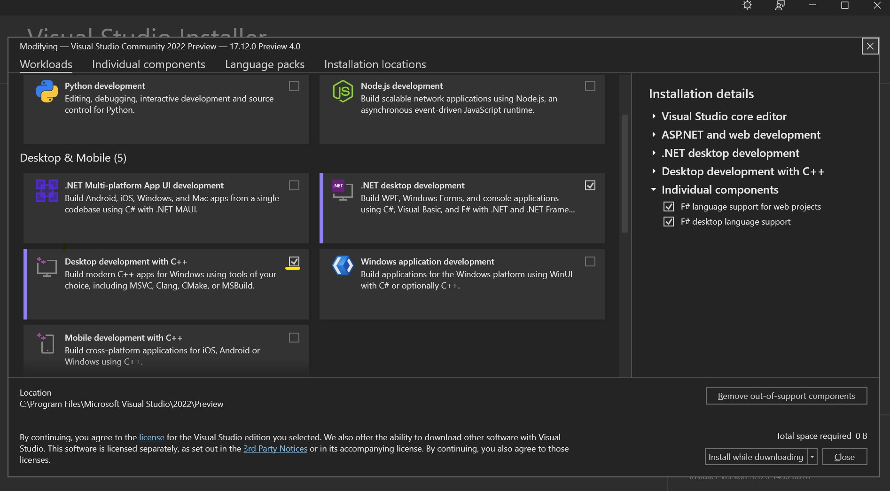
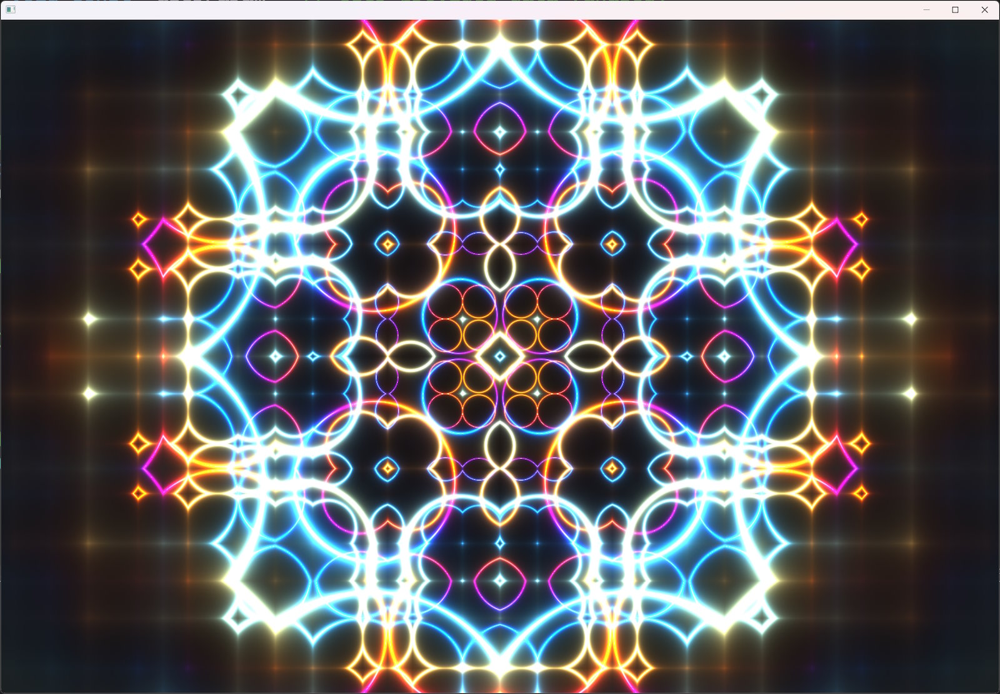

# 🎄⭐🎉 Rendering Shaders in a Windows App 🎉⭐🎄

🧝🎅🧝 *Happy Holidays, Shader Elves!* 🧝🎅🧝

ShaderToy is a playground for wild, colorful effects, but how do we wrap up that magic in a Windows App? Or even, imagine—a 4KiB Windows App for the ultimate techie holiday treat!



Before we get to the 4KiB challenge, let’s make a minimal Windows App to display a shader. Here, I'll guide you through creating a basic app that opens a window and runs a fragment shader.

## 📝 Our Game Plan 📝

1. Start a Visual C++ project
2. Open a Window (old-school Win32 style, just as BillG intended)
3. Initialize OpenGL
4. Compile and load the fragment shader
5. Render a quad that fills the whole window with the shader
6. Repeat until the user hits Escape or closes the window

## 🎁 Step 1: Start a Visual C++ Project 🎁

I’m using [Visual Studio 2022 Community](https://visualstudio.microsoft.com/downloads/)—it’s free and great for shader mischief. During installation, check off `Desktop development with C++`:



Start a new `Console App (C++)` project, or use the source files available [here](wgl-app/) to clone or download and follow along.

## 🔔 Important Dependencies 🔔

You’ll need Windows and OpenGL headers to get going:

```c++
#include <windows.h>    // Core Windows functions (creating windows, handling messages)
#include <GL/gl.h>      // Core OpenGL functions
#include "glext.h"      // Modern OpenGL extensions (needed for shaders)
```

The `glext.h` file contains necessary OpenGL extensions that don’t come built-in; I’ve included a copy in the demo project for easy setup. Don’t forget to link `opengl32.lib` in your project to compile successfully.

## 🪟 Opening a Window 🪟

The entry point for our app is the `main` function, where most of the code lives. We’ll go through it step-by-step. To catch errors early, I’ve packed in plenty of `assert` statements; these are stripped out in a Release build, so they won’t add bulk later.

### 🖼️ Let’s Open a Window 🖼️

Here’s the plan:
1. We’re sticking with the Win32 API only. This keeps things lean, which will help us later as we aim to trim it down to a 4KiB executable. For now, though, the executable will be *much* bigger than that!
2. We create a Window Class with specific flags and a custom event handler. The event handler lets us respond to events, like when the user tries to close the window.
3. With this Window Class, we create a window and center it on the screen.

Here’s how it looks in code:
```c++
/*
  * Step 1: Initialize Window
  */

auto hInstance = GetModuleHandle(0);
assert(hInstance && "Failed to get module handle");

// Complete the window class specification by setting the hInstance
windowClassSpecification.hInstance = hInstance;

// Register the window class with Windows. This is necessary to create a window
// instance later based on the specifications defined in `windowClassSpecification`.
auto regOk = RegisterClassA(&windowClassSpecification);
assert(regOk && "Failed to register window class");

// Define the window style with flags for visibility, overlapping, and popup behavior.
auto dwStyle = WS_VISIBLE | WS_OVERLAPPEDWINDOW | WS_POPUP;

// Adjust the window size to account for window borders and title bar based on the specified
// resolution (`xres` by `yres`). This ensures the client area matches the desired resolution.
RECT windowRect = { 0, 0, xres, yres };
auto rectOk = AdjustWindowRect(&windowRect, dwStyle, 0);
assert(rectOk && "Failed to adjust window rect");

// Calculate the dimensions of the adjusted window and find the center position
// based on the screen size, so the window will open centered on the screen.
auto width        = windowRect.right - windowRect.left;
auto height       = windowRect.bottom - windowRect.top;
auto screenWidth  = GetSystemMetrics(SM_CXSCREEN);
auto screenHeight = GetSystemMetrics(SM_CYSCREEN);

// Create the window with the specified style, dimensions, and centered position.
auto hwnd = CreateWindowExA(
    0                                       // No extended window styles
  , windowClassSpecification.lpszClassName  // Registered window class name
  , nullptr                                 // No window title
  , dwStyle                                 // Window style flags
  , (screenWidth - width) / 2               // Centered X position
  , (screenHeight - height) / 2             // Centered Y position
  , width, height                           // Window dimensions
  , nullptr, nullptr, nullptr, nullptr      // Parent, menu, instance, and param handles (unused)
);
assert(hwnd && "Failed to create window");
```

Opening a window with Win32 can be a bit finicky the first time, but it doesn’t take much code once you’ve got the parameters right!

## 🛠️ Initializing OpenGL 🛠️

Since we’re going to use an OpenGL fragment shader for our graphics, we need to set up OpenGL. Fortunately, this process is pretty straightforward:

1. Grab the **Device Context** (needed for all graphics-related tasks).
2. Request a **pixel format** from Windows that’s compatible with OpenGL.
3. Set this pixel format on the Device Context to enable OpenGL rendering.
4. Create an OpenGL rendering context for our window’s Device Context and make it active.

Here’s how the code comes together:
```c++
/*
  * Step 2: Initialize OpenGL
  */

// Obtain the device context (DC) for the specified window, which allows us to draw
// and interact with the window's graphics.
auto hdc = GetDC(hwnd);
assert(hdc && "Failed to get DC");

// Set up the OpenGL pixel format for the window, specifying how pixels should be represented.
auto pixelFormat = ChoosePixelFormat(hdc, &pixelFormatSpecification);
assert(pixelFormat && "Failed to choose pixel format");

// Apply the selected pixel format to the device context, ensuring that it is properly configured
// for OpenGL rendering.
auto setOk = SetPixelFormat(hdc, pixelFormat, &pixelFormatSpecification);
assert(setOk && "Failed to set pixel format");

// Create and activate an OpenGL rendering context for the device context, which allows us
// to perform OpenGL operations in this window.
auto hglrc = wglCreateContext(hdc);
assert(hglrc && "Failed to create GL context");

// Make the created OpenGL context current for the specified device context, enabling
// OpenGL commands to affect the window's rendering.
auto makeOk = wglMakeCurrent(hdc, hglrc);
assert(makeOk && "Failed to make GL context current");
```

## 🎆 Initializing the Demo 🎆

Setting up OpenGL can get intricate, but for our demo, we’re just compiling and setting up a fragment shader. Here’s the breakdown:

1. **Enable OpenGL Debug Info** during Debug builds, making it easier to troubleshoot if things go haywire.
2. Use `glCreateShaderProgramv` to compile the fragment shader source and store it as `shaderProgram`.
3. **Find the Uniform Variables** `iTime` and `iResolution` in the shader—these let us pass in values (like time and window size) during the render loop.
4. **Disable Debug Info** right after so it won’t interfere with rendering.
5. Finally, **Set the Shader Program** as active.

### 🔎📡 Getting Functions by Name 📡🔍

A unique quirk in OpenGL is that while some functions, like `glUseProgram`, are always available, others (especially newer ones) may not be. Functions like `glCreateShaderProgramv` are considered *extensions*, so we have to request them by name.

To request an OpenGL extension function, we use `wglGetProcAddress` to look it up by name and store a pointer to it. This is a standard OpenGL pattern:

```c++
// Query the function by name and store it as a function pointer
auto glCreateShaderProgramv = (PFNGLCREATESHADERPROGRAMVPROC)wglGetProcAddress("glCreateShaderProgramv");
```

Then, we can call the function through the pointer:

```c++
// Use the queried function to create our shader program
auto shaderProgram = glCreateShaderProgramv(GL_FRAGMENT_SHADER, 1, fragmentShaders);
```

This querying approach is common in OpenGL, especially for accessing newer features or extensions. Here’s how the code comes together:

In code it looks like this:
```c++
/*
  * Step 3: Set up Shader Program
  */

#ifdef _DEBUG
// Enable OpenGL debug output in debug builds
glEnable(GL_DEBUG_OUTPUT);

// Retrieve a pointer to the OpenGL function `glDebugMessageCallback` using `wglGetProcAddress`.
// OpenGL functions like this one are often not directly accessible, as they may be specific
// to certain OpenGL versions or extensions. By looking them up at runtime, we ensure compatibility
// with different graphics drivers and hardware setups.
auto glDebugMessageCallback = (PFNGLDEBUGMESSAGECALLBACKPROC)wglGetProcAddress("glDebugMessageCallback");

// Set up a debug callback function (`debugCallback`) to handle messages from the OpenGL driver,
// like errors or performance warnings. This helps with diagnosing issues during development.
glDebugMessageCallback(debugCallback, 0);
#endif

// Create the shader program using `glCreateShaderProgramv` which creates a shader
// program in one step by specifying the shader type and the shader source code. This function
// allows us to skip manual shader compilation and linking steps. We specify `GL_FRAGMENT_SHADER`
// as the shader type, with `1` indicating that there�s one shader source in `fragmentShaders`.
GLchar const* fragmentShaders[] = { GetFragmentShaderSource() };
auto glCreateShaderProgramv = (PFNGLCREATESHADERPROGRAMVPROC)wglGetProcAddress("glCreateShaderProgramv");
auto shaderProgram = glCreateShaderProgramv(GL_FRAGMENT_SHADER, 1, fragmentShaders);

// Ensure that `shaderProgram` was created successfully. A non-positive value would indicate
// a failure to create the program, so we use an assertion to catch this in debug builds.
assert(shaderProgram > 0 && "Failed to create shader program");

#ifdef _DEBUG
// Retrieve the compilation log for `shaderProgram` and print it
auto glGetProgramInfoLog = (PFNGLGETSHADERINFOLOGPROC)wglGetProcAddress("glGetProgramInfoLog");
glGetProgramInfoLog(shaderProgram, sizeof(debugLog), NULL, debugLog);
printf(debugLog);
#endif

auto glGetUniformLocation = (PFNGLGETUNIFORMLOCATIONPROC)wglGetProcAddress("glGetUniformLocation");
// Get the location of the `iTime` uniform in the shader program. This location will be used
// to set the value of `iTime`.
auto iTimeLocation = glGetUniformLocation(shaderProgram, "iTime");
// Get the location of the `iResolution` uniform in the shader program. This location is
// used to pass the resolution of the rendering window.
auto iResolutionLocation = glGetUniformLocation(shaderProgram, "iResolution");
assert(iTimeLocation > -1 && iResolutionLocation > -1 && "Failed to get uniform locations");

// Activate the shader program so it will be applied to all pixels
// in subsequent draw calls, such as the upcoming call to `glRects`.
auto glUseProgram = (PFNGLUSEPROGRAMPROC)wglGetProcAddress("glUseProgram");
glUseProgram(shaderProgram);

#ifdef _DEBUG
// Final setup is complete, so disable debug output
glDisable(GL_DEBUG_OUTPUT);
#endif
```

## 🔄 The Render Loop 🔄

At last, we’re ready to start the render loop and bring our shader to life! Here’s the game plan:

1. **Capture the Initial Time** in milliseconds. This helps us calculate `iTime` for our shader effects.
2. Enter the loop and run it until `done` is `true`.
3. **Handle Windows Events**: Process events from Windows to keep the window responsive. If we receive a `WM_QUIT` event, we set `done` to `true` to exit the loop.
4. **Calculate `iTime`** as the difference between the current time and the initial time.
5. **Set `iResolution`** based on the current values of `xres` and `yres`.
6. Inject `iTime` and `iResolution` into the shader by setting the uniform values.
7. Render a **quad** (rectangle) that fills the window, with the shader applied.

Here’s how it all comes together in code:
```c++
/*
  * Step 4: Main Render Loop
  */

// Start time (in milliseconds)
auto before = GetTickCount64();
auto done = false;
MSG msg = {};

// Get function pointers for setting uniforms
auto glUniform1f = (PFNGLUNIFORM1FPROC)wglGetProcAddress("glUniform1f");
auto glUniform3f = (PFNGLUNIFORM3FPROC)wglGetProcAddress("glUniform3f");

while (!done) {
  // Process Windows messages in a loop. This is typical in a Win32 application to handle
  // system events like keyboard input, window resizing, or close requests.
  while (PeekMessageA(&msg, 0, 0, 0, PM_REMOVE)) {
    // Check if the message is `WM_QUIT`, which indicates the application should close.
    // If so, set `done` to true to break out of the main loop.
    if (msg.message == WM_QUIT) done = true;
    // Prepare the message for further processing. `TranslateMessage` handles input-specific
    // tasks like converting keystrokes into character messages.
    TranslateMessage(&msg);
    // Dispatch the message to the appropriate window procedure, which will handle the message
    // (e.g., updating the window or responding to user actions).
    DispatchMessageA(&msg);
  }

  // Update shader uniforms with the current time and resolution.

  // Get the current time in milliseconds and calculate the elapsed time (`iTime`)
  // since the program started, in seconds.
  auto now = GetTickCount64();
  auto iTime = (now - before) / 1000.0f;

  // Set the `iTime` uniform in the shader program with the calculated time.
  glUniform1f(iTimeLocation, iTime);

  // Set the `iResolution` uniform with the current window resolution (x, y, depth).
  glUniform3f(
    iResolutionLocation
  , static_cast<GLfloat>(xres)
  , static_cast<GLfloat>(yres)
  , 1.0f
  );

  // Draw a fullscreen quad (rectangle) that covers the viewport from -1 to 1
  // in normalized device coordinates. This applies the shader across the entire window.
  glRects(-1, -1, 1, 1);

  // Swap the front and back buffers to display the rendered frame on the screen.
  auto swapOk = SwapBuffers(hdc);
  assert(swapOk && "Failed to swap buffers");
}
```

## Cleaning Up Resources 🎄

In true holiday spirit, we’ll let Windows handle the cleanup for us! By skipping manual cleanup, we save a few bytes—essential for squeezing the final app down to `4KiB`.

```c++
// We are done, let windows clean up the resources
return 0;
```

No fuss, no mess—just close up shop and leave it to Windows!

## ⏰ Reacting to Windows Events ⏰

Our window’s event handler is the `WndProc` function, which we set up in the Window Class. Whenever our window gets an event, `WndProc` is called, and we peek at `uMsg` to see what type of event it was. Extra data arrives in `wParam` and `lParam`—their structure depends on `uMsg`, so check the Win32 docs for specifics.

Here’s the plan:

1. **Handle Closing Events**: If the user closes the window or hits Escape, we send a `WM_QUIT` message to end the render loop.
2. **Handle Resize Events**: When the window resizes, we update `xres` and `yres` and adjust the OpenGL viewport.
3. **Forward Unused Events**: For events we don’t care about, we pass them to the default Windows event handler.

This is the heart of Win32 “business logic”—e.g., if the user clicks a button, we’d receive `WM_CLICK` here and act on it.

Here’s how it all looks in code:
```c++
// Windows sends messages to our window through the WndProc callback function.
// This allows us to respond to various events, such as resizing or closing the window.
LRESULT CALLBACK WndProc(HWND hWnd, UINT uMsg, WPARAM wParam, LPARAM lParam)
{
  // Ignore system commands related to screensaver activation or monitor power
  // management to prevent interference with our application.
  if (uMsg == WM_SYSCOMMAND && (wParam == SC_SCREENSAVE || wParam == SC_MONITORPOWER))
    return 0;

  // Handle window closing events. If the user requests to close the window,
  // destroys the window, or presses the ESC key, we initiate shutdown.
  if (
    // Check if the window is being closed
        uMsg == WM_CLOSE
    // Check if the window is being destroyed
    ||  uMsg == WM_DESTROY
    // Check if the ESC key was pressed
    ||  (uMsg == WM_CHAR || uMsg == WM_KEYDOWN) && wParam == VK_ESCAPE) {
    // Post a quit message to the message queue, which will be picked up
    // by our main loop to terminate the application.
    PostQuitMessage(0);
    return 0;
  }

  // Handle window resizing. Update the global variables with the new
  // width and height, and adjust the OpenGL viewport accordingly.
  if (uMsg == WM_SIZE) {
    xres = LOWORD(lParam);  // Get the new width
    yres = HIWORD(lParam);  // Get the new height

    // Update the OpenGL viewport to match the new window size.
    glViewport(0, 0, xres, yres);
  }

  // For any other messages, forward them to the default window procedure
  // for further processing.
  return DefWindowProcA(hWnd, uMsg, wParam, lParam);
}

```

## 🎨 Fragment Shader by Kishimisu 🎨

For our demo, I chose a lovely, concise fragment shader by [kishimisu](https://shadertoy.com/user/kishimisu) as an example. It’s short, visually striking, and makes it easy to swap in other ShaderToy-style shaders.

To make this work, I added a *prelude* at the start of the shader code. This prelude sets up any variables and functions needed to make ShaderToy-compatible shaders run smoothly here. Now, you can simply replace the code after the prelude to experiment with different ShaderToy shaders.

Here’s what it looks like:
```c++
GLchar const * GetFragmentShaderSource() {
  // Return the fragment shader source code using a raw string literal for convenience.
  // Shader by Kishimisu: https://www.shadertoy.com/view/mtyGWy
  return
    R"SHADER(
#version 300 es
// Prelude compatible with simple ShaderToy shaders
precision highp float;

out vec4 fragColor;

// ShaderToy Uniforms
// These are the most commonly used ShaderToy uniforms.
uniform float iTime;          // ShaderToy's time uniform
uniform vec3 iResolution;     // ShaderToy's resolution (viewport) uniform

// ShaderToy-compatible mainImage function signature
void mainImage(out vec4 fragColor, in vec2 fragCoord);

void main() {
  // Pass the fragment coordinates to mainImage and output to fragColor
  mainImage(fragColor, gl_FragCoord.xy);
}

// Paste ShaderToy shader code here -->

/* This animation is the material of my first youtube tutorial about creative
    coding, which is a video in which I try to introduce programmers to GLSL
    and to the wonderful world of shaders, while also trying to share my recent
    passion for this community.
                                        Video URL: https://youtu.be/f4s1h2YETNY
*/

//https://iquilezles.org/articles/palettes/
vec3 palette( float t ) {
    vec3 a = vec3(0.5, 0.5, 0.5);
    vec3 b = vec3(0.5, 0.5, 0.5);
    vec3 c = vec3(1.0, 1.0, 1.0);
    vec3 d = vec3(0.263,0.416,0.557);

    return a + b*cos( 6.28318*(c*t+d) );
}

//https://www.shadertoy.com/view/mtyGWy
void mainImage( out vec4 fragColor, in vec2 fragCoord ) {
    vec2 uv = (fragCoord * 2.0 - iResolution.xy) / iResolution.y;
    vec2 uv0 = uv;
    vec3 finalColor = vec3(0.0);

    for (float i = 0.0; i < 4.0; i++) {
        uv = fract(uv * 1.5) - 0.5;

        float d = length(uv) * exp(-length(uv0));

        vec3 col = palette(length(uv0) + i*.4 + iTime*.4);

        d = sin(d*8. + iTime)/8.;
        d = abs(d);

        d = pow(0.01 / d, 1.2);

        finalColor += col * d;
    }

    fragColor = vec4(finalColor, 1.0);
}
)SHADER";
}
```

## 🎉🎁🎉 Wrapping Up 🎉🎁🎉

Once everything is compiled and running, it should look like this:

<p align="center">
  
</p>

And there you have it! This wraps up our code walk-through. While we covered the essentials, there are more settings to tweak, all documented in the [complete example](wgl-app/).

If you’re eager to start and experiment, the easiest way is to clone this repo or download the source files into a directory and open them in Visual Studio. Just remember to install `Desktop development with C++`!

In the next part, we’ll tackle the challenge of shrinking this program to under 4KiB. As of now, it’s about 13 KiB, so we’re not too far off! However, there's a BIG issue that could disqualify it from size-coding competitions, but I’ll reveal more on that soon.

Happy coding, and I can’t wait to see what you create!

🎄🌟🎄 Merry Christmas to all, and happy coding! 🎄🌟🎄

🎅 – mrange

## ❄️Licensing Information❄️

All code content I created for this blog post is licensed under [CC0](https://creativecommons.org/public-domain/cc0/) (effectively public domain). Any code snippets from other developers retain their original licenses.

The text content of this blog is licensed under [CC BY-SA 4.0](https://creativecommons.org/licenses/by-sa/4.0/) (the same license as Stack Overflow).