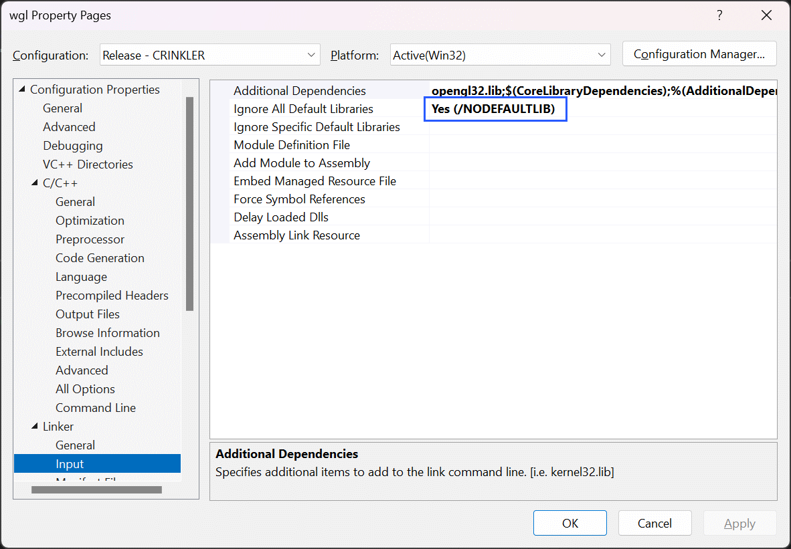
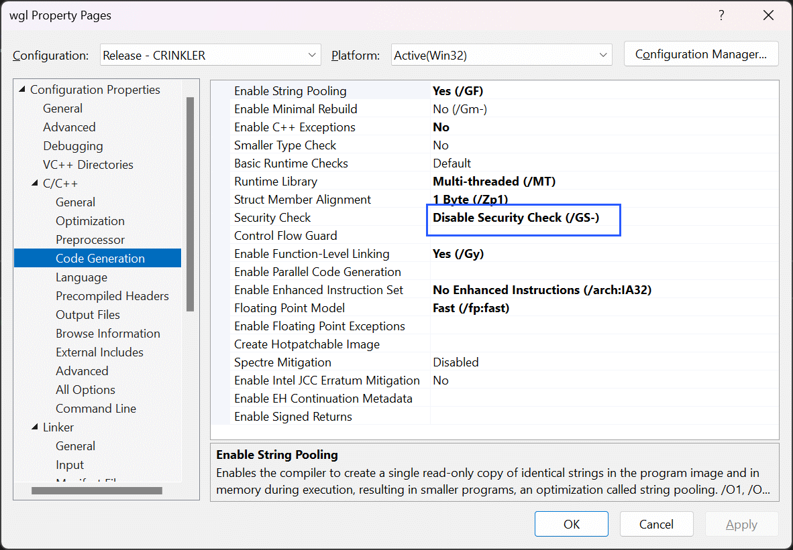
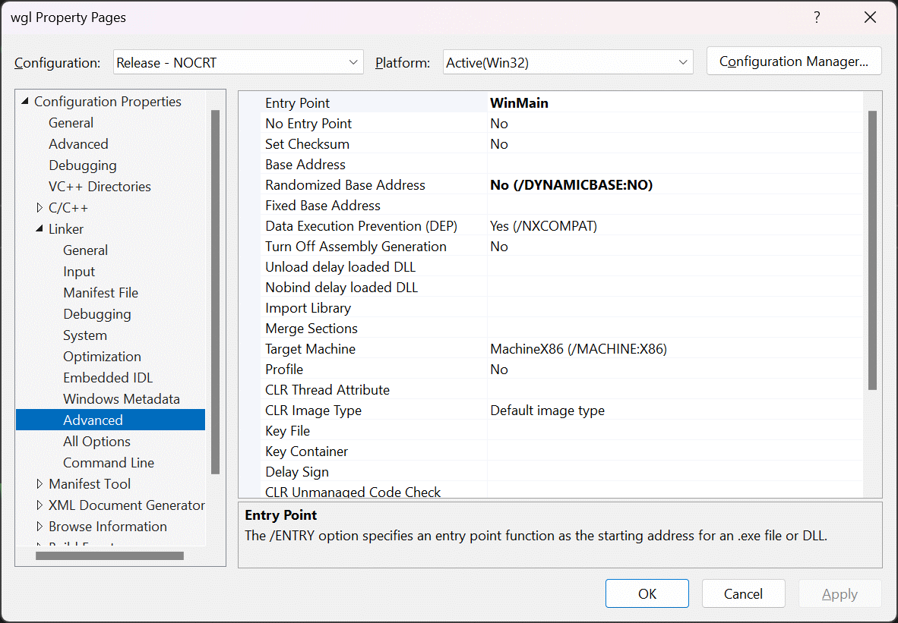
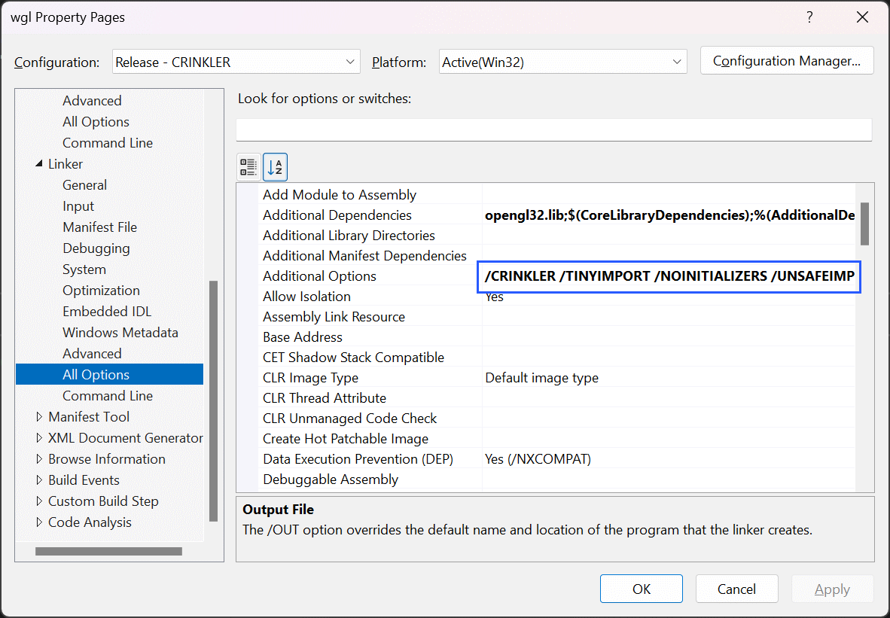

# 🎄⭐🎉 Rendering Shaders in a 4KiB Windows App 🎉⭐🎄

🧝🎅🧝 *Merry Christmas, size-coders!* 🧝🎅🧝

In my last post, I showed you how to create a minimal Windows app that renders a fragment shader. Now, as promised, we’re taking it to the next level—turning it into a *tiny* 4KiB executable.

This post isn’t about heavy coding; it’s more about configuring Visual C++ with some key settings. You can follow along with the project [here](wgl-app/).

As I mentioned before, the Windows app has one *big*, gift-wrapped problem when it comes to size-coding.

## 💥🚨 What's the BIG Problem? 🚨💥

The Windows app I built last time requires C-runtime DLLs, but in a 4KiB size-coding competition, bringing those along is like stuffing a turkey the size of Santa’s sleigh. We could embed the C-runtime into the executable, but that blows us up to about 100KiB. So, to squeeze under the 4KiB limit, we need to ditch the C-runtime entirely.

## 👢➡️ Kicking Out the C-Runtime 🚫👢


I set up a build configuration called "Release - NOCRT," which strips out the C-runtime. The key here is adding the `/NODEFAULTLIB` option to the linker.



Without the C-runtime, we lose functions like `printf` and some floating-point functions, but hey, it's all part of the size-coding challenge!

## ⚠️🧝⚠️ Resolving the Naughty Symbols ⚠️🧝⚠️

Once the C-runtime’s gone, the linker throws a few “missing symbol” tantrums:

1. `__fltused`
2. `@__security_check_cookie@4`
3. `___security_cookie`
4. `_WinMainCRTStartup`

To quiet things down:

- **`__fltused`**: Visual C++ throws this one in for reasons unknown to me. We’ll just define it ourselves in C-style:

```c++
extern "C" int _fltused;
```

- **Security symbols**: These are for Visual C++'s security checks. Since size-coders care more about bytes than buffer overflows, add `/GS-` to disable them.



- **Application Entry Point**: Normally, `WinMain` is called by the C-runtime after initialization, with the entry point managed by Windows via a symbol defined in the Entry Point setting in Visual Studio. Without the C-runtime, we need to update the Entry Point setting to point directly to our `WinMain` instead.



## ⚙️🛠️ A Mountain of Settings to Tinker With 🛠️⚙️

Visual C++ is packed with settings, and I’ve tweaked a whole bunch to minimize overhead. You can compare the `Release` and `Release - NOCRT` configs to see the differences, but I won’t pretend this is the ultimate setup. These are just some handy adjustments to pave the way for our next step.

Of course, the star of the show is removing the C-runtime—that’s the real game-changer here.


This should shrink us to around 7KiB. We’re close—but we’re not done yet. Next up, I’ll cover tricks to shave off those last few KiBs to hit the 4KiB mark.

## 🔗🛠️ Replacing the Default Linker with CRINKLER 🛠️🔗

The executable we’ve generated so far includes a lot of metadata and headers that Windows loves, but we size-coders don’t need. So, we want to strip them out. And wouldn’t it be great if we could bundle everything into a compressed, self-extracting package that decompresses at runtime? Good news! That’s exactly what [CRINKLER](https://github.com/runestubbe/Crinkler) is designed to do.

### Setting Up CRINKLER

To start, download Crinkler and place `link.exe` into your project directory (I’ve already done this in the example). Then, tell Visual C++ to search this directory for executables. Since Crinkler’s linker also goes by `link.exe`, Visual Studio will automatically use it.

> *Quick note*: This is living on the edge. Since Visual Studio just loads any `link.exe` it finds in the project directory, a sneaky `link.exe` from an untrusted source could spell trouble! But that’s the thrill of size-coding, right?

By default, Crinkler behaves like a standard linker. To activate its compression magic, specify `/CRINKLER` as a linker parameter.

Here are the options I’m using in the example project:



```
/CRINKLER /TINYIMPORT /NOINITIALIZERS /UNSAFEIMPORT /PROGRESSGUI /HASHTRIES:20 /COMPMODE:fast /ORDERTRIES:1000 /REPORT:REPORT.html /RANGE:opengl32
```

| Option                    | Description                                              |
|---------------------------|----------------------------------------------------------|
| **`/CRINKLER`**            | Activates Crinkler mode.                                |
| **`/TINYIMPORT`**          | Uses a more compact import format.                      |
| **`/NOINITIALIZERS`**      | Disables global variable initializers.                  |
| **`/UNSAFEIMPORT`**        | Aggressively reduces the import table.                  |
| **`/PROGRESSGUI`**         | Enables a linking progress bar.                         |
| **`/HASHTRIES:20`**        | Sets hash probing attempts, optimizing link time.       |
| **`/COMPMODE:fast`**       | Chooses faster compression.                             |
| **`/ORDERTRIES:1000`**     | Attempts better function/data ordering.                 |
| **`/REPORT:REPORT.html`**  | Generates a detailed HTML report.                       |
| **`/RANGE:opengl32`**      | Includes `opengl32.dll` for OpenGL support.             |


> *Curious?* There are plenty more options to explore in Crinkler’s [manual](https://github.com/runestubbe/Crinkler/blob/master/doc/manual.txt).

In the example project, you’ll find a `Release - CRINKLER` configuration ready to go. Switch to it, compile, and watch the magic happen—your executable should shrink to less than 2KiB!

### 🕵️‍♂️🔎 Tracking Down the Bytes with `REPORT.html` 🔍🕵️‍♂️

Crinkler produces a [`REPORT.html`](wgl-app/wgl/REPORT.html) file, showing what’s taking up space. This is super useful when you’re hunting for those last few bytes.

*Pro Tip*: Windows Defender or other antivirus software might get a bit grumpy about Crinkler’s output since it lacks standard headers. To avoid this, I simply mark the build folder as safe.

*Heads up*: For larger demos, Crinkler’s compression can take some time—usually around 3 minutes for my demos. Enjoy the progress bar while it works!

## 💪🌱 Making Further Improvements 🌱💪

There are plenty of ways to trim the fat even more. For instance, our shader code is a bit too “chatty” right now. To fix this, there’s an amazing tool called [shader-minifier](https://github.com/laurentlb/shader-minifier), which removes comments and shortens variable names to squeeze the shader code even smaller.

In our example, the shader starts at about 2KiB uncompressed, but with `shader-minifier`, you should be able to slim it down to below 1KiB!

And what’s a demo without some festive music? Size-coding doesn’t leave room for an MP3, but there are powerful tools like [4klang](https://github.com/gopher-atz/4klang) and [sointu](https://github.com/vsariola/sointu) that let you compose music, save it as assembly code, and link it directly into your demo. They’re perfect for adding those merry tunes without ballooning file size.

## 🎁 That’s a Wrap! 🎁

I hope this guide has given you everything you need to start with size-coding! It’s a wild mix of fun and challenge—sometimes maddening as you chase down those last 5 bytes. But when you finally get that executable under 4KiB (or even 1KiB!), the feeling is truly magic.

So go on, give it a shot, and let’s see what tiny wonders you can create!

🎄🌟🎄 Merry Christmas, and happy coding to all! 🎄🌟🎄

🎅 – mrange

## ❄️Licensing Information❄️

All code content I created for this blog post is licensed under [CC0](https://creativecommons.org/public-domain/cc0/) (effectively public domain). Any code snippets from other developers retain their original licenses.

The text content of this blog is licensed under [CC BY-SA 4.0](https://creativecommons.org/licenses/by-sa/4.0/) (the same license as Stack Overflow).