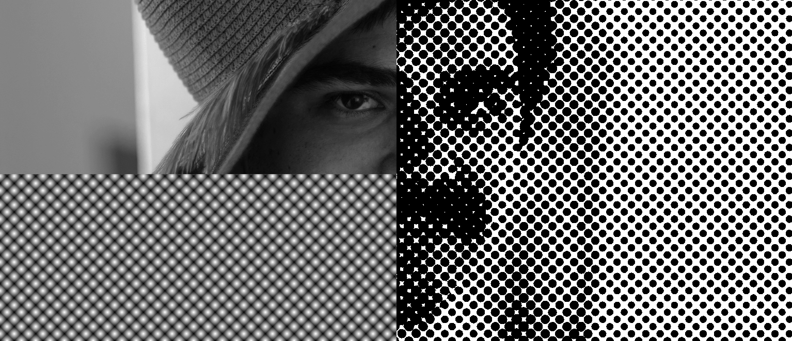
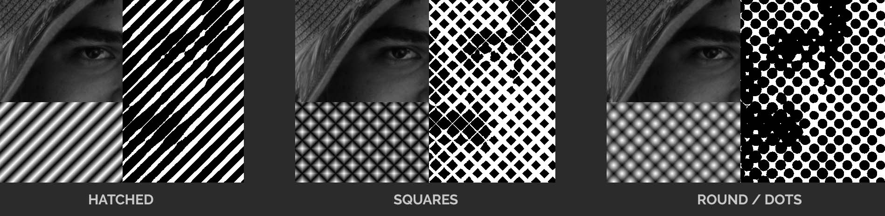
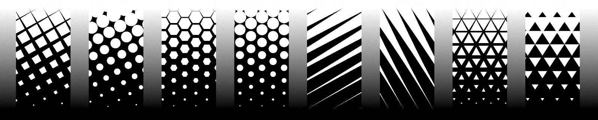
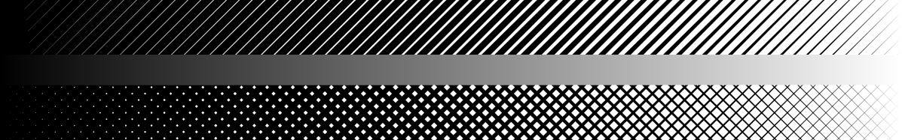
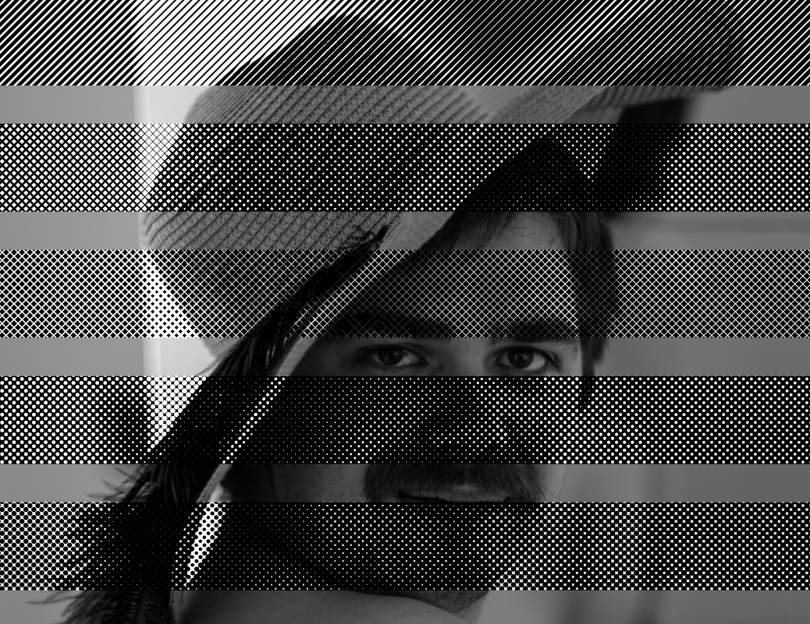
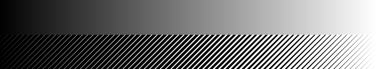
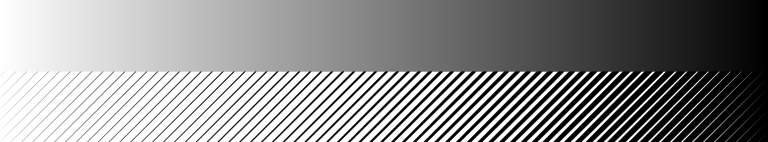

# Halftoning 🎁

## Introduction

[Halftoning](https://en.wikipedia.org/wiki/Halftone) is essentially binary [thresholding](https://en.wikipedia.org/wiki/Thresholding_(image_processing)) with a pattern. You could also think of it as a monochrome dithering process.

It’s commonly used to mimic a [printed](https://en.wikipedia.org/wiki/Offset_printing) look, as seen in magazines or comics.

 

The process is combining a **gray scale image** (top-left) with a **pattern** (bottom-left, represented by a "halftone map"). The result is a binary image (to the right).

#### [Basic halftone example on shadertoy](https://www.shadertoy.com/view/lfKBWV) (applied to video)

```
// create grid
gridUv = mod(gridUv * gridSize., 1.0);

// for each grid-cell, just take the distance to center
// and divide by the length of half the diagonal 
float halftone = length(gridUv - 0.5) / length(vec2(0.5, 0.5));

// threshold
float c = halftone < lum ? 1.0 : 0.0;
```


## Halftone dot shapes

I think of the pattern as a grayscale image (halftone map), that defines the detail shapes for all levels of intensity.

 

#### [Halftone dot shapes illustration](https://www.shadertoy.com/view/lfyfRc) (shadertoy)

```
float hatchHalftone(vec2 uv) {
   return 1.0 - 2. * abs(uv.y - 0.5);
}

float squareHalftone(vec2 uv) {
   return 1.0 - 2. * max(abs(uv.x - 0.5), abs(uv.y - 0.5));
}

float roundHalftone(vec2 uv) {
   // just take the distance to center and divide by diagonal
   return 1.0 - length(uv - 0.5) / length(vec2(0.5, 0.5));
}
```
The dot-shapes most commonly used in printing are: round, elliptical and square. But we can use any kind of pattern!

 

## Preserving percieved contrast/brightness

So far we've totally ignored the issue with drifting contrast and brightness as we do halftoning. To get a bit more rigour, we should:
 1. Do halftoning in [linear color space](https://silverhammermba.github.io/blog/2017/12/01/gamma)
 2. Make sure our halftone maps have uniform histograms

Having a **uniform histogram** just means that:

 * If you threshold at 0.5, 50% of the map is filled.
 * If you threshold at 0.2, 20% of the map is filled.
 * and so on...

The hatched halftone map already has this property, as it kind of opens linearly like a sliding door.
The square one needs a simple adjustment (squaring one of the terms), but the dot one is trickier since the dots grow and eventually start overlapping.
A few years back I came up with a function that warps the dot halftone map so it's close to uniform, but I think there is probably a much better solution...

Here is a [madtealab link with 3 halftone maps, and a way to verify that they are close to uniform](https://madtealab.com/#V=1&C=3&F=6&G=1&R=0&O=1&W=788&GW=734&GH=198&GX=0.5&GY=0.5&GS=1.9&GQ=90&EH=180&aN=threshold&b=246&bMi=8&bMa=2048&bI=1&bN=N&cMa=2&cI=1&cN=which&f1=1+-+2.+%2A+abs%28y+-+0.5%29&fs1=2D&f1N=hatched&f2=1+-+pow%282.+%2A+max%28abs%28x+-+0.5%29%2C+abs%28y+-+0.5%29%29%2C+2%29&fe2=0&fs2=2D&f2N=squares&f3=warpDots%28+1+-+sqrt%28%28x+-+0.5%29%2A%2A2+%2B+%28y+-+0.5%29%2A%2A2%29+%2F+0.707106781186+%29&fe3=0&fs3=2D&f3N=dots&f4=hatched%28x%2C+y%29+%3C+threshold&fs4=2D&f4N=hatchedCoverage&f5=squares%28x%2C+y%29+%3C+threshold&fe5=0&fs5=2D&f5N=squaresCoverage&f6=dots%28x%2C+y%29+%3C+threshold&fe6=0&fs6=2D&f6N=dotsCoverage&Expr=warpDots+%3D+function%28x%29+%7B%0A+var+m+%3D+3.1383226%3B%0A+var+bl+%3D+clamp%28x%2F0.293%2C+0.%2C+1.%29%0A+x+%3D+%28m%2Ax+-+m%2Ax%2Ax%2F2%29%2Amix%280.619-x%2A0.28-x%2Ax%2A1.1-pow%28max%280%2Cx-0.09%29%2C5%29%2A300%2C1%2Cbl%29+-+0.5692+%2A+bl%0A+return+x%0A%7D%0A%0A%2F%2F+calculate+coverage+%28select+function+using+%22which%22%2C+and+precision+using+N%29%0Avar+sampleFunc+%3D+%5BhatchedCoverage%2C+squaresCoverage%2C+dotsCoverage%5D%5Bwhich%5D%0Avar+coverage+%3D+mean%28+range%28N%2AN%29.map%28xy+%3D%3E+sampleFunc%28floor%28xy+%2F+N%29+%2F+N%2C+%28xy+%25+N%29+%2F+N%29%29+%29%0A%0Aout%28%22threshold%3A+%22+%2B+threshold%29%0Aout%28%22+coverage%3A+%22+%2B+coverage%29%0Aout%28%22+++++diff%3A+%22+%2B+%28threshold+-+coverage%29%29%0A)

## It's still too dark...

 

With linear processing and uniform histograms, it's still too dark. And running out of rigour, a tried a quick hack to compensate, by adjusting the input channel in linear space, [like so](https://madtealab.com/#V=1&C=2&F=1&G=1&E=0&R=0&W=657&GW=603&GH=346&GX=0.5&GY=0.5&GS=1.9&a=0.06&aMa=0.1&aN=ShapeLowBoost&b=0.45&bN=ShapeLowBoostGamma&f1=x+%2B+pow%28x%2C+ShapeLowBoostGamma%29+%2A+%281.+-+x%29+%2A+ShapeLowBoost):

    x += pow(x, ShapeLowBoostGamma) * (1. - x) * ShapeLowBoost; 

Playing around a bit I concluded that the feeling of too much darkness:
 *  increase as the dots gets bigger
 *  decrease when the pattern has lines rather than dots
 *  changes depending on display/platform (I should stop now...)

(But I did not try to compensate for these)

------------------------------------------------------------

This final shadertoy version displays 5 variants, as the square and round patterns behave differently when reversed:
 
#### [Halftone - 3 kinds](https://www.shadertoy.com/view/XcKfWc) (shadertoy)


  

## Interesting consequences...

Let's revisit the hatched ramp:

 

Now, let's think of the hatched ramp as a white vector shape against a black background. Intuitively, if a vector shape represents a smooth transition between colors A and B, surely we can swap the colors and expect a similar result! 

This is what actually happens:

 

The transition is now much too bright, and the end is abrupt. So I guess a shape is never really independent from the color context...

I don't really know what's going on, but I guess it has to do with the remarkable dynamic range of human vision. A similar effect is observed in typography, making white text on dark backgrounds appear more bold than dark text on bright backgrounds, sometimes referred to as [the irradiation illusion](https://en.wikipedia.org/wiki/Irradiation_illusion).

I feel it makes sense that a speck of light in the dark would be more salient than absense of light in a sea of brightness. Some of it is probably due to light scattering inside the eye, and some of it is probably in the brain circuitry. 


## ❄❄❄ 🌟🌟🌟 ❄❄❄

Merry Christmas from [teadrinker](https://teadrinker.net/prods)!

[Test image by Morten Rieger Hannemose, 2019](https://mortenhannemose.github.io/lena/)
