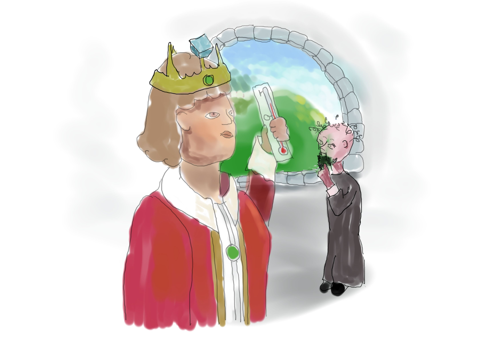
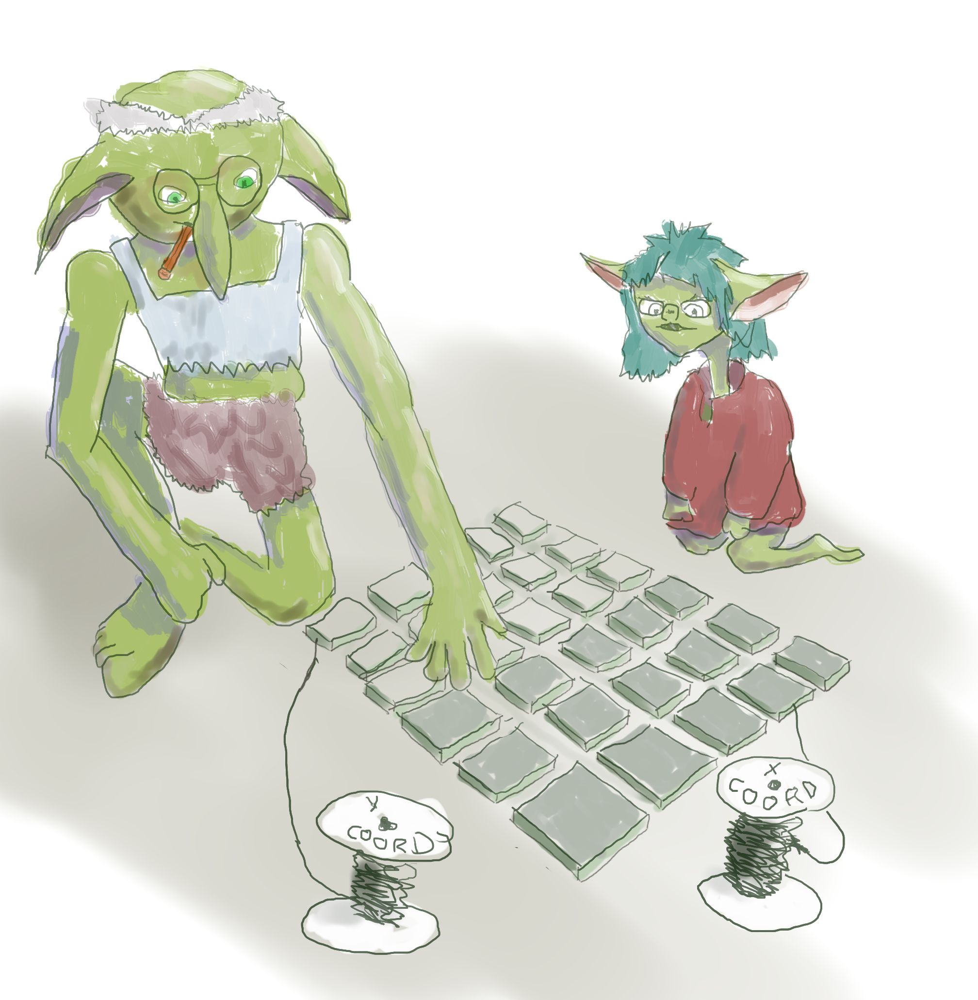
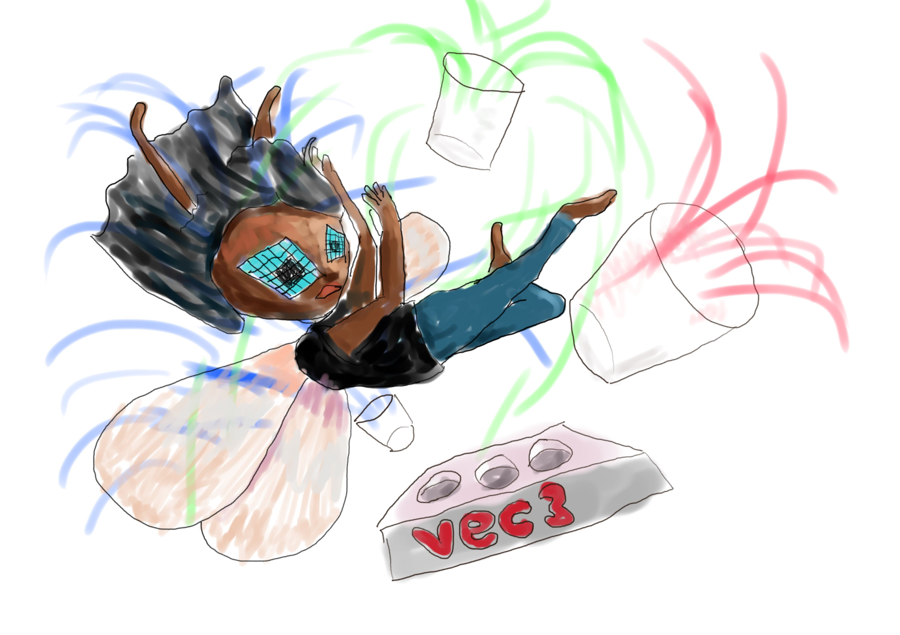
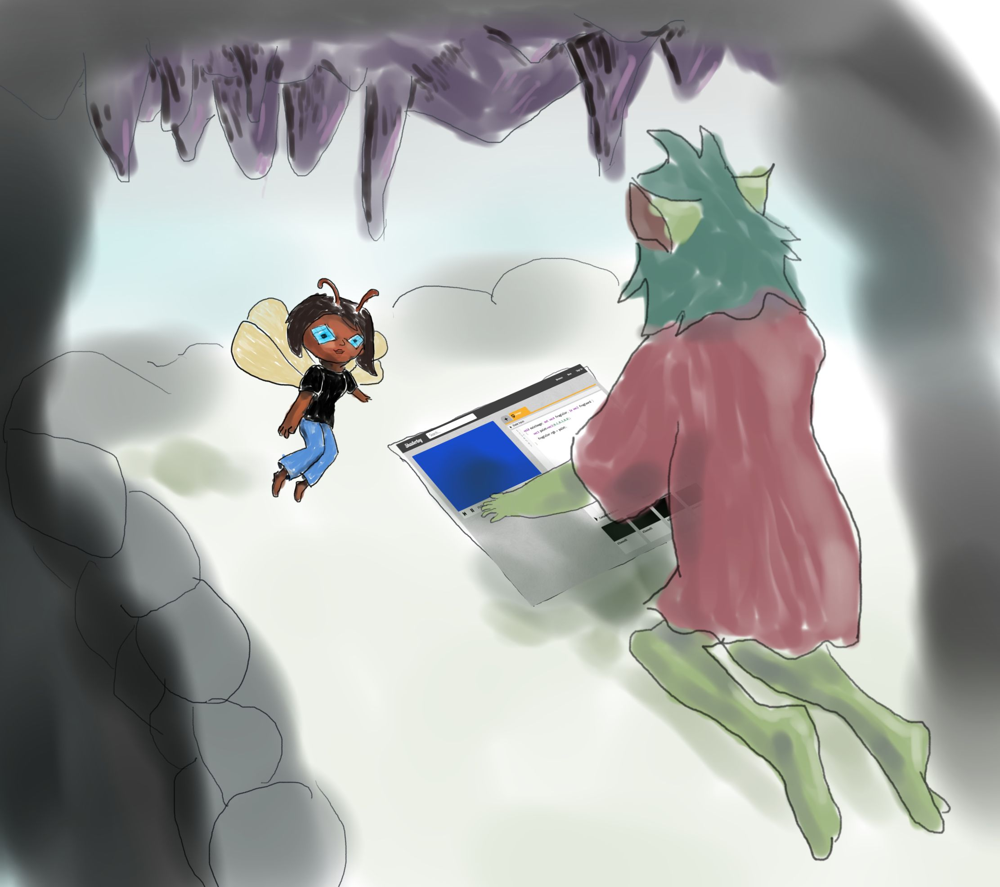
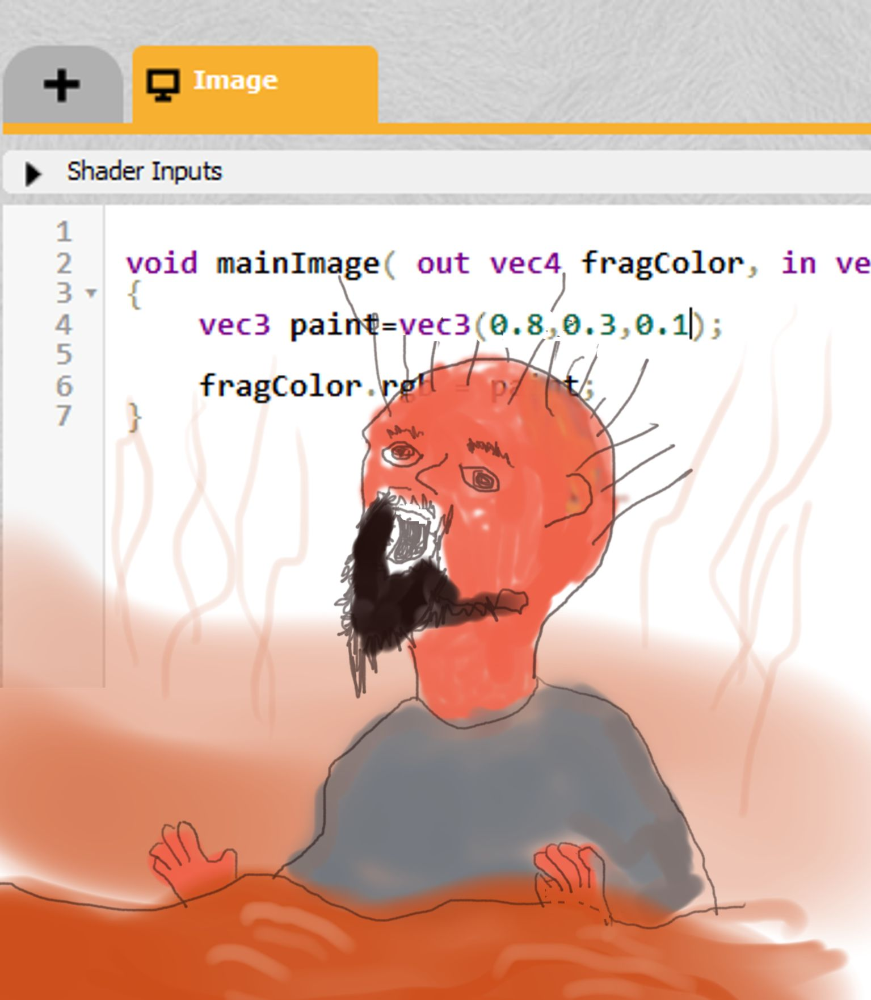
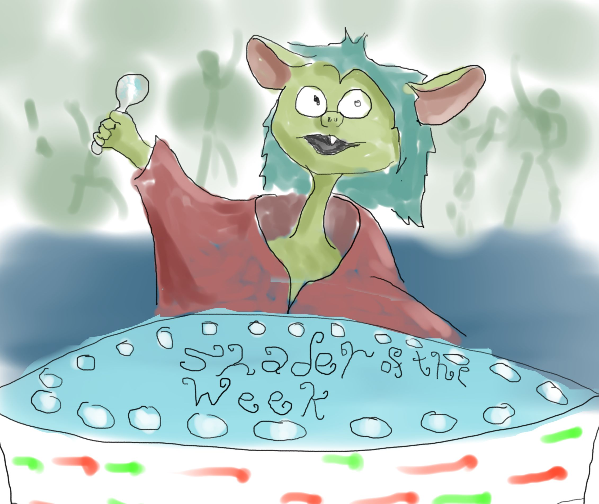

A short and fantastic story about goblins and their magical use of shaders. You can run these magical spells by writing them into a new shader at https://shadertoy.com/new.

The technical part of this story is only the most basic syntax for changing the color in a fragment shader. On its own it is not a good way to learn to write shaders, any more than Aladdin is the best way to learn lamp cleaning technique. But maybe you'll enjoy it anyway.

## Chapter 1 – The King’s Palace

In the kingdom of Shadertoy, the sun was rising over the green hill in front of the castle. Behind the hill, the fairy woods of Raymarch faded into the morning fog. It had been a damp night, and the king was in a bad mood.



“I’m in a bad mood,” Said the king. The king was not known for subtlety.

And when the king is in a bad mood in the kingdom of Shadertoy, everybody gets to hear about it.

“All harken to our evil king!” demanded his disloyal advisor, a man with a pointy beard that could cut cheese. Despite this shameless attempt to butter him up, the king was not pleased.

“It was 0.5 degrees last night, I was freezing in my castle.”

“0.5 degrees?” asked the disloyal advisor, whose full title was Count Variable the Disreputable. He had a green cape on and it didn’t suit him, but he thought it made him look more important so he wore it.

“Yes,” said the evil king. “0.5. It’s halfway between 0 degrees and 1 degree. And if I spend another year in this miserable castle, I shall behead someone! I shall command the people of my kingdom to build me a better home.” He thought for a bit. “A palace! Not some rustic old castle, but a sparkly modern place with … sparkles and things. Send forth a proclamation. I want a palace!”

“Will there be a reward, sire?” asked Count Variable the disloyal advisor, who was very greedy, and already thinking about how he could profit from this. (You might be wondering why the king employed such a disloyal person, and the simple answer is that they went to school together.) “People like a good reward,” he added, and then to himself: _I would like a good reward_.

The king thought about this. He was a mean man, and didn’t want to give away his wealth, but the kingdom did have a lot of goblins in it, and he was not fond of goblins. “What about the goblins?” He said out loud. “Yes, that’s it. The kingdom must build me a castle, and whoever builds me the most beautiful part of the castle, be it a wall or a door or a moat, they shall be lord over all goblins in the kingdom.”

_Ugh,_ thought Count Variable to himself, but quietly because the king was in one of his moods. _Who wants a thousand stinking old goblins?_ 

But then, a bit later, as he walked down the long corridor of the castle to get his breakfast, he started thinking... _Well, goblins are rather tasty when baked in a pie._ He stopped walking and licked his lips. _Yes, if I was lord of the goblins, I could eat them all and no-one, not even the goblins, could stop me. But I can’t be bothered making anything myself for this silly castle. Let the peasants do it and I will steal the credit._


## Chapter 2 – Meet the Goblins

Deep inside the green hill outside the castle, the news of the king’s decision was about to reach the goblin main.

A main is what goblins call their home. It’s like a cave, but far more beautiful, with crystal stalactites and marble walls and tinkling underground streams. Although a lot of people think goblins are nasty and mean and stupid and stinky, they’re actually kind, artistic and thoughtful. But the smell, unfortunately, is true. Goblins smell terrible. But goblins are proud of their stink, and who are we to judge?

Another thing about goblins is that they do magic. It is like a craft to them, and they make things out of tiny tiles called fragments. Noff the young goblin was watching Fragbog the Fragmaster do his magic.



Fragbog was an old goblin, and he didn’t like trouble, or surprises. He was putting down a mosaic of fragment tiles on the floor of the main. Tiles next to tiles, side to side and up and down. Each fragment was tiny, so that the magic could be more detailed. He was casting a traditional image spell on the tiles, and it began like this:

```
void mainImage( out vec4 fragColor, in vec2 fragCoord )
{
	...
}
```

The way goblin magic works, you see, is they cast an image spell on each tile. Every fragment tile gets the same spell, but each tile knows where it is because it’s woven together by a pice of coord. How far along the coord a fragment is, tells it where it is. Like, imagine you held a piece of string that was 8 metres long, and you walked straight ahead. Where would you be? 8 metres ahead of where you started. And then the spell changes the fragColor, depending on where it is.

```
void mainImage( out vec4 fragColor, in vec2 fragCoord )
{
    if (fragCoord.x > 500.0) fragColor.rgb = vec4(0.0,0.0,0.0);
    else fragColor.rgb = vec3(1.0,1.0,1.0);
}
```
Fragbog cast this spell on the tiles by typing it into [Shadertoy](https://www.shadertoy.com/new) and then saying the magic words, which are "alt+enter."

This spell is then cast on every tile. In goblin magic, just like in fairy magic, “x” means sideways and “y” means up. So in this case, if a tile has a coord more than 500 long, then it turns itself one color, and if it is less than 500 long it turns itself a different color. Because goblins are so detailed in their work, you can fit an amazing number of tiles in a small space. Fragbog had been making this pattern for years.

## Chapter 3 – The News Reaches the Goblins

Fragbog was sitting preparing his magic, with tiles all around him, and little pots of paint stored in trays. The trays that goblins keep their pots in are called vecs, and they have different sized trays for different things. It’s a bit confusing, but the goblins practice until they get the hang of it. Noff was helping by preparing a color for him.

She got out three little pots in a row. In goblin magic, three little pots in a row is called a vec3. And when they’re used to make a color, the pots contain sparkling light in different colors. The first one contains all the red light, the middle one contains all the green light, and the last pot contains all the blue light. Red, Green and Blue, or RGB for short. When a pot is empty, it is 0.0, when it is full it is 1.0, and when it is half full it is 0.5, just like 5 is halfway to 10. You might already know, but you can make all the colors you need out of just three paints in different amounts. And that’s how goblin magic works, too. Look at how the colors worked in Fragbog’s spell above.

```
    if (fragCoord.x > 500.0) fragColor.rgb = vec3(0.0,0.0,0.0);
    else fragColor.rgb = vec3(1.0,1.0,1.0);
```

The first line means “if you go along the sideways coord (that’s what `fragCoord.x` is) by more than 500, put in a color vec3 with nothing in the color pots. No color in the color pots means it is black, because there is no light coming from the pots. The second line shows what the spell does otherwise, and that is to fill the red, green, and blue pots right to the brim. When red, green, and blue are shining brightly together, you get white.

Noff and Fragbog were sitting in the doorway, putting the color vec3 in the mainImage, when a distraught pixel fairy named Olive Stick flew into the main in a hurry. Unfortunately, she didn’t see Fragbog in the corner by the door, and she tripped over his vec3, causing a strange and beautiful  explosion of color everywhere. 



Hastily apologising, she explained that she had been out chopping wood in the forest when she had found a shiny proclamation nailed to a tree. “Become lord of the goblins!” it had said. She had torn it down and brought it straight to the goblins. “Whoever builds the best piece of castle will rule over the kingdom’s stinkiest community,” it said, meaning the goblins.

“Typical,” said a goblin standing nearby. “Nobody asked us, did they?”

“Why should they?” said another. “The king don’t like us, he thinks he owns everything and everyone. The trouble is, he’s got those nasty men with the big sticks, so we end up having to do what they say. Goblins will never be free in this kingdom. This is bad.”

Noff spoke up. “What if we won the prize? Then we would be lords of ourselves, and we would be free!”

Every head turned and looked at Noff, and Noff immediately regretted saying her idea. She was a small goblin, and not as thoughtful as some. Most goblins would like to think about an idea all morning before telling anyone, just in case it was silly. Noff just opened her big mouth (and it was big, though not that big if you are a goblin). And then, all at once, the rest of the goblins burst out laughing.

Noff hid her face, and thought about never speaking again.

## Chapter 4 – Making The Moat

But she didn’t give up her idea, and that afternoon, when most of the goblins were having a midday nap, Olive Stick came and found her crying under a pile of rocks she had heaped over herself.

“I think your idea is good,” said Olive, panting breathlessly. She had to move several rocks before could even see Noff’s face, and pixel fairies don’t usually carry anything heavier than a wand.

Noff stopped sniffling, unburied herself, and together they found a quiet little corner down by a flowing underwater stream, ready to set up a new spell. Olive watched while Noff stared at the spell, not knowing where to start.

She was watching Olive paddling in the underground stream as it flowed through the cold rocks in the main and was thinking about the color blue, so Noff put some blue paint in the blue pot and left the other ones empty. Like the king said, 0.5 is halfway between 0 of something and 1 of something. In this case 1 is a full pot of color, and 0 is an empty pot. 0.8 is quite full, and 0.1 is nearly empty.

```
void mainImage( out vec4 fragColor, in vec2 fragCoord )
{
    vec3 paint=vec3(0.0,0.0,0.8);
    
    fragColor.rgb = paint;
}
```

She tried changing the amounts of paint in each of the pots for the paint. Like this:

```
vec3 paint=vec3(0.7,0.3,0.1);
```

“Too much red, not enough blue!” she said to herself. Olive agreed.

```
vec3 paint=vec3(0.1,0.3,0.8);
```



Olive smiled when she saw the spell turn the fragments a beautiful clear blue. Noff was delighted with the deep blue color she had made, “that is a perfect blue for a watery moat around the castle,”  she thought. She called the spell “blue moat for the castle,” tagged it #fairytale and saved it. Then she went to bed, and dreamed about flying through the sky on a blue frog with wings. That’s not relevant to the story, but she insisted that I mention it because it was a cool dream.

## Chapter 4.5 - That Night

In the deep middle of the night, a dark figure stole inside the main, holding a candle. A goblin would never carry a candle at night, because they can see really well in the dark. So this wasn’t a goblin but someone else, someone up to no good. The candle, and therefore its owner, bobbed sneakily around the main until it found its way to the little underground stream. It saw the magic spell there, and it picked up one of the tiny fragment tiles. Through the sounds of a thousand goblins snoring, the mysterious candleholder tiptoed out.

## Chapter 5 – Betrayal, Justice, and Cake

It was a new dawn, a new day, and Noff woke with a bounce, ready to present her makings and hoping to win a great prize from the king. 

She knew she couldn’t go to the king looking and smelling like a goblin so she needed a disguise. First she hopped into the stream with a bar of soap, and made herself smell as fresh as a pixel fairy. She put on her most human-looking clothes (they were pyjamas, but at least they were human), a pair of shoes on stilts, and a fake beard. She put her enchanted fragment tiles in a shoulder bag, and stalked wobblily out of the main, and over to the king’s palace building site.

Olive Stick met her on the way, and she laughed delightedly at Noff’s disguise, including the long, wobbly stilts that she had hidden in the pyjama trousers. They talked excitedly about winning the great reward. But when she got there, the sight she saw sent shivers down her spine. Around the edge of the palace grounds there was a new...

Beautiful…

Blue…

Moat.

In exactly the same color that she had designed herself. She felt a chill of betrayal run through her.

_Someone stole my idea!_ She realised at once. And there, wading in the moat, showing off its beautiful blueness to the king himself, was Count Variable.

“Oh yes your majesty,” she heard the disloyal advisor saying to the king. “I worked hard all night to make this.” Noff was outraged at his lie. She had made this!

But even as Noff was storming over, the heat of her anger flushing her cheeks, she overheard the king say, “this really is an exceptional shade of blue,” said the king, impressed. “This is the best piece of my new palace, and I name you lord over all of the goblins.” Noff wobbled, partly out of fury but mainly because she had forgotten that she was walking on stilts.

Count Variable licked his lips, and his mouth watered. In his eagerness he had already packed his frying pan and a camping stove. He knew exactly what he was going to do to the goblins once he caught them. Delicious he was thinking to himself.

“Stop!” Shouted Noff. Then she realised she was in disguise and shouted again, but deeper. “Stoooop. This man is a cheat! He stole this moat from me.”

“Nah broski,” said the king. “This is my most untrustworthy courtier, you’re simply jealous of his success. Who are you anyway? I don’t think I’ve seen you before.”

“No-” Noff began to say her name, but caught herself in time. “-rman. Yes, Norman. I keep myself to myself, your majesty. I invented this moat with my own magic, and I can _prove_ it. I bet this man,” she indicated the count, “has no idea how it’s made.”

“I do so!” said the count, treading water in the magical moat he had stolen. “It’s blue, and you make it into a moat, and that’s that. Guards, seize this suspiciously spindly man in his pyjamas.”

Noff had to act fast, there were two grumpy-looking men in black walking over, and if they discovered that Norman was in fact Noff, she would be the first into Count Variable’s frying pan. She opened up the spell source for the moat, and saw her own magic inside. She saw where it said

```
vec3 paint=vec3(0.1,0.3,0.8);
```

And she swapped the red and blue pots around.

```
vec3 paint=vec3(0.8,0.3,0.1);
```



Immediately, the moat turned red. Red-hot, that is. Count Variable hooted in pain and swam to the land as quickly as he could, where he lay on the grass feeling sorry for himself. “It’s like getting in the bath too soon,” he muttered, trying to cool off.

It was obvious that "Norman" knew more about the way the moat was made than the Count did. The king looked at his disloyal advisor with narrowed eyes and sighed. “He is disloyal, I suppose I shouldn't be surprised,” he said. “Very well Norman, I see you were the true maker of this magic moat, and in the name of myself, I declare you lord of the goblins. I hope you’re happy with them.”

Noff smiled. “Goblins have a lot of hidden surprises,” she said in her best Norman voice. “I will set them free, to live as they wish.”

“WHAAAT” shouted Count Variable, though he was still too hot to move. The king just nodded. “Fair enough,” he said with a shrug.

As she was leaving, Noff turned the moat back to a cool blue, and as she was walking away, trying not to wobble on her stilts, she heard the count divebomb into its coolness gratefully.

When she got back to the main, her and Olive told the other goblins what she had done. They didn’t really know whether to believe her tall story, but they baked her a cake anyway. And as the months went by, and the king did nothing to bother them, they decided that maybe Noff was a hero after all.

