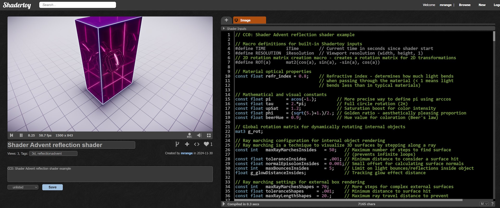

# 🎄🌟 Reflecting on Christmas Eve 🌟🎄

🎅 Ho, ho, ho! Welcome, shader enthusiasts, to another festive foray into the world of WebGL! 🎅

## A Holiday Glow-Up for Your Shaders

If you've already unwrapped the basics of ray marching in GLSL, it’s time to take things up a notch. Let’s make something dazzling—like a shiny 3D block with glowing inner reflections.



Think of it as building your own digital Christmas ornament, complete with all the sparkle and shine.

## What's in Santa’s Shader Sack?

This shader will use **three ray tracers**, each working together like little elves:

1. **The World Ray Tracer:** Creates the ground and sky—the stage for our glowing block.
2. **The Block's Outer Ray Tracer:** Reflects the world around it and refracts light into the block.
3. **The Inner Reflections Ray Tracer:** Handles light bouncing inside the block, accumulating glow using Beer’s Law to fade out distant reflections.

## Step 1: Painting the World

The first ray tracer builds the background. It’s simple with a touch of anti-aliasing to keep things smooth.

We start with the ray origin (`ro`) and direction (`rd`). From the ray direction, we calculate the sky color—a gradient that shifts with the vertical angle:

```glsl
col = hsv2rgb_approx(vec3(
  0.6,                                // A bluish hue for the sky
  clamp(0.3 + 0.9 * rd.y, 0.0, 1.0),  // Saturation varies with height
  1.5 * clamp(2.0 - 2.0 * rd.y * rd.y, 0.0, 2.0) // Non-linear brightness
));
```

The result of festive tinkering. Like most shader developers, I adjusted and eyeballed it until it looked good enough—our industry’s secret sauce!

### Step 2: Crafting the Ground

For the ground, we draw a light gray grid on a white background. To create the grid, we use a technique called domain repetition to repeat a single cross "for free":

```glsl
// Create grid coordinate system
// Snap coordinates to the nearest grid point
vec2 npp = round(bpp);
vec2 cpp = bpp - npp;
```

Here, `cpp` defines a coordinate system for 1x1 grid cells. From there, creating the distance field for the grid lines is straightforward.

```glsl
vec2 app = abs(cpp);
float gd = min(app.x, app.y); // Distance to the nearest grid line
```

### Step 3: Anti-Aliasing

To reduce aliasing, we make the grid lines fade based on distance and viewing angle. For this, we compute `gfre` like so:

```glsl
// Grid line distance field with view-angle compensation
float gfre = 1.0 + rd.y;
gfre *= gfre;
gfre *= gfre;
```

Here’s the trick: `gfre` ranges from 0 (looking straight down) to 1 (viewing at a grazing angle). I kept tweaking how many times to multiply `gfre`—the classic shader developer's experiment-until-it-looks-right process.

Here is the complete `renderWorld` function:

```glsl
// Render the surrounding world environment
// Responsible for creating the background scene including sky and ground plane
vec3 renderWorld(vec3 ro, vec3 rd) {
  vec3 col = vec3(0.0);

  // Calculate distance to floor plane using ray-plane intersection
  // Uses ray origin (ro) and ray direction (rd) to compute intersection point
  float bt = -(ro.y-bottom)/(rd.y);

  // Generate sky color using HSV approximation
  // Color varies based on ray direction (up/down angle)
  // - Hue is fixed at blue-cyan (0.6)
  // - Saturation depends on vertical ray angle
  // - Brightness uses a quadratic falloff to create gradient effect
  col = hsv2rgb_approx(vec3(
    0.6,                                // Fixed hue for sky color
    clamp(0.3+0.9*rd.y, 0.0, 1.0),      // Saturation varies with vertical angle
    1.5*clamp(2.0-2.*rd.y*rd.y, 0.0, 2.) // Brightness with non-linear falloff
  ));

  // If ray intersects ground plane, render ground details
  if (bt > 0.) {
    // Compute intersection point on ground plane
    vec3 bp = ro + rd*bt;
    vec2 bpp = bp.xz;

    // Create grid coordinate system
    // Round coordinates to snap to grid points
    vec2 npp = round(bpp);
    vec2 cpp = bpp - npp;
    vec2 app = abs(cpp);

    // Grid line distance field with view-angle compensation
    // Reduces aliasing by adjusting line width based on view angle
    float gfre = 1.+rd.y;
    gfre *= gfre;
    gfre *= gfre;

    // Compute grid line distance
    // Dynamically adjusts line width based on view angle to reduce hard edges
    float gd = min(app.x, app.y) - mix(0.01, 0.0, gfre);

    // Ground base color using HSV approximation macro
    // Soft grayish tone with slight warmth
    const vec3 bbcol = HSV2RGB_APPROX(vec3(0.7, 0.2, 1.25));

    // Distance-based fade effect
    // Reduces ground detail and brightness at far distances
    float bfade = mix(1., 0.2, exp(-0.3*max(bt-15., 0.)));

    // Anti-aliasing width adjustment
    float aa = mix(0.0, 0.08, bfade);

    // Blend ground color with fading and grid line effects
    // Creates soft, slightly faded grid appearance
    vec3 bcol = mix(bbcol, bbcol*bfade, smoothstep(aa, -aa, gd));

    // Blend ground with sky, creating distance fog effect
    // Simulates atmospheric perspective
    col = mix(col, bcol, exp(-0.008*bt));
  }

  return col;
}
```

## Rendering the World

The world ray tracer alone isn’t enough—we need to do a bit more to bring it to life.

One concept that can feel a bit tricky at first is setting up the ray direction based on the fragment’s 2D coordinates.

The simplest approach? Copy and paste the setup code—just like everyone else does:

```glsl
// Set the starting point of the ray in 3D space
vec3 ro = rayOrigin;

// Define the "up" direction, used for camera orientation
const vec3 up = vec3(0.0, 1.0, 0.0);

// Set up the ray direction using a "look-at" camera model
// Normalize the direction from the ray origin to the look-at point
vec3 ww = normalize(lookAt - ro);

// Compute the right vector by crossing the up vector with the direction
vec3 uu = normalize(cross(up, ww));

// Compute the true "up" vector (orthogonal to both ww and uu)
vec3 vv = cross(ww, uu);

// Define the field of view (FOV); larger values mean a wider view
const float fov = 2.0;

// Compute the ray direction for this pixel
// Combine the perspective (FOV) and the camera's orientation
vec3 rd = normalize(-p.x * uu + p.y * vv + fov * ww);
```

To understand the ray direction setup, let’s break it down. In a 3D scene, imagine you’re looking through a camera. The ray direction determines where each pixel on the screen "looks" into the scene.

Here’s how it works:

1. **Camera orientation:** The `lookAt` vector specifies where the camera is pointing, and the `up` vector ensures the camera isn’t tilted sideways. Using these, we calculate three key vectors:
   - `ww`: The forward direction of the camera (where it’s looking).
   - `uu`: The right-hand direction, derived by crossing the `up` vector with `ww`.
   - `vv`: The true upward direction, which is perpendicular to both `ww` and `uu`.

2. **Field of view (FOV):** The `fov` value controls how wide the camera’s view is. A larger `fov` means a wider perspective, while a smaller one zooms in.

3. **Mapping the screen to rays:** Each fragment’s 2D coordinate (`p`) is mapped to a 3D ray direction. This is done by combining the camera orientation (`uu`, `vv`, `ww`) with the FOV and the screen’s aspect ratio.

In simpler terms, the code sets up a virtual "lens" through which rays are cast into the scene. Each pixel gets its own unique ray direction, which allows us to simulate perspective and depth. Once the ray directions are set, they’re passed to the ray tracer to determine what each pixel "sees."

Finally, we calculate the pixel color by passing the ray origin and direction to the `renderWorld` function.

```glsl
// Initialize the color accumulator
vec3 col = vec3(0.0);

// Render the scene by tracing the ray (ro: origin, rd: direction)
col = renderWorld(ro, rd);

// Saturate the colors a bit
col -= 0.03 * vec3(2.0, 3.0, 1.0) * (length(p) + 0.25);

// Apply a vignette effect to darken edges of the screen
col *= smoothstep(1.7, 0.8, length(pp));

// Tone map the color from high dynamic range (HDR) to standard [0,1] range
col = aces_approx(col);

// Simulate a gamma correction for RGB to sRGB conversion
col = sqrt(col);
```

Below is the complete world renderer example. Note that some constants and functions included aren’t used yet—they’ll come into play when we add the other ray tracers.

If I’ve done my job right, [create a new ShaderToy](https://www.shadertoy.com/new), paste the code below, and you should see a rotating grid in white.

Alternatively, visit the [shader I uploaded to ShaderToy](https://www.shadertoy.com/view/MftBWH).


```glsl
// Macro definitions for built-in Shadertoy inputs
#define TIME        iTime        // Current time in seconds since shader start
#define RESOLUTION  iResolution  // Viewport resolution (width, height, 1)
// 2D rotation matrix creation macro - creates a rotation matrix for 2D transformations
#define ROT(a)      mat2(cos(a), sin(a), -sin(a), cos(a))

// Material optical properties
const float refr_index = 0.8;    // Refractive index - determines how much light bends
                                 // when passing through the material (< 1 means light
                                 // bends less than in typical materials)

// Mathematical and visual constants
const float pi      = acos(-1.);        // More precise way to define pi using arccos
const float tau     = 2.*pi;            // Full circle rotation (2π)
const float upSat   = 1.2;              // Saturation boost for color intensity
const float phi     = (sqrt(5.)+1.)/2.; // Golden ratio - aesthetically pleasing proportion
const float beerHue = 0.9;              // Hue value for coloration (Beer's law)

// Global rotation matrix for dynamically rotating internal objects
mat3 g_rot;

// Ray marching configuration for internal object rendering
// Ray marching is a technique to visualize 3D surfaces by stepping along a ray
const int   maxRayMarchesInsides   = 50;   // Maximum number of steps to find surface
                                           // (prevents infinite loops)
const float toleranceInsides       = .001; // Minimum distance to consider a surface hit
const float normalEpisolonInsides  = 0.001;// Small offset for calculating surface normals
const int   maxBouncesInsides      = 5;    // Limit on light bounces/reflections inside object
float g_glowDistanceInsides;               // Tracking glow effect distance

// Ray marching settings for external box rendering
const int   maxRayMarchesShapes = 70;      // More steps for complex external surfaces
const float toleranceShapes     = .001;    // Minimum distance to surface hit
const float maxRayLengthShapes  = 20.;     // Maximum ray travel distance to prevent
                                           // unnecessary computation
const float normalEpisolonShapes= 0.01;    // Slightly larger normal calculation precision
float g_glowDistanceShapes;                // Tracking glow effect for external box

// Scene composition parameters
const vec3 sunDir    = normalize(vec3(1.0));    // Directional light source
const vec3  boxDim   = vec3(1., phi*phi, phi);  // Box dimensions using golden ratio
                                                // for aesthetically pleasing proportions
const float boxEdge  = 0.005;                   // Thickness of box's frame/outline
const float bottom   = -boxDim.y-0.033;         // Ground level, slightly below the box

const vec3 rayOrigin = normalize(vec3(0.0, 3.0, -5.))*8.; // Camera position
const vec3 lookAt    = vec3(0.0, 0.5*bottom, 0.0);        // Define a "look-at" point, where the camera is focusing

// Approximate HSV to RGB conversion by XorDev
// Creates smoother, more visually appealing color transitions compared to standard conversion
// License: Unknown, author: XorDev, found: https://x.com/XorDev/status/1808902860677001297
vec3 hsv2rgb_approx(vec3 hsv) {
  // Trigonometric color transformation
  // Uses cosine waves with offset to create non-linear color transitions
  return (cos(hsv.x*tau+vec3(0.,4.,2.))*hsv.y+2.-hsv.y)*hsv.z/2.;
}
#define  HSV2RGB_APPROX(hsv) ((cos(hsv.x*tau+vec3(0.,4.,2.))*upSat*hsv.y+2.-upSat*hsv.y)*hsv.z/2.)

// ACES Filmic Tone Mapping Approximation
// Compresses high dynamic range images to display on standard screens
// License: Unknown, author: Matt Taylor (https://github.com/64), found: https://64.github.io/tonemapping/
vec3 aces_approx(vec3 v) {
  // Ensure no negative values
  v = max(v, 0.0);

  // Reduce overall intensity
  v *= 0.6;

  float a = 2.51;
  float b = 0.03;
  float c = 2.43;
  float d = 0.59;
  float e = 0.14;

  // Apply tone mapping and clamp to valid color range
  return clamp((v*(a*v+b))/(v*(c*v+d)+e), 0.0, 1.0);
}

// "Fancy" animated rotation matrix
// Generates a time-dependent rotation matrix for dynamic effects
// I got it from Chat AI so likely "borrowed" from shadertoy.
mat3 animatedRotationMatrix(float time) {
  // Define three independent angles for rotation over time
  float angle1 = time * 0.5;       // Primary rotation (slower)
  float angle2 = time * 0.707;     // Secondary rotation (based on √2 for variety)
  float angle3 = time * 0.33;      // Tertiary rotation (even slower)

  // Precompute trigonometric values for efficiency
  float c1 = cos(angle1); float s1 = sin(angle1);
  float c2 = cos(angle2); float s2 = sin(angle2);
  float c3 = cos(angle3); float s3 = sin(angle3);

  // Construct a 3x3 rotation matrix
  // Combines rotations across multiple axes with varying speeds
  // Rows represent the transformed basis vectors
  return mat3(
      c1 * c2,                // X-axis scaling with first two rotations
      c1 * s2 * s3 - c3 * s1, // Y-axis rotation and scaling
      s1 * s3 + c1 * c3 * s2, // Z-axis interaction with all three rotations

      c2 * s1,                // X-axis influenced by secondary and tertiary rotations
      c1 * c3 + s1 * s2 * s3, // Y-axis affected by all three angles
      c3 * s1 * s2 - c1 * s3, // Z-axis with secondary and tertiary dependencies

      -s2,                   // X-axis negation for secondary rotation
      c2 * s3,               // Y-axis scaling for secondary and tertiary rotations
      c2 * c3                // Z-axis scaling for the primary and secondary angles
  );
}

// Soft minimum - smoothly interpolates between two values
// Creates a smooth blend instead of a hard transition
// License: MIT, author: Inigo Quilez, found: https://www.iquilezles.org/www/articles/smin/smin.htm
float pmin(float a, float b, float k) {
  float h = clamp(0.5+0.5*(b-a)/k, 0.0, 1.0);
  return mix(b, a, h) - k*h*(1.0-h);
}

// Soft maximum - complementary to soft minimum
float pmax(float a, float b, float k) {
  // Implemented by negating soft minimum
  return -pmin(-a, -b, k);
}

// 2D box distance function - calculates signed distance to a 2D box
// License: MIT, author: Inigo Quilez, found: https://iquilezles.org/articles/distfunctions/
float box(vec2 p, vec2 b) {
  vec2 d = abs(p)-b;
  return length(max(d,0.0)) + min(max(d.x,d.y),0.0);
}

// 3D box distance function - calculates signed distance to a 3D box
// License: MIT, author: Inigo Quilez, found: https://iquilezles.org/articles/distfunctions/
float box(vec3 p, vec3 b) {
  vec3 q = abs(p) - b;
  return length(max(q,0.0)) + min(max(q.x,max(q.y,q.z)),0.0);
}

// Torus distance function - calculates distance to a donut-shaped object
// License: MIT, author: Inigo Quilez, found: https://iquilezles.org/articles/distfunctions/
float torus(vec3 p, vec2 t) {
  // Computes distance from point to torus surface
  // t.x is ring radius, t.y is tube radius
  vec2 q = vec2(length(p.xz)-t.x, p.y);
  return length(q)-t.y;
}

// Box frame distance function - calculates distance to a wireframe box
// License: MIT, author: Inigo Quilez, found: https://iquilezles.org/articles/distfunctions/
float boxFrame(vec3 p, vec3 b, float e) {
  p = abs(p)-b;
  vec3 q = abs(p+e)-e;
  return min(min(
      length(max(vec3(p.x,q.y,q.z),0.0))+min(max(p.x,max(q.y,q.z)),0.0),
      length(max(vec3(q.x,p.y,q.z),0.0))+min(max(q.x,max(p.y,q.z)),0.0)),
      length(max(vec3(q.x,q.y,p.z),0.0))+min(max(q.x,max(q.y,p.z)),0.0));
}

// "Super" sphere - a boxy looking "sphere". Has nice normals
float ssphere4(vec3 p, float r) {
  p *= p;
  return pow(dot(p, p), 0.25)-r;
}

// Render the surrounding world environment
// Responsible for creating the background scene including sky and ground plane
vec3 renderWorld(vec3 ro, vec3 rd) {
  vec3 col = vec3(0.0);

  // Calculate distance to floor plane using ray-plane intersection
  // Uses ray origin (ro) and ray direction (rd) to compute intersection point
  float bt = -(ro.y-bottom)/(rd.y);

  // Generate sky color using HSV approximation
  // Color varies based on ray direction (up/down angle)
  // - Hue is fixed at blue-cyan (0.6)
  // - Saturation depends on vertical ray angle
  // - Brightness uses a quadratic falloff to create gradient effect
  col = hsv2rgb_approx(vec3(
    0.6,                                // Fixed hue for sky color
    clamp(0.3+0.9*rd.y, 0.0, 1.0),      // Saturation varies with vertical angle
    1.5*clamp(2.0-2.*rd.y*rd.y, 0.0, 2.) // Brightness with non-linear falloff
  ));

  // If ray intersects ground plane, render ground details
  if (bt > 0.) {
    // Compute intersection point on ground plane
    vec3 bp = ro + rd*bt;
    vec2 bpp = bp.xz;

    // Create grid coordinate system
    // Round coordinates to snap to grid points
    vec2 npp = round(bpp);
    vec2 cpp = bpp - npp;
    vec2 app = abs(cpp);

    // Grid line distance field with view-angle compensation
    // Reduces aliasing by adjusting line width based on view angle
    float gfre = 1.+rd.y;
    gfre *= gfre;
    gfre *= gfre;

    // Compute grid line distance
    // Dynamically adjusts line width based on view angle to reduce aliasing
    float gd = min(app.x, app.y) - mix(0.01, 0.0, gfre);

    // Ground base color using HSV approximation macro
    // Soft grayish tone with slight warmth
    const vec3 bbcol = HSV2RGB_APPROX(vec3(0.7, 0.2, 1.25));

    // Distance-based fade effect
    // Reduces ground detail and brightness at far distances
    float bfade = mix(1., 0.2, exp(-0.3*max(bt-15., 0.)));

    // Anti-aliasing width adjustment
    float aa = mix(0.0, 0.08, bfade);

    // Blend ground color with fading and grid line effects
    // Creates soft, slightly faded grid appearance
    vec3 bcol = mix(bbcol, bbcol*bfade, smoothstep(aa, -aa, gd));

    // Blend ground with sky, creating distance fog effect
    col = mix(col, bcol, exp(-0.008*bt));
  }

  return col;
}


vec3 effect(vec2 p, vec2 pp) {
  // Set the starting point of the ray in 3D space
  vec3 ro = rayOrigin;

  // Define the "up" direction, used for camera orientation
  const vec3 up = vec3(0.0, 1.0, 0.0);

  // Apply a slight rotation to the ray origin for dynamic effects
  ro.xz *= ROT(0.1 * TIME);

  // Compute a time-based rotation matrix for animating objects
  g_rot = animatedRotationMatrix(0.707 * TIME);

  // Set up the ray direction using a "look-at" camera model
  // Normalize the direction from the ray origin to the look-at point
  vec3 ww = normalize(lookAt - ro);

  // Compute the right vector by crossing the up vector with the direction
  vec3 uu = normalize(cross(up, ww));

  // Compute the true "up" vector (orthogonal to both ww and uu)
  vec3 vv = cross(ww, uu);

  // Define the field of view (FOV); larger values mean a wider view
  const float fov = 2.0;

  // Compute the ray direction for this pixel
  // Combine the perspective (FOV) and the camera's orientation
  vec3 rd = normalize(-p.x * uu + p.y * vv + fov * ww);

  // Initialize the color accumulator
  vec3 col = vec3(0.0);

  // Render the scene by tracing the ray (ro: origin, rd: direction)
  col = renderWorld(ro, rd);

  // Saturate the colors a bit
  col -= 0.03 * vec3(2.0, 3.0, 1.0) * (length(p) + 0.25);

  // Apply a vignette effect to darken edges of the screen
  col *= smoothstep(1.7, 0.8, length(pp));

  // Tone map the color from high dynamic range (HDR) to standard [0,1] range
  col = aces_approx(col);

  // Simulate a gamma correction for RGB to sRGB conversion
  col = sqrt(col);

  // Return the final color
  return col;
}

void mainImage(out vec4 fragColor, in vec2 fragCoord) {
  // Normalize fragment coordinates to a [0,1] range
  vec2 q = fragCoord / RESOLUTION.xy;

  // Map coordinates to a [-1,1] range for ray tracing
  vec2 p = -1.0 + 2.0 * q;

  // Keep a copy of the original coordinates for effects like vignette
  vec2 pp = p;

  // Correct the aspect ratio of the coordinates
  p.x *= RESOLUTION.x / RESOLUTION.y;

  // Initialize the final color
  vec3 col = vec3(0.0);

  // Compute the color for this fragment using the effect function
  col = effect(p, pp);

  // Output the final color with full alpha (1.0)
  fragColor = vec4(col, 1.0);
}
```

## Rendering the Box

Next, let’s add a box to the scene. This box will be raymarched—a technique commonly used on ShaderToy for rendering 3D objects.

The process works like this:

1. Start at the ray origin.
2. Query the distance field for the 3D object to determine how far the current point is from the object.
3. Step forward in the ray direction by that distance.
4. Repeat the query and step process until one of three things happens:
   - You hit the object (the distance is very small).
   - You step too far.
   - You exceed the maximum number of iterations.

If you hit the object, use the last stepped distance to compute the exact point on the object. Then, use the distance field to calculate the object’s normal (essentially by deriving the distance field around the point).

With the normal, you can calculate:
- The reflection direction.
- The refraction direction.
- Cool lighting effects.

That’s the plan.

### The Distance Field for the Objects

For this step, add the `dfShapes` function under the `renderWorld` function from the previous example.

This function defines the distance field for the box from the outside and adds some flair by computing the box's frame, which will later produce a glowing effect on the edges.

```glsl
// Distance field function for external box
float dfShapes(vec3 p) {
  // Compute distance to solid box
  float dbox = box(p, boxDim);

  // Compute distance to box frame for glow effect
  float dboxFrame = boxFrame(p, boxDim, 0.) - boxEdge;

  // Initialize distance to a large value
  float d = 1E3;

  // Set primary distance to box
  d = dbox;

  // Soften box edges using smooth maximum operation
  // Creates a more organic, less sharp edge appearance
  d = pmax(d, -(dboxFrame-2.*boxEdge), 8.*boxEdge);

  // Include box frame in distance calculation
  d = min(d, dboxFrame);

  // Track glow distance for visual effects
  float gd = 1E3;
  gd = dboxFrame;

  // Update global glow distance
  // Used for creating glowing edge/surface effects
  g_glowDistanceShapes = min(g_glowDistanceShapes, gd);

  return d;
}
```

### The Ray Marching Loop

Next, add the ray marching code below `dfShapes`. This loop is the core of ray marching, using the algorithm outlined above to find the intersection between the ray and the object defined by the distance field.

Additionally, I’ve included a trick I learned from IQ to reduce artifacts that can occur when the ray direction narrowly misses an object. This technique steps back to the point where the ray was closest to the surface and uses that as the result.

It’s a clever trick, but like most hacks, it’s not foolproof—it works well in some cases and not so well in others. You’ll need to experiment to see if it helps in your scene.

```glsl
// Ray marching algorithm for external box
// Finds intersection point by stepping along the ray
float rayMarchShapes(vec3 ro, vec3 rd, float tinit) {
  float t = tinit;

  // Optional backstep technique to reduce rendering artifacts
#if defined(BACKSTEP_SHAPES)
  vec2 dti = vec2(1e10,0.0);
#endif

  int i;
  for (i = 0; i < maxRayMarchesShapes; ++i) {
    // Compute distance to nearest surface
    float d = dfShapes(ro + rd*t);

    // Track closest approach for potential backstep
#if defined(BACKSTEP_SHAPES)
    if (d<dti.x) { dti=vec2(d,t); }
#endif

    // Stop if we're close to a surface or exceed max ray length
    if (d < toleranceShapes || t > maxRayLengthShapes) {
      break;
    }

    // Step along ray
    t += d;
  }

  // Backstep technique for missed rays
#if defined(BACKSTEP_SHAPES)
  if(i==maxRayMarchesShapes) { t=dti.y; };
#endif

  return t;
}
```

### Computing the Normal

Now let’s tackle the function that computes the normal of the distance field. This is an absolutely crucial step because the normal—essentially the direction perpendicular to the object’s surface at a given point—is essential for tasks like lighting and reflections.

While the concept of calculating normals might not be intuitive, the good news is that you don’t need to fully understand the math to use it. You can simply copy and paste the code below as it works for all distance fields.

Here’s the gist of what’s happening:
- The code measures how the distance field changes (its "rate of change") in the `x`, `y`, and `z` directions.
- It forms a vector from these three values.
- Finally, it normalizes the vector, which means adjusting its length to exactly 1.

The key parameter here is the `epsilon` value. It controls the step size for measuring the rate of change:
- If `epsilon` is too small, the normals will be noisy and jittery.
- If it’s too large, the normals will look smooth and loses detail around edges.

Finding the right balance for `epsilon` often involves a bit of trial and error.

```glsl
// Compute surface normal using gradient of distance field
vec3 normalShapes(vec3 pos) {
  // Small offset for numerical gradient calculation
  const vec2 eps = vec2(normalEpisolonShapes, 0.0);

  // Compute normal by sampling distance field in small directions
  return normalize(vec3(
      dfShapes(pos+eps.xyy)-dfShapes(pos-eps.xyy)
    , dfShapes(pos+eps.yxy)-dfShapes(pos-eps.yxy)
    , dfShapes(pos+eps.yyx)-dfShapes(pos-eps.yyx))
    );
}
```

### Computing the Color by Putting It All Together

Now that we’ve defined the distance field, implemented the ray marcher, and have a method for calculating normals, it’s time to compute the final color.

The process begins with the `renderWorld` function, which provides the background and the reflections on the box. We also calculate the distance to the ground floor (`bd`) to fake some shadows.

Using the ray marcher, we find the distance to the box and compute the normal at the intersection point, which allows us to determine the reflection vector.

If the ray hits the box before hitting the floor, we calculate the box's color. The condition for detecting a hit might look a bit intimidating, but here’s a breakdown:

```glsl
if (st < maxRayLengthShapes && (bt < 0.0 || st < bt)) {
```

1. **`st < maxRayLengthShapes`**: Checks if the ray hit the box within a valid distance.
2. **`bt < 0.0`**: Determines if the ground is behind the ray's starting point (i.e., not visible).
3. **`st < bt`**: If the ground is visible, this ensures the box is closer than the ground.

If these conditions are true, the ray intersects the box, so we calculate its color. To do this, we call `renderWorld` in the reflected direction, apply a purple tint (`refCol`), and multiply by the Fresnel factor (`sfre`):

```glsl
if (st < maxRayLengthShapes && (bt < 0.0 || st < bt)) {
  // Ray hit the object
  // Render reflections on the object's surface
  vec3 rwcol = renderWorld(sp, sr);
  col = rwcol * refCol * sfre;
}
```

### Understanding the Fresnel Effect

The Fresnel effect describes how reflection intensity changes based on the angle of view. For example, when looking straight down at water, you see almost no reflection of the sky. As your gaze shifts closer to the horizon, the reflection grows stronger. Many materials exhibit this effect.

In the shader, I approximate the Fresnel effect with:

```glsl
float sfre = 1.0 + dot(rd, sn);
```

Here’s what happens:
- When looking straight at a surface, the ray direction (`rd`) and surface normal (`sn`) point in nearly opposite directions, so the dot product is negative, and `sfre` is close to 0.
- When the ray direction and surface normal are perpendicular, the dot product approaches 0, making `sfre` equal to 1.

To refine the effect, we square `sfre` to reduce reflections when looking directly at the object. The number of times we multiply depends entirely on what looks visually pleasing. Lastly, we blend (`mix`) the Fresnel value to ensure some reflection remains:

```glsl
// Fake Fresnel effect (reflection intensity based on view angle)
float sfre = 1.0 + dot(rd, sn);
sfre *= sfre;
sfre = mix(0.05, 1.0, sfre);
```

While this isn’t physically accurate, it’s inspired by the natural behavior of light and materials.

### Floor Shadows

If the ray doesn’t hit the box and instead hits the floor, we use the box’s distance to create a simple shadow effect. While basic, it adds a lot to how we perceive the scene:

```glsl
} else if (bt > 0.0) {
  // Ray hit the floor
  // Apply fake shadow effect
  col *= mix(1.0, 0.125, exp(-bd));
}
```


### Adding Glow

Finally, we use the glow distance to apply a glow effect:

```glsl
// Add glow effect to the rendering
const vec3 glowCol = HSV2RGB_APPROX(vec3(0.66, 0.5, 4E-3));
col += glowCol / max(sglowDistance, toleranceShapes);
```

The glow is simple yet effective, adding that extra bit of visual interest.

All in all it looks like this:

```glsl
// Render external box and their interactions
vec3 renderShapes(vec3 ro, vec3 rd) {
  // Start with world background rendering
  vec3 col = renderWorld(ro, rd);

  // Calculate distance to floor plane
  float bt = -(ro.y-bottom)/(rd.y);
  vec3 bp = ro+rd*bt;

  // Compute floor distance for fake shadow effect
  float bd = dfShapes(bp);

  // Reset glow distance tracking
  g_glowDistanceShapes = 1E3;

  // Ray march to find intersection with external box
  float st = rayMarchShapes(ro, rd, 0.);
  float sglowDistance = g_glowDistanceShapes;

  // Compute intersection point and surface properties
  vec3 sp = ro+rd*st;
  vec3 sn = normalShapes(sp);

  vec3 sr = reflect(rd,sn);

  // Fake fresnel effect (reflection intensity based on view angle)
  float sfre = 1.+dot(rd,+sn);
  sfre *= sfre;
  sfre = mix(0.05, 1.0,sfre);

  // Reflection color
  const vec3 refCol = HSV2RGB_APPROX(vec3(beerHue, 2./3., 1./3.));

  if (st < maxRayLengthShapes && (bt < 0.0 || st < bt)) {
    // Ray hit the object
    // Render reflections on object's surface
    vec3 rwcol = renderWorld(sp, sr);

    col = rwcol*refCol*sfre;

  } else if (bt > 0.0) {
    // Ray hit the floor
    // Apply fake shadow effect
    col *= mix(1.0, 0.125, exp(-bd));
  }

  // Add glow effect to the rendering
  const vec3 glowCol = HSV2RGB_APPROX(vec3(0.66,0.5, 4E-3));
  col += glowCol/max(sglowDistance, toleranceShapes);

  return col;
}
```

### Putting It All Together

To display the box, you need to call `renderShapes` from the `effect` function instead of `renderWorld`. Here’s how you can do it:

```glsl
// Render the scene by tracing the ray (ro: origin, rd: direction)
col = renderShapes(ro, rd);
```

If everything’s set up properly, you should see a slowly rotating box with subtle reflections. If you struggle following my instructions see this [ShaderToy shader](https://www.shadertoy.com/view/McdBWH).


## Rendering the Insides

Next up, it’s time to render the inside of the box. The idea here is to allow the ray to bounce back and forth inside the box, picking up the glow from the edges. To make things more exciting, I’ll also add a rotating super sphere and a glowing torus in the middle.

The normal and the ray marcher functions for the inside will mostly be the same as for the outside, so let’s start with defining the inside distance field.

### The Distance Field for the Inside

Add the `dfInsides` function below `renderWorld`.

This distance field is similar to the one for the outside, except we invert the box’s distance field because now we’re inside the box. Additionally, we’ll create a super sphere (which is like a boxy sphere) and a torus, subtracting the torus from the super sphere. We use smooth subtraction for this, which helps create better normals and a smoother look.

To subtract one shape from another in distance fields, the typical method is using `max(distanceObject0, -distanceObject1)`, but to make the subtraction smoother, we can use a handy function called `pmax` (a smooth maximum function).

```glsl
// "Super" sphere with a glowing torus
float dsphere = ssphere4(p0, 0.7);
float dtorus  = torus(p0, 0.707*vec2(1.0, 0.025));

// Combine sphere and torus with smooth boolean operation
// Creates a more interesting shape by subtracting torus from sphere
dsphere = pmax(dsphere, -(dtorus-0.05), 0.05);
```

This is what it all comes down to:

```glsl
// Distance field function for objects inside the box
// Calculates signed distances to various internal geometric shapes
float dfInsides(vec3 p) {
  // Negative box distance (we are inside the box)
  float dbox = -box(p, boxDim);

  // Create a copy of point for rotation
  vec3 p0 = p;
  // Apply global rotation matrix to the point
  p0 *= g_rot;

  // Create box frame with slight thickness
  float dboxFrame = boxFrame(p, boxDim, 0.) - boxEdge;

  // "Super" sphere with a glowing torus
  float dsphere = ssphere4(p0, 0.7);
  float dtorus  = torus(p0, 0.707*vec2(1.0, 0.025));

  // Combine sphere and torus with smooth boolean operation
  // Creates a more interesting shape by subtracting torus from sphere
  dsphere = pmax(dsphere, -(dtorus-0.05), 0.05);

  // Initialize distance to a large value
  float d = 1E3;

  // Combine the shapes
  d = dbox;
  d = min(d, dsphere);
  d = min(d, dtorus);

  // Compute glow distance
  float gd = 1E3;
  gd = dboxFrame;
  gd = min(gd, dtorus);

  // Global variable to track minimum glow distance
  // Used for creating glowing edge/surface effects
  g_glowDistanceInsides = min(g_glowDistanceInsides, gd);

  return d;
}
```

### Just a "Normal" Ray Marcher

The ray marcher and the compute normal function for the inside are very similar to what we used for the outside. However, since we can’t “miss” the inside of the box (we're guaranteed to hit something), I’ve removed the check for missing the object from the loop.

Add the following code under the `dfInsides` function above:

```glsl
// Ray marching algorithm for interior of box
// Finds intersection point by stepping along the ray
float rayMarchInsides(vec3 ro, vec3 rd, float tinit) {
  float t = tinit;

  // Optional backstep technique to reduce rendering artifacts
  // Inspired by Inigo Quilez's techniques
  // Helps smooth out issues when ray intersects surface at shallow angles
#if defined(BACKSTEP_INSIDES)
  vec2 dti = vec2(1e10,0.0);
#endif

  int i;
  for (i = 0; i < maxRayMarchesInsides; ++i) {
    // Compute distance to nearest surface
    float d = dfInsides(ro + rd*t);

    // Track closest approach for potential backstep
#if defined(BACKSTEP_INSIDES)
    if (d<dti.x) { dti=vec2(d,t); }
#endif

    // Stop if we're close enough to a surface
    if (d < toleranceInsides) {
      break;
    }

    // Step along ray
    t += d;
  }

  // Backstep technique for missed rays
#if defined(BACKSTEP_INSIDES)
  if(i==maxRayMarchesInsides) { t=dti.y; };
#endif

  return t;
}

// Compute surface normal using gradient of distance field
// Essential for lighting, reflections, and shading calculations
vec3 normalInsides(vec3 pos) {
  // Small offset for numerical gradient calculation
  const vec2 eps = vec2(normalEpisolonInsides, 0.0);

  // Compute normal by sampling distance field in small directions
  return normalize(vec3(
      dfInsides(pos+eps.xyy)-dfInsides(pos-eps.xyy)
    , dfInsides(pos+eps.yxy)-dfInsides(pos-eps.yxy)
    , dfInsides(pos+eps.yyx)-dfInsides(pos-eps.yyx))
    );
}
```

### Compute the Color for the Insides

The goal here is to simulate light bouncing back and forth inside the box. We start by tracing a ray from a point inside the box, finding where it intersects with the inside objects, and then computing the normal at that point. From there, we reflect the ray and continue this process until we either run out of bounces (e.g., 5 bounces) or the reflection becomes too weak.

As the ray bounces around, we accumulate the color at each bounce in the `agg` variable. To simulate light absorption, we gradually reduce the intensity of the reflections using the `ragg` variable, which starts at 1 and decays toward 0 with each bounce. We also track the total distance the ray has traveled using `tagg`, which helps us compute light absorption based on a simplified version of Beer's law.

Here’s the code, which you should add below the `normalInsides` function:

```glsl
// Render the interior of the box
// Handles multiple light bounces, absorption, and glow effects
vec3 renderInsides(vec3 ro, vec3 rd, float db) {
  // Accumulated color from multiple reflections
  vec3 agg = vec3(0.0);

  // Reflection intensity factor
  float ragg = 1.;

  // Total distance traveled
  float tagg = 0.;

  // Multiple bounce light simulation
  for (int bounce = 0; bounce < maxBouncesInsides; ++bounce) {
    // Stop if reflection is too weak
    if (ragg < 0.1) break;

    // Reset glow distance for this bounce
    g_glowDistanceInsides = 1E3;

    // Find intersection point
    float it  = rayMarchInsides(ro, rd, db);
    float glowDistanceInsides = g_glowDistanceInsides;

    // Accumulate total distance
    tagg += it;

    // Compute intersection point and surface normal
    vec3 ip     = ro+rd*it;
    vec3 in_    = normalInsides(ip);

    // Compute reflection vector
    vec3 ir     = reflect(rd, in_);

    // Fake fresnel effect (reflection intensity based on view angle)
    float ifre  = 1.+dot(in_,rd);
    ifre *= ifre;

    // Color absorption using Beer's law
    // Simulates how light is absorbed when traveling through a medium
    const vec3 beerCol = -HSV2RGB_APPROX(vec3(beerHue+0.5, 0.5, 1.0));
    vec3 beer = ragg*exp(0.2*beerCol*tagg);

    // Glow color for internal edges and surfaces
    const vec3 glowCol = HSV2RGB_APPROX(vec3(0.95, 0.7, 2E-3));

    // Add glow effect with distance-based blurring
    // Creates soft, glowing internal edges
    agg += glowCol*beer*((1.+tagg*tagg*4E-2)*6./max(glowDistanceInsides, 5E-4+tagg*tagg*2E-4/ragg));

    // Update reflection intensity
    ragg *= mix(0.6, 0.8, ifre);

    // Stop reflecting if we hit a non-reflective surface
    if (glowDistanceInsides < 2.*toleranceInsides) {
      ragg = 0.;
    }

    // Prepare for next bounce
    ro = ip;        // New ray origin
    rd = ir;        // New ray direction (reflection)

    // Adaptive step distance for next ray
    // Helps prevent self-intersection artifacts
    db = min(max(glowDistanceInsides,0.05), 0.25);
  }

  return agg;
}
```

### Explanation of How the Code Works

1. **Color Accumulation (`agg`)**: This variable accumulates the colors from all the bounces, representing the light that reflects off the surfaces inside the box. Each bounce adds more color to this accumulated result.

2. **Reflection Intensity (`ragg`)**: This factor starts at 1 (full intensity) and decays with each bounce. If the reflection becomes too weak (i.e., `ragg < 0.1`), the loop will break early.

3. **Total Distance (`tagg`)**: This keeps track of the total distance the ray has traveled inside the box, which helps simulate light absorption using Beer's law.

4. **Ray Marching (`rayMarchInsides`)**: This function finds the intersection point for each bounce. The ray marches forward until it hits a surface or a maximum step distance is reached.

5. **Surface Normal (`normalInsides`)**: The normal is computed at the intersection point, which is used to reflect the ray and determine the angle of reflection.

6. **Reflection (`reflect`)**: After calculating the normal, the ray is reflected based on the angle of incidence, which is determined by the normal at the intersection.

7. **Fresnel Effect (`ifre`)**: This effect simulates how reflections change depending on the angle at which you view the surface. When looking at a surface head-on, reflections are weaker, and when viewed at an angle, reflections are stronger.

8. **Beer’s Law Absorption**: As light travels through a medium (like the inside of the box), it is gradually absorbed. This is modeled using an exponential decay based on the total distance traveled (`tagg`).

9. **Glow Effect**: We simulate a soft glowing effect around the inside surfaces by adding the glow color based on the ray's distance from the object and the current reflection intensity.

10. **Adaptive Step Distance (`db`)**: The step distance is adjusted dynamically based on the glow distance, helping prevent visual artifacts like self-intersections.

### Putting It All Together

Now that we’ve covered all the individual pieces, we’re ready to put everything together in the `renderShapes` function. At this stage, we need to:

1. **Compute Reflections and Refractions**: In addition to calculating the reflection vector as before, we now compute the refraction vector to simulate light passing through surfaces and bending as it enters the inside of the box.
2. **Call the `renderInsides` Function**: After computing the reflection and refraction, we call `renderInsides` to handle the bouncing rays and glow effects inside the box, accumulating the colors as we go.

The code below shows how we integrate the reflection and refraction effects:

Find the section that starts with:

```glsl
// Fake fresnel effect (reflection intensity based on view angle)
float sfre = 1.+dot(rd,+sn);
sfre *= sfre;
```

Then replace that section and the `if` statement that follows with this:

```glsl
// Fake fresnel effect (reflection intensity based on view angle)
float sfre = 1.+dot(rd,+sn);
sfre *= sfre;
sfre = mix(0.05, 1.0,sfre);

// Reflection color
const vec3 refCol = HSV2RGB_APPROX(vec3(beerHue, 2./3., 1./3.));

if (st < maxRayLengthShapes && (bt < 0.0 || st < bt)) {
  // Ray hit the object
  // Render reflections on object's surface
  vec3 rwcol = renderWorld(sp, sr);
  vec3 ricol = vec3(0.);

  // Render inside of object if not hitting glow
  if (sglowDistance > 2.*toleranceShapes) {
    ricol = renderInsides(sp, srr, min(max(sglowDistance,0.05), 0.25))*(1.-sfre);
  }

  // Handle total internal reflection
  // Can occur when refraction index is > 1
  if (srr == vec3(0.0)) {
    col = rwcol*sqrt(sfre)*refCol;
  } else  {
    // Mix between inside rendering and surface reflections
    col = mix(ricol*smoothstep(0., 0.25, sglowDistance), rwcol*refCol, sfre);
  }

} else if (bt > 0.0) {
  // Ray hit the floor
  // Apply fake shadow effect
  col *= mix(1.0, 0.125, exp(-bd));
}
```

If you're lucky, you should see a rotating box with glowing lines inside, reflecting off the surfaces. It can be tricky to get everything working perfectly so if you're having trouble or want to see a complete, working version, I've prepared the entire example on [ShaderToy](https://www.shadertoy.com/view/4fcfWH).


## 🎉 Let’s Reflect on What We’ve Done 🎉

We've reached the end, and hopefully, you now have a clearer idea of how shaders with reflections can be structured.

Before you head back to your Christmas dinner, a quick thought: when I first studied shaders, I was often puzzled by strange constants or unusual combinations of variables. "How did they arrive at this?" I’d wonder. While there's sometimes deeper meaning, a lot of it comes down to trial and error. I rarely sit down and calculate everything from scratch. Shader coding is an interactive process, where intuition leads the way. The only metric that matters is that it looks cool. So go ahead—tinker and experiment until it feels right!

A little advice: Don't shy away from using multiple ray tracers. In this shader, we used `renderWorld`, `renderInsides`, and `renderShapes`. Early on, I tried building one massive ray tracer, but splitting them up allows for better optimization and easier tweaking. For example, specialized anti-aliasing in `renderWorld` wouldn’t be as easy to implement in a single ray tracer.

✨🎄🎁 Merry Christmas and keep reflecting those normals! 🎁🎄✨

🎅 - mrange

## ❄️Licensing Information❄️

All code content I created for this blog post is licensed under [CC0](https://creativecommons.org/public-domain/cc0/) (effectively public domain). Any code snippets from other developers retain their original licenses.

The text content of this blog is licensed under [CC BY-SA 4.0](https://creativecommons.org/licenses/by-sa/4.0/) (the same license as Stack Overflow).

## Appendix

### Appendix 1: The entire shader source code:

Below is the full source code for the shader:

```glsl
// CC0: Shader Advent reflection shader example

// Macro definitions for built-in Shadertoy inputs
#define TIME        iTime        // Current time in seconds since shader start
#define RESOLUTION  iResolution  // Viewport resolution (width, height, 1)
// 2D rotation matrix creation macro - creates a rotation matrix for 2D transformations
#define ROT(a)      mat2(cos(a), sin(a), -sin(a), cos(a))

// Material optical properties
const float refr_index = 0.8;    // Refractive index - determines how much light bends
                                 // when passing through the material (< 1 means light
                                 // bends less than in typical materials)

// Mathematical and visual constants
const float pi      = acos(-1.);        // More precise way to define pi using arccos
const float tau     = 2.*pi;            // Full circle rotation (2π)
const float upSat   = 1.2;              // Saturation boost for color intensity
const float phi     = (sqrt(5.)+1.)/2.; // Golden ratio - aesthetically pleasing proportion
const float beerHue = 0.9;              // Hue value for coloration (Beer's law)

// Global rotation matrix for dynamically rotating internal objects
mat3 g_rot;

// Ray marching configuration for internal object rendering
// Ray marching is a technique to visualize 3D surfaces by stepping along a ray
const int   maxRayMarchesInsides   = 50;   // Maximum number of steps to find surface
                                           // (prevents infinite loops)
const float toleranceInsides       = .001; // Minimum distance to consider a surface hit
const float normalEpisolonInsides  = 0.001;// Small offset for calculating surface normals
const int   maxBouncesInsides      = 5;    // Limit on light bounces/reflections inside object
float g_glowDistanceInsides;               // Tracking glow effect distance

// Ray marching settings for external box rendering
const int   maxRayMarchesShapes = 70;      // More steps for complex external surfaces
const float toleranceShapes     = .001;    // Minimum distance to surface hit
const float maxRayLengthShapes  = 20.;     // Maximum ray travel distance to prevent
                                           // unnecessary computation
const float normalEpisolonShapes= 0.01;    // Slightly larger normal calculation precision
float g_glowDistanceShapes;                // Tracking glow effect for external box

// Scene composition parameters
const vec3 sunDir    = normalize(vec3(1.0));    // Directional light source
const vec3  boxDim   = vec3(1., phi*phi, phi);  // Box dimensions using golden ratio
                                                // for aesthetically pleasing proportions
const float boxEdge  = 0.005;                   // Thickness of box's frame/outline
const float bottom   = -boxDim.y-0.033;         // Ground level, slightly below the box

const vec3 rayOrigin = normalize(vec3(0.0, 3.0, -5.))*8.; // Camera position
const vec3 lookAt    = vec3(0.0, 0.5*bottom, 0.0);        // Define a "look-at" point, where the camera is focusing

// Approximate HSV to RGB conversion by XorDev
// Creates smoother, more visually appealing color transitions compared to standard conversion
// License: Unknown, author: XorDev, found: https://x.com/XorDev/status/1808902860677001297
vec3 hsv2rgb_approx(vec3 hsv) {
  // Trigonometric color transformation
  // Uses cosine waves with offset to create non-linear color transitions
  return (cos(hsv.x*tau+vec3(0.,4.,2.))*hsv.y+2.-hsv.y)*hsv.z/2.;
}
#define  HSV2RGB_APPROX(hsv) ((cos(hsv.x*tau+vec3(0.,4.,2.))*upSat*hsv.y+2.-upSat*hsv.y)*hsv.z/2.)

// ACES Filmic Tone Mapping Approximation
// Compresses high dynamic range images to display on standard screens
// License: Unknown, author: Matt Taylor (https://github.com/64), found: https://64.github.io/tonemapping/
vec3 aces_approx(vec3 v) {
  // Ensure no negative values
  v = max(v, 0.0);

  // Reduce overall intensity
  v *= 0.6;

  float a = 2.51;
  float b = 0.03;
  float c = 2.43;
  float d = 0.59;
  float e = 0.14;

  // Apply tone mapping and clamp to valid color range
  return clamp((v*(a*v+b))/(v*(c*v+d)+e), 0.0, 1.0);
}

// "Fancy" animated rotation matrix
// Generates a time-dependent rotation matrix for dynamic effects
// I got it from Chat AI so likely "borrowed" from shadertoy.
mat3 animatedRotationMatrix(float time) {
  // Define three independent angles for rotation over time
  float angle1 = time * 0.5;       // Primary rotation (slower)
  float angle2 = time * 0.707;     // Secondary rotation (based on √2 for variety)
  float angle3 = time * 0.33;      // Tertiary rotation (even slower)

  // Precompute trigonometric values for efficiency
  float c1 = cos(angle1); float s1 = sin(angle1);
  float c2 = cos(angle2); float s2 = sin(angle2);
  float c3 = cos(angle3); float s3 = sin(angle3);

  // Construct a 3x3 rotation matrix
  // Combines rotations across multiple axes with varying speeds
  // Rows represent the transformed basis vectors
  return mat3(
      c1 * c2,                // X-axis scaling with first two rotations
      c1 * s2 * s3 - c3 * s1, // Y-axis rotation and scaling
      s1 * s3 + c1 * c3 * s2, // Z-axis interaction with all three rotations

      c2 * s1,                // X-axis influenced by secondary and tertiary rotations
      c1 * c3 + s1 * s2 * s3, // Y-axis affected by all three angles
      c3 * s1 * s2 - c1 * s3, // Z-axis with secondary and tertiary dependencies

      -s2,                   // X-axis negation for secondary rotation
      c2 * s3,               // Y-axis scaling for secondary and tertiary rotations
      c2 * c3                // Z-axis scaling for the primary and secondary angles
  );
}

// Soft minimum - smoothly interpolates between two values
// Creates a smooth blend instead of a hard transition
// License: MIT, author: Inigo Quilez, found: https://www.iquilezles.org/www/articles/smin/smin.htm
float pmin(float a, float b, float k) {
  float h = clamp(0.5+0.5*(b-a)/k, 0.0, 1.0);
  return mix(b, a, h) - k*h*(1.0-h);
}

// Soft maximum - complementary to soft minimum
float pmax(float a, float b, float k) {
  // Implemented by negating soft minimum
  return -pmin(-a, -b, k);
}

// 2D box distance function - calculates signed distance to a 2D box
// License: MIT, author: Inigo Quilez, found: https://iquilezles.org/articles/distfunctions/
float box(vec2 p, vec2 b) {
  vec2 d = abs(p)-b;
  return length(max(d,0.0)) + min(max(d.x,d.y),0.0);
}

// 3D box distance function - calculates signed distance to a 3D box
// License: MIT, author: Inigo Quilez, found: https://iquilezles.org/articles/distfunctions/
float box(vec3 p, vec3 b) {
  vec3 q = abs(p) - b;
  return length(max(q,0.0)) + min(max(q.x,max(q.y,q.z)),0.0);
}

// Torus distance function - calculates distance to a donut-shaped object
// License: MIT, author: Inigo Quilez, found: https://iquilezles.org/articles/distfunctions/
float torus(vec3 p, vec2 t) {
  // Computes distance from point to torus surface
  // t.x is ring radius, t.y is tube radius
  vec2 q = vec2(length(p.xz)-t.x, p.y);
  return length(q)-t.y;
}

// Box frame distance function - calculates distance to a wireframe box
// License: MIT, author: Inigo Quilez, found: https://iquilezles.org/articles/distfunctions/
float boxFrame(vec3 p, vec3 b, float e) {
  p = abs(p)-b;
  vec3 q = abs(p+e)-e;
  return min(min(
      length(max(vec3(p.x,q.y,q.z),0.0))+min(max(p.x,max(q.y,q.z)),0.0),
      length(max(vec3(q.x,p.y,q.z),0.0))+min(max(q.x,max(p.y,q.z)),0.0)),
      length(max(vec3(q.x,q.y,p.z),0.0))+min(max(q.x,max(q.y,p.z)),0.0));
}

// "Super" sphere - a boxy looking "sphere". Has nice normals
float ssphere4(vec3 p, float r) {
  p *= p;
  return pow(dot(p, p), 0.25)-r;
}

// Render the surrounding world environment
// Responsible for creating the background scene including sky and ground plane
vec3 renderWorld(vec3 ro, vec3 rd) {
  vec3 col = vec3(0.0);

  // Calculate distance to floor plane using ray-plane intersection
  // Uses ray origin (ro) and ray direction (rd) to compute intersection point
  float bt = -(ro.y-bottom)/(rd.y);

  // Generate sky color using HSV approximation
  // Color varies based on ray direction (up/down angle)
  // - Hue is fixed at blue-cyan (0.6)
  // - Saturation depends on vertical ray angle
  // - Brightness uses a quadratic falloff to create gradient effect
  col = hsv2rgb_approx(vec3(
    0.6,                                // Fixed hue for sky color
    clamp(0.3+0.9*rd.y, 0.0, 1.0),      // Saturation varies with vertical angle
    1.5*clamp(2.0-2.*rd.y*rd.y, 0.0, 2.) // Brightness with non-linear falloff
  ));

  // If ray intersects ground plane, render ground details
  if (bt > 0.) {
    // Compute intersection point on ground plane
    vec3 bp = ro + rd*bt;
    vec2 bpp = bp.xz;

    // Create grid coordinate system
    // Round coordinates to snap to grid points
    vec2 npp = round(bpp);
    vec2 cpp = bpp - npp;
    vec2 app = abs(cpp);

    // Grid line distance field with view-angle compensation
    // Reduces aliasing by adjusting line width based on view angle
    float gfre = 1.+rd.y;
    gfre *= gfre;
    gfre *= gfre;

    // Compute grid line distance
    // Dynamically adjusts line width based on view angle to reduce aliasing
    float gd = min(app.x, app.y) - mix(0.01, 0.0, gfre);

    // Ground base color using HSV approximation macro
    // Soft grayish tone with slight warmth
    const vec3 bbcol = HSV2RGB_APPROX(vec3(0.7, 0.2, 1.25));

    // Distance-based fade effect
    // Reduces ground detail and brightness at far distances
    float bfade = mix(1., 0.2, exp(-0.3*max(bt-15., 0.)));

    // Anti-aliasing width adjustment
    float aa = mix(0.0, 0.08, bfade);

    // Blend ground color with fading and grid line effects
    // Creates soft, slightly faded grid appearance
    vec3 bcol = mix(bbcol, bbcol*bfade, smoothstep(aa, -aa, gd));

    // Blend ground with sky, creating distance fog effect
    col = mix(col, bcol, exp(-0.008*bt));
  }

  return col;
}

// Distance field function for objects inside the box
// Calculates signed distances to various internal geometric shapes
float dfInsides(vec3 p) {
  // Negative box distance (we are inside the box)
  float dbox = -box(p, boxDim);

  // Create a copy of point for rotation
  vec3 p0 = p;
  // Apply global rotation matrix to the point
  p0 *= g_rot;

  // Create box frame with slight thickness
  float dboxFrame = boxFrame(p, boxDim, 0.) - boxEdge;

  // "Super" sphere with a glowing torus
  float dsphere = ssphere4(p0, 0.7);
  float dtorus  = torus(p0, 0.707*vec2(1.0, 0.025));

  // Combine sphere and torus with smooth boolean operation
  // Creates a more interesting shape by subtracting torus from sphere
  dsphere = pmax(dsphere, -(dtorus-0.05), 0.05);

  // Initialize distance to a large value
  float d = 1E3;

  // Combine the shapes
  d = dbox;
  d = min(d, dsphere);
  d = min(d, dtorus);

  // Compute glow distance
  float gd = 1E3;
  gd = dboxFrame;
  gd = min(gd, dtorus);

  // Global variable to track minimum glow distance
  // Used for creating glowing edge/surface effects
  g_glowDistanceInsides = min(g_glowDistanceInsides, gd);

  return d;
}

// Ray marching algorithm for interior of box
// Finds intersection point by stepping along the ray
float rayMarchInsides(vec3 ro, vec3 rd, float tinit) {
  float t = tinit;

  // Optional backstep technique to reduce rendering artifacts
  // Inspired by Inigo Quilez's techniques
  // Helps smooth out issues when ray intersects surface at shallow angles
#if defined(BACKSTEP_INSIDES)
  vec2 dti = vec2(1e10,0.0);
#endif

  int i;
  for (i = 0; i < maxRayMarchesInsides; ++i) {
    // Compute distance to nearest surface
    float d = dfInsides(ro + rd*t);

    // Track closest approach for potential backstep
#if defined(BACKSTEP_INSIDES)
    if (d<dti.x) { dti=vec2(d,t); }
#endif

    // Stop if we're close enough to a surface
    if (d < toleranceInsides) {
      break;
    }

    // Step along ray
    t += d;
  }

  // Backstep technique for missed rays
#if defined(BACKSTEP_INSIDES)
  if(i==maxRayMarchesInsides) { t=dti.y; };
#endif

  return t;
}

// Compute surface normal using gradient of distance field
// Essential for lighting, reflections, and shading calculations
vec3 normalInsides(vec3 pos) {
  // Small offset for numerical gradient calculation
  const vec2 eps = vec2(normalEpisolonInsides, 0.0);

  // Compute normal by sampling distance field in small directions
  return normalize(vec3(
      dfInsides(pos+eps.xyy)-dfInsides(pos-eps.xyy)
    , dfInsides(pos+eps.yxy)-dfInsides(pos-eps.yxy)
    , dfInsides(pos+eps.yyx)-dfInsides(pos-eps.yyx))
    );
}

// Render the interior of the box
// Handles multiple light bounces, absorption, and glow effects
vec3 renderInsides(vec3 ro, vec3 rd, float db) {
  // Accumulated color from multiple reflections
  vec3 agg = vec3(0.0);

  // Reflection intensity factor
  float ragg = 1.;

  // Total distance traveled
  float tagg = 0.;

  // Multiple bounce light simulation
  for (int bounce = 0; bounce < maxBouncesInsides; ++bounce) {
    // Stop if reflection is too weak
    if (ragg < 0.1) break;

    // Reset glow distance for this bounce
    g_glowDistanceInsides = 1E3;

    // Find intersection point
    float it  = rayMarchInsides(ro, rd, db);
    float glowDistanceInsides = g_glowDistanceInsides;

    // Accumulate total distance
    tagg += it;

    // Compute intersection point and surface normal
    vec3 ip     = ro+rd*it;
    vec3 in_    = normalInsides(ip);

    // Compute reflection vector
    vec3 ir     = reflect(rd, in_);

    // Fake fresnel effect (reflection intensity based on view angle)
    float ifre  = 1.+dot(in_,rd);
    ifre *= ifre;

    // Color absorption using Beer's law
    // Simulates how light is absorbed when traveling through a medium
    const vec3 beerCol = -HSV2RGB_APPROX(vec3(beerHue+0.5, 0.5, 1.0));
    vec3 beer = ragg*exp(0.2*beerCol*tagg);

    // Glow color for internal edges and surfaces
    const vec3 glowCol = HSV2RGB_APPROX(vec3(0.95, 0.7, 2E-3));

    // Add glow effect with distance-based blurring
    // Creates soft, glowing internal edges
    agg += glowCol*beer*((1.+tagg*tagg*4E-2)*6./max(glowDistanceInsides, 5E-4+tagg*tagg*2E-4/ragg));

    // Update reflection intensity
    ragg *= mix(0.6, 0.8, ifre);

    // Stop reflecting if we hit a non-reflective surface
    if (glowDistanceInsides < 2.*toleranceInsides) {
      ragg = 0.;
    }

    // Prepare for next bounce
    ro = ip;        // New ray origin
    rd = ir;        // New ray direction (reflection)

    // Adaptive step distance for next ray
    // Helps prevent self-intersection artifacts
    db = min(max(glowDistanceInsides,0.05), 0.25);
  }

  return agg;
}

// Distance field function for external box
float dfShapes(vec3 p) {
  // Compute distance to solid box
  float dbox = box(p, boxDim);

  // Compute distance to box frame for glow effect
  float dboxFrame = boxFrame(p, boxDim, 0.) - boxEdge;

  // Initialize distance to a large value
  float d = 1E3;

  // Set primary distance to box
  d = dbox;

  // Soften box edges using smooth maximum operation
  // Creates a more organic, less sharp edge appearance
  d = pmax(d, -(dboxFrame-2.*boxEdge), 8.*boxEdge);

  // Include box frame in distance calculation
  d = min(d, dboxFrame);

  // Track glow distance for visual effects
  float gd = 1E3;
  gd = dboxFrame;

  // Update global glow distance
  // Used for creating glowing edge/surface effects
  g_glowDistanceShapes = min(g_glowDistanceShapes, gd);

  return d;
}

// Ray marching algorithm for external box
// Finds intersection point by stepping along the ray
float rayMarchShapes(vec3 ro, vec3 rd, float tinit) {
  float t = tinit;

  // Optional backstep technique to reduce rendering artifacts
#if defined(BACKSTEP_SHAPES)
  vec2 dti = vec2(1e10,0.0);
#endif

  int i;
  for (i = 0; i < maxRayMarchesShapes; ++i) {
    // Compute distance to nearest surface
    float d = dfShapes(ro + rd*t);

    // Track closest approach for potential backstep
#if defined(BACKSTEP_SHAPES)
    if (d<dti.x) { dti=vec2(d,t); }
#endif

    // Stop if we're close to a surface or exceed max ray length
    if (d < toleranceShapes || t > maxRayLengthShapes) {
      break;
    }

    // Step along ray
    t += d;
  }

  // Backstep technique for missed rays
#if defined(BACKSTEP_SHAPES)
  if(i==maxRayMarchesShapes) { t=dti.y; };
#endif

  return t;
}

// Compute surface normal using gradient of distance field
vec3 normalShapes(vec3 pos) {
  // Small offset for numerical gradient calculation
  const vec2 eps = vec2(normalEpisolonShapes, 0.0);

  // Compute normal by sampling distance field in small directions
  return normalize(vec3(
      dfShapes(pos+eps.xyy)-dfShapes(pos-eps.xyy)
    , dfShapes(pos+eps.yxy)-dfShapes(pos-eps.yxy)
    , dfShapes(pos+eps.yyx)-dfShapes(pos-eps.yyx))
    );
}

// Render external box and their interactions
vec3 renderShapes(vec3 ro, vec3 rd) {
  // Start with world background rendering
  vec3 col = renderWorld(ro, rd);

  // Calculate distance to floor plane
  float bt = -(ro.y-bottom)/(rd.y);
  vec3 bp = ro+rd*bt;

  // Compute floor distance for fake shadow effect
  float bd = dfShapes(bp);

  // Reset glow distance tracking
  g_glowDistanceShapes = 1E3;

  // Ray march to find intersection with external box
  float st = rayMarchShapes(ro, rd, 0.);
  float sglowDistance = g_glowDistanceShapes;

  // Compute intersection point and surface properties
  vec3 sp = ro+rd*st;
  vec3 sn = normalShapes(sp);

  // Compute reflection and refraction vectors
  vec3 sr = reflect(rd,sn);
  vec3 srr= refract(rd,sn, refr_index);

  // Fake fresnel effect (reflection intensity based on view angle)
  float sfre = 1.+dot(rd,+sn);
  sfre *= sfre;
  sfre = mix(0.05, 1.0,sfre);

  // Reflection color
  const vec3 refCol = HSV2RGB_APPROX(vec3(beerHue, 2./3., 1./3.));

  if (st < maxRayLengthShapes && (bt < 0.0 || st < bt)) {
    // Ray hit the object
    // Render reflections on object's surface
    vec3 rwcol = renderWorld(sp, sr);
    vec3 ricol = vec3(0.);

    // Render inside of object if not hitting glow
    if (sglowDistance > 2.*toleranceShapes) {
      ricol = renderInsides(sp, srr, min(max(sglowDistance,0.05), 0.25))*(1.-sfre);
    }

    // Handle total internal reflection
    // Can occur when refraction index is > 1
    if (srr == vec3(0.0)) {
      col = rwcol*sqrt(sfre)*refCol;
    } else  {
      // Mix between inside rendering and surface reflections
      col = mix(ricol*smoothstep(0., 0.25, sglowDistance), rwcol*refCol, sfre);
    }

  } else if (bt > 0.0) {
    // Ray hit the floor
    // Apply fake shadow effect
    col *= mix(1.0, 0.125, exp(-bd));
  }

  // Add glow effect to the rendering
  const vec3 glowCol = HSV2RGB_APPROX(vec3(0.66,0.5, 4E-3));
  col += glowCol/max(sglowDistance, toleranceShapes);

  return col;
}

vec3 effect(vec2 p, vec2 pp) {
  // Set the starting point of the ray in 3D space
  vec3 ro = rayOrigin;

  // Define the "up" direction, used for camera orientation
  const vec3 up = vec3(0.0, 1.0, 0.0);

  // Apply a slight rotation to the ray origin for dynamic effects
  ro.xz *= ROT(0.1 * TIME);

  // Compute a time-based rotation matrix for animating objects
  g_rot = animatedRotationMatrix(0.707 * TIME);

  // Set up the ray direction using a "look-at" camera model
  // Normalize the direction from the ray origin to the look-at point
  vec3 ww = normalize(lookAt - ro);

  // Compute the right vector by crossing the up vector with the direction
  vec3 uu = normalize(cross(up, ww));

  // Compute the true "up" vector (orthogonal to both ww and uu)
  vec3 vv = cross(ww, uu);

  // Define the field of view (FOV); larger values mean a wider view
  const float fov = 2.0;

  // Compute the ray direction for this pixel
  // Combine the perspective (FOV) and the camera's orientation
  vec3 rd = normalize(-p.x * uu + p.y * vv + fov * ww);

  // Initialize the color accumulator
  vec3 col = vec3(0.0);

  // Render the scene by tracing the ray (ro: origin, rd: direction)
  col = renderShapes(ro, rd);

  // Saturate the colors a bit
  col -= 0.03 * vec3(2.0, 3.0, 1.0) * (length(p) + 0.25);

  // Apply a vignette effect to darken edges of the screen
  col *= smoothstep(1.7, 0.8, length(pp));

  // Tone map the color from high dynamic range (HDR) to standard [0,1] range
  col = aces_approx(col);

  // Simulate a gamma correction for RGB to sRGB conversion
  col = sqrt(col);

  // Return the final color
  return col;
}

void mainImage(out vec4 fragColor, in vec2 fragCoord) {
  // Normalize fragment coordinates to a [0,1] range
  vec2 q = fragCoord / RESOLUTION.xy;

  // Map coordinates to a [-1,1] range for ray tracing
  vec2 p = -1.0 + 2.0 * q;

  // Keep a copy of the original coordinates for effects like vignette
  vec2 pp = p;

  // Correct the aspect ratio of the coordinates
  p.x *= RESOLUTION.x / RESOLUTION.y;

  // Initialize the final color
  vec3 col = vec3(0.0);

  // Compute the color for this fragment using the effect function
  col = effect(p, pp);

  // Output the final color with full alpha (1.0)
  fragColor = vec4(col, 1.0);
}
```
